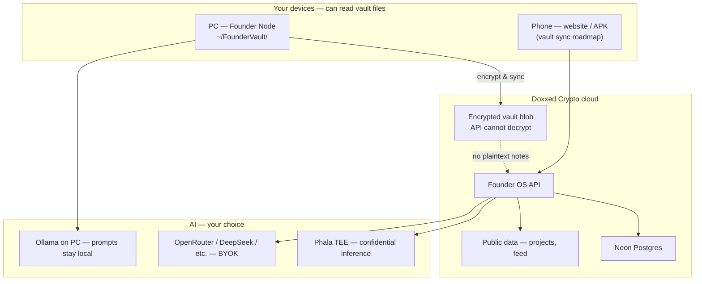
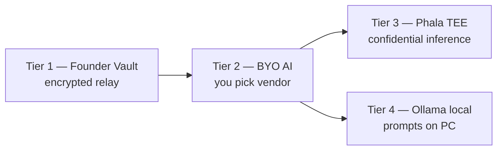

# Privacy & security — how Founder Vault works

**Tagline:** Vault encrypted on our servers; readable only on your devices. Choose Phala or local Ollama when you want confidential AI — not just encrypted storage.

**Live product:** [doxxedcrypto.digital](https://doxxedcrypto.digital) · **Architecture:** [docs/ARCHITECTURE.md](docs/ARCHITECTURE.md)

---

## At a glance



| What | Encrypted on our servers? | Who can read the full text? |
|------|---------------------------|-----------------------------|
| Vault notes, roadmap, private tasks | **Yes** (AES-GCM relay blob) | **Only your paired PC** (and future mobile vault) |
| API keys (Cursor, LLM, etc.) | **Yes** (sealed credentials) | **Server unwraps** only to call integrations you enabled — never sent back to the browser |
| Public projects, feed, rankings | Stored in Neon | **Public** via the website |
| Your source code | **Not in Founder Vault** | **GitHub** — Copilot/Cursor use repo access you connect |

---

## Disclaimer (normal, honest)

### Local vault — expected, not a bug

Founder Vault is **local-first**. Your paired **computer** (Founder Node) reads and writes files under `~/FounderVault/`. That is **required** for the product to work — the same way a password manager or notes app on your laptop can read your data.

- **We do not** store your private notes as plaintext in our database when you use Founder Node + encrypted relay.
- **You do** trust the physical devices you pair. Protect them like you protect email or banking apps.

### Cloud AI — separate choice

| If you use… | What happens to your Copilot prompt? |
|-------------|--------------------------------------|
| **Ollama + Founder Node (PC)** | Processed **on your machine** — strongest “stay local” path |
| **Private AI (Phala TEE)** | Processed in **Phala confidential hardware** — attestation in Settings |
| **OpenRouter / DeepSeek / OpenAI / etc.** | Processed by **that vendor** — you bring your own key (BYOK) |

Choosing Phala or Ollama does **not** remove “device reads vault files.” It controls **where the AI runs** and **who sees the question you send**.

### Code vs memory

- **Founder Vault** = goals, roadmap, tasks, decisions, private notes (founder memory).
- **GitHub** = source code, commits, PRs.
- **Cursor Cloud** = edits your **repo on GitHub** — not a full copy of your vault folder.

Do not paste entire codebases into vault files; keep code in Git.

---

## How encryption works

```text
You save in Founder Node (PC)
        │
        ▼
Plaintext files in ~/FounderVault/
  project-context.md, roadmap.md, tasks.json, …
        │
        ▼
Encrypt with key derived from your node pairing token
        │
        ▼
Upload ciphertext + metadata (goal, task count, device label)
        │
        ▼
Neon stores encrypted blob — API cannot decrypt private bodies
```

| Layer | Technology |
|-------|------------|
| Vault relay blob | AES-256-GCM (node-derived key) |
| Integration API keys | AES-256-GCM (platform sealed storage) |
| Optional Phala CVM | TEE-side unwrap / vault backup (operator-configured) |

---

## Protect your PC and phone

### On your computer (Founder Node)

| Do | Why |
|----|-----|
| Install Founder Node from [official releases](https://github.com/danishhaiderau-maker/doxed-founders-website/releases/latest) only | Avoid fake installers |
| Use a **Windows password** / **macOS login** / disk encryption | Stops casual access to `~/FounderVault/` |
| **Revoke** old nodes in Settings if you retire a laptop | Invalidates that device’s pairing token |
| Do not share `node-config.json` or pairing screenshots | Contains secrets |
| Keep OS and antivirus updated | Standard device hygiene |

### On your phone (website / APK)

| Do | Why |
|----|-----|
| Use the official app or **doxxedcrypto.digital** | Phishing sites can steal logins |
| Enable **screen lock** / biometrics | Protects your founder session |
| Sign out on shared devices | JWT session = access to your account |
| Prefer **Phala** or **PC Ollama** when discussing sensitive topics on cloud Copilot | See AI table above |

### On your account (website)

| Do | Why |
|----|-----|
| Enable **2FA / passkeys** in Security settings when available | Protects founder account |
| Use **separate pairing codes** per device when mobile vault ships | One stolen phone ≠ both devices |
| Review **Attestation dashboard** — vault integrity + Phala verify | Confirms posture, not marketing fluff |

---

## Privacy tiers (pick your level)



| Tier | Setup | Best for |
|------|-------|----------|
| **1** | Pair Founder Node, memory mode **Founder Vault** | Private notes off plaintext Neon |
| **2** | Connect OpenRouter / DeepSeek in Builder | Flexible models, you pay vendor |
| **3** | Connect Phala, default **Private AI (Phala TEE)** | Cloud scale + TEE + verify button |
| **4** | Ollama on PC + Founder Node online | Minimal cloud inference |

**In product:** Settings → Builder → Steps 1–5 ([privacy stack](docs/PRIVACY_STACK.md)).

---

## What the website sees when PC is offline

```text
PC offline ──► API uses last encrypted relay + Neon + GitHub
Phone online ──► Copilot & agents still work (cloud AI / GitHub)
PC returns   ──► Founder Node syncs again (~60s heartbeat)
```

Mobile vault sync between phone and PC is on the [roadmap](docs/MOBILE_APP.md) — today the desktop node is the primary vault device.

---

## Quick FAQ

**Is it a security flaw that my PC reads vault files?**  
No. That is local-first design. The risk to disclose is claiming “nobody ever sees your data” while sending full vault text to a cloud LLM without telling you.

**Does Phala replace Founder Node?**  
No. Phala strengthens **inference**. Founder Node holds **memory** on your machine.

**Are failed GitHub red ✗ deploys a breach?**  
No. Usually Railway deploy status — see [docs/railway-deploy.md](docs/railway-deploy.md#github-red--on-commits-not-an-outage-or-security-breach).

---

## More documentation

| Doc | Topic |
|-----|--------|
| [docs/PRIVACY_STACK.md](docs/PRIVACY_STACK.md) | Five-step setup |
| [docs/FOUNDER_VAULT.md](docs/FOUNDER_VAULT.md) | Vault files |
| [docs/PHALA_PRIVATE_AI.md](docs/PHALA_PRIVATE_AI.md) | Phala TEE |
| [docs/BYO_AI.md](docs/BYO_AI.md) | Bring your own AI |
| [docs/DATA_CLASSIFICATION.md](docs/DATA_CLASSIFICATION.md) | Public vs private data |
| [docs/ARCHITECTURE.md](docs/ARCHITECTURE.md) | System diagrams |
