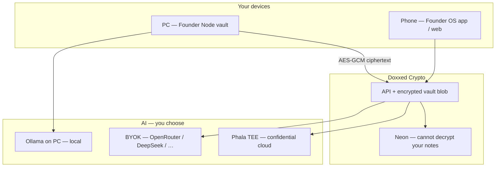

# DoxedCryptoFounder

**Live:** [doxxedcrypto.digital](https://doxxedcrypto.digital)

Curated crypto intelligence for retail who want **tech and accountable founders** — not anonymous pumps. We surface projects **building in public**, power **Founder OS** (AI-assisted shipping), and **Founder Node** (self-custody vault + optional local AI).

---

## Privacy & security — read this first

> **Vault encrypted on our servers; readable only on your devices. Choose Phala or local Ollama when you want confidential AI — not just encrypted storage.**

**Full guide (diagrams, disclaimers, protect PC/phone):** [**PRIVACY.md**](./PRIVACY.md) ← start here on GitHub



| Question | Answer |
|----------|--------|
| Can the **server** read my private vault notes? | **No** (encrypted relay when using Founder Node mode) |
| Can my **PC** read vault files? | **Yes** — normal; vault lives on your machine |
| Where is my **code**? | **GitHub** — not inside Founder Vault |
| Strongest **cloud** AI privacy? | **Phala TEE** in Builder settings |
| Strongest **local** AI privacy? | **Ollama** via Founder Node on PC |

**Protect your devices:** lock screen, official [Founder Node releases](https://github.com/danishhaiderau-maker/doxed-founders-website/releases/latest) only, revoke old paired nodes in Settings, never share `node-config.json`. Details → [**PRIVACY.md**](./PRIVACY.md).

→ **System architecture:** [docs/ARCHITECTURE.md](docs/ARCHITECTURE.md)  
→ **Privacy stack (Steps 1–5):** [docs/PRIVACY_STACK.md](docs/PRIVACY_STACK.md)

---

## Documentation

→ **Why we exist:** [docs/MISSION.md](docs/MISSION.md)  
→ **All docs index:** [docs/README.md](docs/README.md)  
→ **External audit (ChatGPT-safe):** [AUDIT.md](AUDIT.md) · [docs/AUDIT_FOR_CHATGPT.md](docs/AUDIT_FOR_CHATGPT.md)  
→ **Public vs private files:** [docs/REPOSITORY_LAYOUT.md](docs/REPOSITORY_LAYOUT.md)

## Tech Stack

| Layer | Technology |
|-------|------------|
| Frontend | Next.js 15, React, TypeScript, Tailwind CSS, shadcn/ui |
| Backend | NestJS, Node.js, TypeScript |
| Database | PostgreSQL + Prisma |
| Cache | Redis |
| Auth | NextAuth (Phase 3) |
| Monorepo | Turborepo + npm workspaces |

## Project Structure

```text
doxedcryptofounder/
  apps/
    web/          # Next.js frontend
    api/          # NestJS backend
    founder-node/ # Electron desktop vault (see apps/founder-node/README.md)
  packages/
    ui/           # Shared UI components
    types/        # Shared TypeScript types
    config/       # Shared configuration
    utils/        # Shared utilities
  prisma/         # Database schema & migrations
  docs/           # Mission, privacy stack, audit guides (no secrets)
  docker/         # Docker configs
  scripts/        # Utility scripts (ops — not in audit export)
  services/       # Showcase trading bot (btc-conservative-agent)
```

## Repository zones

| Zone | Location | Commit to git? |
|------|----------|----------------|
| **Public source** | This repo | Yes |
| **Secrets vault** | `../doxedcryptofounder-secrets/vault/` | **Never** |
| **Audit export** | `../doxedcryptofounder-audit/` (generated) | **Never** |

After clone: `npm run secrets:link` · For reviewers: `npm run audit:export` — see [docs/REPOSITORY_LAYOUT.md](docs/REPOSITORY_LAYOUT.md).

## Quick Start

### 1. Install dependencies

```bash
npm install
```

### 2. Configure environment

```bash
cp .env.example .env
```

### 3. Start infrastructure

**Option A — Docker (recommended long-term):**

```powershell
npm run setup
```

**Option B — No Docker (fastest if Docker won't start):**

```powershell
npm run setup:neon
```

Uses free [Neon](https://neon.tech) cloud PostgreSQL. No WSL/Docker required.

**If Docker fails to start:**

```powershell
npm run setup:repair   # runs wsl --update
# RESTART PC, open Docker Desktop, then npm run setup
```

> **Docker Desktop must show "Running"** before `docker compose up` works.
> If you see `Docker Desktop is unable to start`, run `npm run setup:repair`,
> restart your PC, or use `npm run setup:neon` instead.

### 4. Run database migrations

```bash
npm run db:migrate
```

### 5. Seed initial data

```bash
npm run db:seed
```

### 6. Start development servers

```bash
npm run dev
```

- **Frontend:** http://localhost:3000
- **Backend API:** http://localhost:4000/api/health

## Production deploy (Neon + Railway + Vercel)

1. **Database:** `npm run setup:neon` → copy connection string to Railway/Vercel env as `DATABASE_URL`.
2. **API (Railway):** connect repo, set env from `.env.production.example`, first deploy set `PRISMA_DB_PUSH=true`, then run `npm run db:seed` against Neon once.
3. **Web (Vercel):** import repo, set **Root Directory** to `apps/web`, add `NEXT_PUBLIC_API_URL`, `NEXTAUTH_URL`, `NEXTAUTH_SECRET`, Google/Stripe keys.
4. **Stripe webhook:** point to `https://YOUR-API/api/paper-trading/stripe/webhook`.
5. **Google OAuth redirect:** `https://YOUR-DOMAIN/api/auth/callback/google`.

Railway uses `railway.toml`. Vercel uses `apps/web/vercel.json`.

## Scripts

| Command | Description |
|---------|-------------|
| `npm run dev` | Start all apps in dev mode |
| `npm run dev:web` | Start frontend only |
| `npm run dev:api` | Start backend only |
| `npm run build` | Build all apps |
| `npm run build:api` | Build utils + Prisma client + API |
| `npm run verify:prod` | Build API + web and verify deploy files |
| `npm run smoke:test` | Hit public API endpoints (API must be running) |
| `npm run start:api:prod` | Migrate/push DB + start API (production) |
| `npm run db:deploy` | Run Prisma migrate deploy (PostgreSQL) |
| `npm run db:migrate` | Run Prisma migrations |
| `npm run db:seed` | Seed chains, categories, founders & projects |
| `npm run db:verify` | Verify Phase 2 seed data |
| `npm run dev:founder-node` | Start Founder Node desktop app (dev) |
| `npm run pack:founder-node` | Build Founder Node installer (.exe / .dmg) |
| `npm run audit:export` | Code-only bundle for ChatGPT / security audit |
| `npm run secrets:link` | Link vault secrets for local dev |
| `npm run sync:all` | Sync Neon + Railway + Vercel (requires vault) |

## Mission (short)

Crypto retail deserves better than scam founders and influencer-driven memecoins. **DoxxedCrypto.digital** connects people to **legit builders** — founders who ship in public, document their work, and earn trust through execution. We bring back **conviction over hype**, support **HODL culture** for real tech, and use **Founder OS + Founder Node + BYOK** so founders keep control of memory and AI keys while building visibly.

Full narrative: [docs/MISSION.md](docs/MISSION.md).

## Supported Chains

Ethereum, Solana, Polygon, Arbitrum, Optimism, Base, Avalanche, BNB Chain

## Development Phases

- [x] **Phase 1** — Monorepo foundation
- [x] **Phase 2** — Database seed + sample projects
- [x] **Phase 3** — Auth + users (email/password + Google OAuth wiring)
- [x] **Phase 4** — Projects + founders APIs
- [x] **Phase 5** — Admin listing review + publish pipeline
- [x] **Phase 6** — Market data (DexScreener preview + live metrics sync)
- [x] **Phase 7** — Public frontend pages
- [x] **Phase 9** — Paper trading + feed + portfolio sharing + Stripe reset
- [x] **Phase 10** — Trending feed spotlight + leaderboard
- [x] **Phase 11** — Listing applications → live projects
- [x] **Phase 8** — Watchlist + basic analytics events
- [x] **Phase 12** — Production deploy live on [Neon](https://neon.tech) + Railway API + [Vercel](https://doxxedcrypto.digital) (see Production deploy above)
- [x] **Founder Node Phase 2** — One-click `.exe` / `.dmg` installers ([setup guide](apps/founder-node/README.md))

## Founder Node

Desktop self-custody vault for project memory. **Installers:** [GitHub Releases](https://github.com/danishhaiderau-maker/doxed-founders-website/releases/latest) · **Setup:** [doxxedcrypto.digital/founder-node](https://doxxedcrypto.digital/founder-node) · **Docs:** [apps/founder-node/README.md](apps/founder-node/README.md)

## License

Private — All rights reserved.
