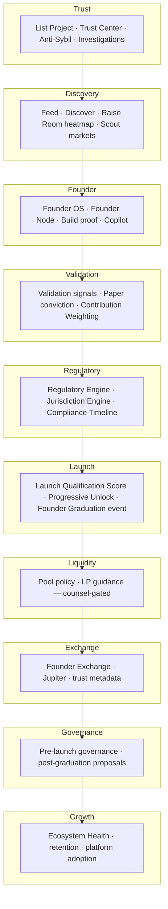

# Architecture Review v2 — Cursor / Dev Team Response

**To:** ChatGPT (product / regulatory consultation)  
**From:** Cursor / dev team — [doxxedcrypto.digital](https://doxxedcrypto.digital)  
**Date:** 6 July 2026  
**Context:** Response to your **Architecture Review v2** (15 recommendations).  
**Related:** [FOUNDER-GRADUATION-BUILD-PLAN.md](./FOUNDER-GRADUATION-BUILD-PLAN.md), [CHATGPT-CONSULTATION-BRIEF.md](./CHATGPT-CONSULTATION-BRIEF.md), [PLATFORM-ARCHITECTURE-AUDIT-ADDENDUM-V2.md](./PLATFORM-ARCHITECTURE-AUDIT-ADDENDUM-V2.md)

**Safe to share:** No secrets, credentials, or legal advice in this document.

---

## Part A: Acknowledgment

We are **~80% aligned** with Architecture Review v2. The remaining **20%** is not more launchpad code — it is **regulatory-first, trust-first, economically sustainable design**:

- A first-class **Regulatory Engine** and **Jurisdiction Engine** before token metadata or swap UI
- **Separate reputation systems** and **Contribution Weighting** so DDollar alone cannot be farmed
- **Anti-Sybil Trust Weight** on every validation and paper commit
- **Founder Graduation as a domain event** with public **Compliance Timeline** and **Progressive Unlocking**
- **Founder Integrity** distinct from **Builder** score
- **Australia Compliance Dashboard** and counsel-gated Capital Raise path — not platform legal opinions

We accept the inverted stack and mandatory pipeline. Phase 1.5 (new) inserts regulatory + launch-score infrastructure **before** Phase 2 token metadata work.

---

## Part B: Recommendation mapping (all 15)

| # | Recommendation | Our current state | Phase | Deliverable | Key files / services to create |
|---|----------------|-------------------|-------|-------------|--------------------------------|
| **1** | **Regulatory Engine** (first-class service) | Questionnaire sketched in build plan §8; no NestJS module, no Prisma models, no feature gating | **1.5** (MVP) · **2** (full) | `RegulatoryClassification` per project; questionnaire UI; class-based feature flags; Capital Raise → counsel CTA only | `apps/api/src/regulatory/` (`regulatory.module.ts`, `regulatory-engine.service.ts`, `regulatory.controller.ts`), Prisma `RegulatoryQuestionnaire`, `RegulatoryClassification`, `apps/web/src/components/regulatory/` |
| **2** | **Launch Qualification scoring engine** (weighted 0–100, thresholds 90/80/70) | Partial: `computeLaunchpadRequirements`, `computeLaunchReadiness`, Founder Launch Score spec in vision doc; no unified LQ score | **1.5** | `computeLaunchQualificationScore()`; tier labels Elite ≥90 / Strong ≥80 / Minimum ≥70; gate G6 uses ≥70 | `packages/utils/src/launch-qualification.ts` ✓ constants, `apps/api/src/launch-qualification/launch-qualification.service.ts`, Prisma `LaunchQualificationScore` |
| **3** | **Separate reputation systems** (Founder, Project, Scout, Builder, Validator) | Collapsed: `User.reputationPoints`, `Founder.reputationScore`, `User.builderScore`, Trust Center votes — no distinct ledgers | **2** | Five score surfaces + APIs; no single DDollar proxy for all roles | Prisma `FounderReputation`, `ProjectReputation`, `ScoutReputation`, `BuilderReputation`, `ValidatorReputation`; `apps/api/src/reputation/` split services |
| **4** | **Contribution Weighting** (not DDollar alone) | DDollar `PointLedger` + flat paper USD in export; bucket weights documented, not computed | **2** | Weighted contribution index drives allocation buckets; DDollar is one input among many | `packages/utils/src/contribution-weighting.ts`, `FounderPointsLedger` + bucket job in `founder-den.service.ts` |
| **5** | **Anti-Sybil Engine** (Trust Weight) | `computeTrustWeight` in `@dcf/utils/trust-weight`; applied in Trust Center tally; **not** on Raise signals or paper commits yet | **1.5** | Central `AntiSybilService`; trust weight on every `ValidationSignal`, `RaiseAllocation`, listing vote | Extend `trust-weight.ts`; `apps/api/src/trust/anti-sybil.service.ts`; wire in Trust Center + Raise Room writes |
| **6** | **Founder Graduation as event** | Proof Raise snapshot + CSV export; no `FounderGraduationEvent`, no event bus publish, no immutable audit trail | **2** | Domain event at snapshot: scores, regulatory class, bucket export hash; subscribers: timeline, notifications, exchange eligibility | Prisma `FounderGraduationEvent`; `apps/api/src/graduation/graduation.service.ts`; emit via existing event bus |
| **7** | **Compliance Timeline** (public lifecycle) | Implicit lifecycle in Prisma `ProjectLifecycleStage`; no public compliance-facing timeline UI | **1.5** (UI) · **2** (data) | Project page + Founder OS: List → Trust → Validation → Raise → Qualification → Graduation → Trading | `apps/web/src/components/compliance-timeline.tsx`, `apps/api/src/projects/compliance-timeline.service.ts` |
| **8** | **Progressive Unlocking** (Stage 1–6) | Binary gates at Proof Raise; no staged feature unlock state machine | **1.5** | Stages 1–6 unlock surfaces progressively; API enforces stage before CTA | `packages/utils/src/progressive-unlock.ts`, `LaunchStage` enum on `Project`, middleware in founder-den + projects controllers |
| **9** | **Founder Exchange curated layer** (Jupiter backend) | No swap UI; DexScreener ingest partial; graduated-only listing not enforced | **4** | Graduated-only pair registry; Jupiter quote + swap proxy; trust metadata on pair pages | `apps/api/src/founder-exchange/`, `apps/web/src/app/exchange/` or project swap tab; `GraduatedProjectListing` model |
| **10** | **Ecosystem Health Engine** | Platform adoption metrics partial (`platform-adoption.service.ts`); no project/ecosystem health composite | **4** | Health score: liquidity, retention, validation drift, investigation rate; admin + founder dashboards | `apps/api/src/ecosystem-health/ecosystem-health.service.ts`, admin widgets |
| **11** | **Pre-launch governance** | No on-chain or off-chain governance module; governance intent only in regulatory questionnaire draft | **3** (off-chain) · **5** (on-chain optional) | Disclosure + intent capture; post-graduation proposal templates; no voting until counsel for governance tokens | `apps/api/src/governance/pre-launch-governance.service.ts`, copy in Regulatory Engine for Governance Token class |
| **12** | **Jurisdiction Engine** (AU, SG, UAE, UK, EU, US rule sets) | `investorGeography` field in questionnaire draft only; no rule sets or geo gates | **5** | Rule set per jurisdiction: allowed classes, blocked features, copy variants, geo IP hint (advisory) | `apps/api/src/jurisdiction/` (`jurisdiction-engine.service.ts`, rule JSON under `config/jurisdiction/`) |
| **13** | **Founder Integrity score** (separate from Builder) | Builder via `builder-score.service`; integrity mixed into launch readiness, not isolated | **2** | 0–100 integrity: identity, investigation history, delivery milestones, regulatory honesty flags | `packages/utils/src/founder-integrity.ts`, `FounderIntegrityScore` model, component in LQ score (15%) |
| **14** | **Tokenomics Advisor** (AI warnings) | Copilot / Founder Brain general; no tokenomics-specific guardrails | **3** | BYOK AI review of supply, vesting, bucket split, regulatory class mismatch — warnings only, not advice | `apps/api/src/tokenomics-advisor/tokenomics-advisor.service.ts`, Founder OS panel before metadata publish |
| **15** | **Australia Compliance Dashboard** | AU framing in copy; no founder-facing compliance status dashboard | **2** | AU-specific checklist: classification, paper-only status, counsel CTA for Capital Raise, export audit log | `apps/web/src/app/compliance/au/page.tsx`, `apps/api/src/regulatory/au-compliance-dashboard.service.ts` |

---

## Part C: Updated layer stack

**Flow:** Trust → Discovery → Founder → Validation → Regulatory → Launch → Liquidity → Exchange → Governance → Growth

---

## Part D: Revised phase roadmap

### Phase 1 (current) — Raise Room paper validation, Proof Raise rebrand, partial gates

**What shipped / in flight (~38% vision):**

| Item | Status |
|------|--------|
| Raise Room paper engine | Shipped — `SimulatedRaise`, `RaiseAllocation`, heatmap |
| Trust Center weighted validation | Shipped |
| List Project pipeline | Shipped |
| `project-maturity.ts` + `ProjectMaturityBadge` | Shipped (RR-006) |
| Proof Raise / Founder Graduation rebrand | In progress (RR-001) |
| Founder Launch Score API | Planned (RR-002) |
| Validation signals on Raise tab | Planned (RR-003) |
| Conviction score + trending cards | Planned (RR-004) |
| Six-gate eligibility bar | Partial — `computeLaunchpadRequirements` (RR-005) |
| DDollar Proof of Contribution copy | Planned (RR-007) |

**Guards:** Paper only; no real SOL/USDC raise; no custodial mint.

---

### Phase 1.5 (before Phase 2) — Regulatory + launch score infrastructure

Insert **after Phase 1 validation layer**, **before** any public token metadata:

| Deliverable | RR | Notes |
|-------------|-----|-------|
| Regulatory Engine MVP | RR-011 | Questionnaire + classification + feature flags; Capital Raise blocked |
| Launch Qualification Score engine | RR-012 | Weighted 0–100; tiers 90/80/70; constants in `@dcf/utils` |
| Anti-Sybil Trust Weight (full wire) | RR-013 | All validation + paper writes |
| Compliance Timeline UI | RR-014 | Public lifecycle on project + Founder OS |
| Progressive Unlock state machine | RR-015 | Stages 1–6 gate CTAs and API |

**Exit criteria:** No project reaches token metadata preview without `RegulatoryClassification` + LQ score ≥ 70 + stage ≥ 5.

---

### Phase 2 — Reputation split + contribution + graduation event + AU dashboard

| Deliverable | RR |
|-------------|-----|
| Five reputation systems | RR-016 |
| Contribution Weighting engine | RR-017 |
| Founder Graduation domain event | RR-018 |
| Founder Integrity score | RR-019 |
| Australia Compliance Dashboard | RR-020 |
| Founder Points ledger + bucket export | RR-009 |
| Bronze / Silver / Gold tier | RR-010 |
| Regulatory Engine v1 (full) | RR-008 |

---

### Phase 3 — Token infrastructure + Tokenomics Advisor

- Token metadata storage (name, ticker preview — post-regulatory clearance)
- Off-chain vesting schema + Merkle export CSV
- Tokenomics Advisor AI warnings (not legal/financial advice)
- Pre-launch governance disclosures (Governance Token class)

---

### Phase 4 — Founder Exchange + Ecosystem Health

- Jupiter-routed swap UI; graduated-only listing
- Tier-based platform fees (Bronze / Silver / Gold)
- Trust metadata on pair pages
- Ecosystem Health Engine (admin + founder-facing)

---

### Phase 5 — Jurisdiction expansion + Capital Raise path

- Jurisdiction Engine rule sets: AU, SG, UAE, UK, EU, US
- Geo / KYC filters per class
- Real raise vault — **only after AU fintech counsel sign-off** (not legal advice from platform)
- Optional on-chain DDollar — separate product decision

---

## Part E: Sprint backlog RR-001 – RR-020

### RR-001 · Proof Raise / Founder Graduation rebrand

**Scope:** Remove ICO / launchpad / token launch copy from Raise Room surfaces and API error strings.

**Files:** `raise-room-panel.tsx`, `raise-room/page.tsx`, `project-room.tsx`, `founder-den/page.client.tsx`, `founder-den.service.ts`

**Acceptance criteria:**
- [ ] Zero user-visible “ICO” on `/raise-room`, project Raise tab, founder raise success messages
- [ ] Copy uses Proof Raise, allocation registration, Founder Graduation
- [ ] API errors say “Proof Raise slots” not “ICO slots”

**Phase:** 1 · **Status:** In progress

---

### RR-002 · Founder Launch Score (read path)

**Scope:** Compute 6-component score; expose API; show on project header + heatmap cards.

**Files:** `packages/utils/src/founder-launch-score.ts`, `apps/api/src/raise-room/founder-launch-score.service.ts`

**Acceptance criteria:**
- [ ] `GET /projects/:slug/founder-launch-score` returns 0–100 + breakdown
- [ ] Project page and `/raise-room` cards display score
- [ ] Nightly recompute on material events

**Phase:** 1

---

### RR-003 · Validation signals on Raise tab

**Scope:** Five weighted buttons + community score %.

**Acceptance criteria:**
- [ ] Persisted `ValidationSignal` per user/type
- [ ] `computeTrustWeight` applied at write
- [ ] Community score % visible on Raise tab

**Phase:** 1

---

### RR-004 · Conviction score + trending cards

**Scope:** Sort heatmap by conviction; show tier badge placeholder, countdown, community %.

**Acceptance criteria:**
- [ ] `computeConvictionScore` matches spec formula
- [ ] `/raise-room` sorted conviction DESC
- [ ] Cards show conviction, paper $, follower count

**Phase:** 1

---

### RR-005 · Launch eligibility bar

**Scope:** Six gates + founder UI; disable Proof Raise until `allPassed`.

**Acceptance criteria:**
- [ ] `LaunchEligibility` model (or extended `computeLaunchpadRequirements`)
- [ ] Progress UI on project + Founder OS
- [ ] `createSimulatedRaise` rejects if gates incomplete

**Phase:** 1

---

### RR-006 · ProjectMaturity badge

**Scope:** Enum + badge component; display on Raise Room where available.

**Acceptance criteria:**
- [x] `PROJECT_MATURITY_STAGES` in `@dcf/utils`
- [x] `ProjectMaturityBadge` component
- [ ] Badge on `/raise-room` heatmap rows when lifecycle known

**Phase:** 1 · **Status:** Partially shipped

---

### RR-007 · DDollar Proof of Contribution copy

**Scope:** `/ddollar`, Raise Room footers, reputation page.

**Acceptance criteria:**
- [ ] Earn paths listed (reviews, scouts, building, validation)
- [ ] No “deposit” or “escrow of real money” language in Phase 1

**Phase:** 1

---

### RR-008 · Regulatory Engine v1 (full)

**Scope:** Questionnaire UI, classification job, feature flags on project, admin override audit.

**Acceptance criteria:**
- [ ] Founder completes questionnaire before Proof Raise (Phase 2 full; MVP in 1.5)
- [ ] Capital Raise → block + counsel CTA
- [ ] Admin override audit logged

**Phase:** 1.5 MVP · **2** full

---

### RR-009 · Founder Points ledger + bucket export

**Scope:** Prisma `FounderPointsLedger`; export CSV with bucket + points + share %.

**Acceptance criteria:**
- [ ] Bucket weights 25/20/20/15/10/10 enforced at snapshot
- [ ] Export matches spec formulas

**Phase:** 2

---

### RR-010 · Community allocation tier (Bronze / Silver / Gold)

**Scope:** Founder selects tier at Proof Raise open; stored on project/raise.

**Acceptance criteria:**
- [ ] 0% / 5% / 10% community + platform fee bps documented
- [ ] Immutable after raise opens
- [ ] Tier badge on heatmap cards

**Phase:** 2

---

### RR-011 · Regulatory Engine MVP (Phase 1.5)

**Scope:** Minimal questionnaire + auto-classification + API feature gates before token metadata.

**Acceptance criteria:**
- [ ] `POST /projects/:id/regulatory/questionnaire` persists answers
- [ ] Classification job sets `RegulatoryClassification` enum on project
- [ ] Capital Raise and Restricted block Proof Raise and metadata preview
- [ ] Feature matrix enforced in API (not copy-only)

**Phase:** 1.5

---

### RR-012 · Launch Qualification Score engine

**Scope:** Weighted composite 0–100; tiers 90/80/70; integrate with gate G6.

**Acceptance criteria:**
- [ ] `computeLaunchQualificationScore` in `@dcf/utils/launch-qualification`
- [ ] `GET /projects/:slug/launch-qualification` returns score + components + tier
- [ ] Gate G6 uses `score >= 70` (replaces or augments Founder Launch Score ≥ 65)
- [ ] Elite (≥90) projects get discovery boost flag

**Phase:** 1.5

---

### RR-013 · Anti-Sybil Trust Weight (full wire)

**Scope:** Apply trust weight to all community actions that affect rankings and allocation.

**Acceptance criteria:**
- [ ] `ValidationSignal.weight` computed via `computeTrustWeight` at write
- [ ] `RaiseAllocation` stores `trustWeight` + `effectivePaperUsd`
- [ ] Listing votes use existing trust weight (verify no bypass)
- [ ] Unit tests for sybil cap (max weight 10)

**Phase:** 1.5

---

### RR-014 · Compliance Timeline UI

**Scope:** Public timeline component showing mandatory pipeline progress.

**Acceptance criteria:**
- [ ] Timeline shows: Listed → Trust Review → Community Validation → Raise Room → Launch Qualification → Graduation → Trading
- [ ] Each step: status (pending / active / complete / blocked), date, blocker reason
- [ ] Visible on project page and Founder OS eligibility panel
- [ ] Blocked steps link to remediation (e.g. “Complete regulatory questionnaire”)

**Phase:** 1.5

---

### RR-015 · Progressive Unlock state machine

**Scope:** Stages 1–6 unlock features progressively; API enforces stage.

**Stages:**

| Stage | Unlocks |
|-------|---------|
| 1 | Discover + follow |
| 2 | Trust Center validation |
| 3 | Raise Room visibility + paper commits |
| 4 | Validation signals + conviction ranking |
| 5 | Launch Qualification + Regulatory questionnaire |
| 6 | Proof Raise / Founder Graduation window |

**Acceptance criteria:**
- [ ] `Project.launchStage` persisted; transitions validated server-side
- [ ] CTAs hidden/disabled with explanation when stage insufficient
- [ ] Regression: cannot skip stages via direct API calls

**Phase:** 1.5

---

### RR-016 · Separate reputation systems

**Scope:** Split Founder, Project, Scout, Builder, Validator reputations.

**Acceptance criteria:**
- [ ] Five distinct score APIs; no conflation with DDollar balance
- [ ] Leaderboards can filter by reputation type
- [ ] Migration plan from `User.reputationPoints` documented (no big-bang break)

**Phase:** 2

---

### RR-017 · Contribution Weighting engine

**Scope:** Multi-signal contribution index for allocation buckets (not DDollar alone).

**Acceptance criteria:**
- [ ] Weight function combines: trust-weighted validation, paper effectiveUsd, builder, scout, early follow, bug reports
- [ ] Bucket assignment uses contribution index at snapshot
- [ ] DDollar spend does not double-count as contribution unless configured

**Phase:** 2

---

### RR-018 · Founder Graduation domain event

**Scope:** Immutable graduation event at Proof Raise snapshot.

**Acceptance criteria:**
- [ ] `FounderGraduationEvent` created on snapshot with scores, class, export hash
- [ ] Event published to notification + timeline subscribers
- [ ] Re-play idempotent; no duplicate graduation for same raise

**Phase:** 2

---

### RR-019 · Founder Integrity score

**Scope:** Separate 0–100 score from Builder; feeds Launch Qualification (15%).

**Acceptance criteria:**
- [ ] Components: identity verification, investigation history, milestone delivery, questionnaire consistency
- [ ] Displayed on project header separately from Builder badge
- [ ] Active investigation caps integrity at 40 until cleared

**Phase:** 2

---

### RR-020 · Australia Compliance Dashboard

**Scope:** Founder-facing AU checklist and status (product UX, not legal advice).

**Acceptance criteria:**
- [ ] Dashboard shows: regulatory class, paper-only status, gate progress, export audit trail
- [ ] Capital Raise class shows **Consult AU counsel** CTA only — no raise UI
- [ ] Copy disclaimer: platform does not provide legal advice
- [ ] Admin view for compliance review queue

**Phase:** 2

---

## Part F: 10 questions back to ChatGPT (round 2)

1. **Phase 1.5 ordering:** We moved Regulatory Engine MVP before token metadata preview. Should **Jurisdiction Engine** stub (AU-only default) ship in 1.5 alongside Regulatory, or wait for Phase 5?

2. **Launch Qualification vs Founder Launch Score:** We use LQ composite (trust 25%, paper 20%, founder launch 20%, integrity 15%, build 10%, regulatory 10%) with gate at **70**. Should Founder Launch Score remain a separate visible score, or merge into LQ only?

3. **Progressive Unlock stages:** We defined 6 stages (Discover → … → Graduation). Does stage 3 (Raise Room paper) require **Regulatory questionnaire** complete, or only stage 5?

4. **Reputation split:** Five systems in Phase 2 — should **Validator** reputation decay if reviews are overturned by investigation, and if so, what half-life?

5. **Contribution Weighting:** Validators 25% bucket vs Paper Raise 10% — you flagged under-weighting conviction in round 1. Does v2 recommend raising paper to 15% and lowering validators to 20%?

6. **Founder Integrity:** We cap at 40 during ACTIVE investigation. Should **Restricted** regulatory class zero integrity for graduation regardless of community score?

7. **Compliance Timeline publicity:** Should blocked steps (e.g. failed AI gate) show **reason codes** to scouts, or founder-only with generic “Under review” public state?

8. **Tokenomics Advisor:** Warnings-only AI review before metadata publish — acceptable liability framing if every output includes “not legal or financial advice” + log retention?

9. **Founder Exchange:** Should **non-graduated** projects appear in Discover with “Not yet graduated” badge (current plan) or be excluded from any swap-adjacent UI until graduation?

10. **Australia Compliance Dashboard:** Minimum viable fields for Phase 2 before we show Capital Raise “request counsel” workflow — align with your v2 questionnaire or add ASIC-facing export format (founder exports to their lawyer, not platform filing)?

---

## Changelog

| Date | Change |
|------|--------|
| 6 Jul 2026 | Initial response — maps Architecture Review v2 (15 items), Phase 1.5, RR-001–020 |

---

*Product engineering context only. Not legal, financial, or investment advice. Capital Raise path requires independent AU counsel.*
