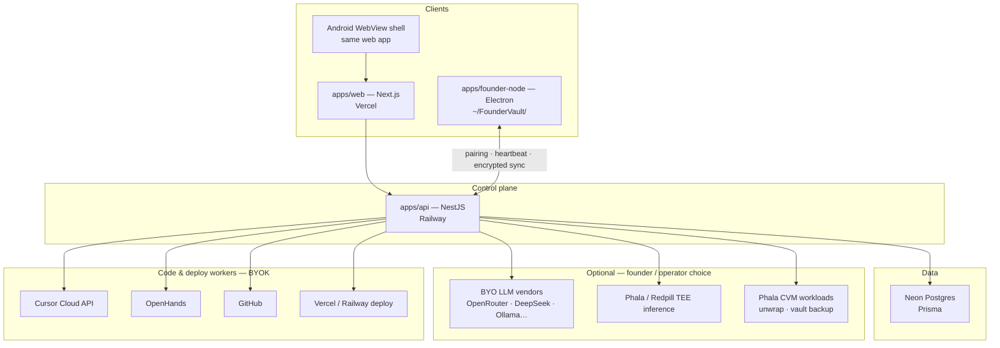
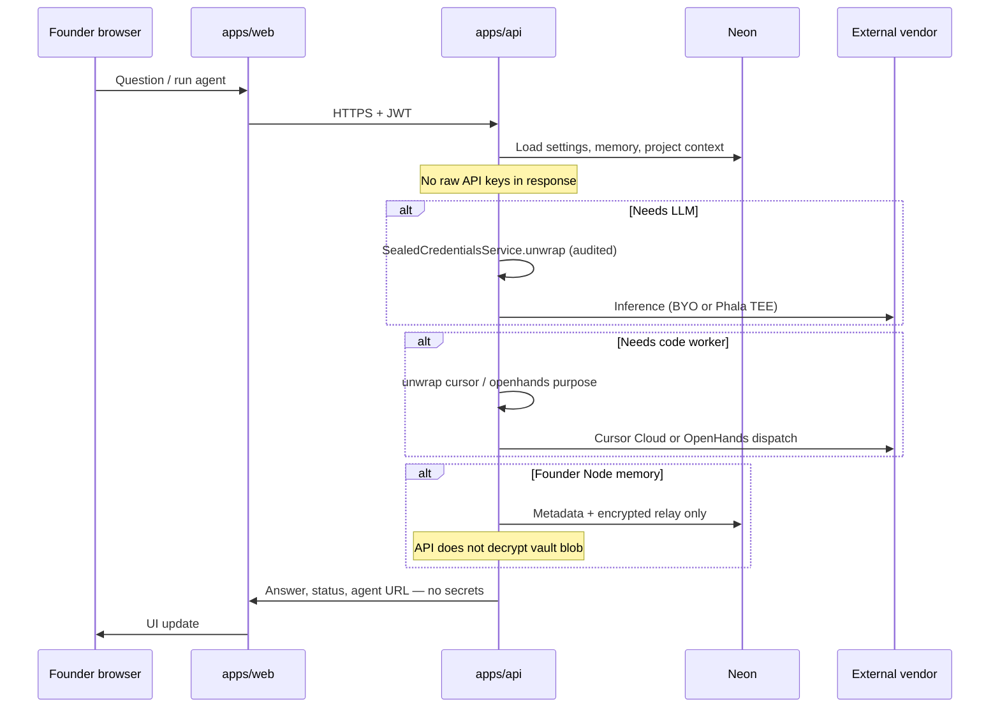
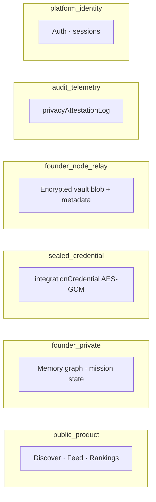
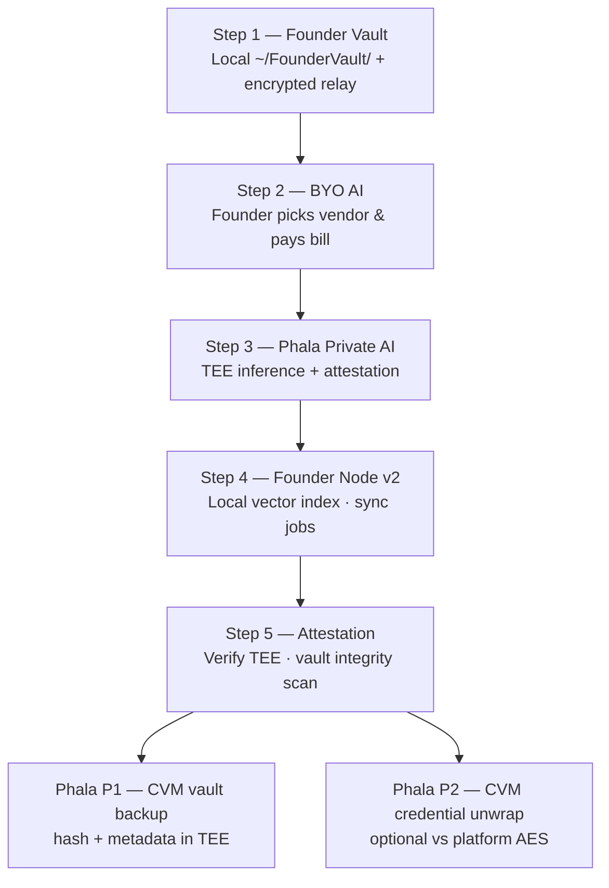
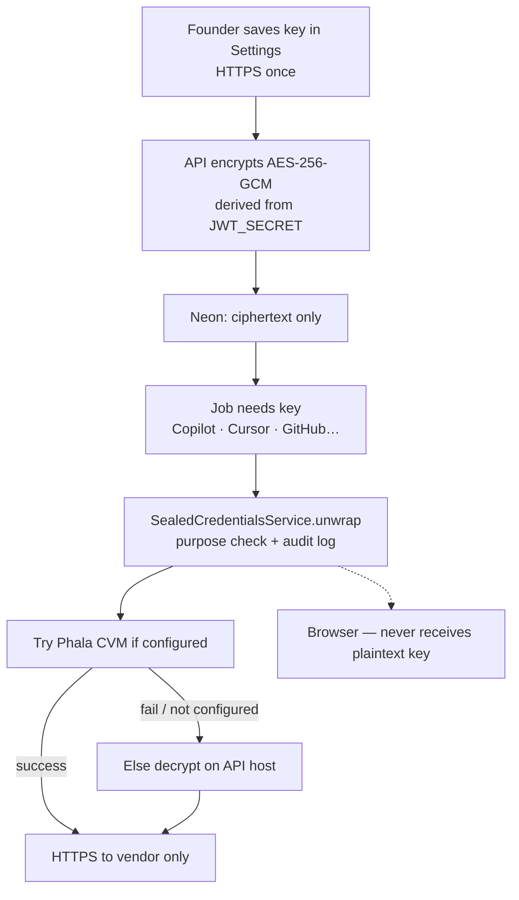
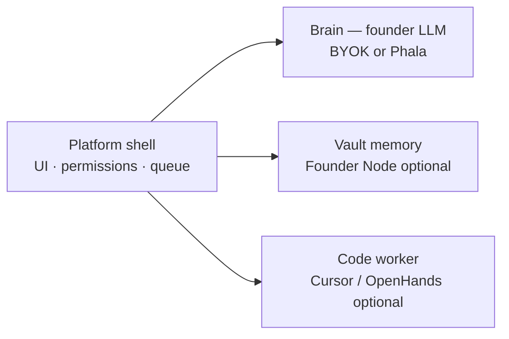

# DoxxedCrypto / Founder OS — System Architecture

**Audience:** Contributors, founders, security reviewers, and anyone reading the public GitHub repo.  
**Safe to publish:** This document contains no secrets, API keys, or production credentials.

Related docs: [**PRIVACY.md**](../PRIVACY.md) (GitHub front page) · [PRIVACY_STACK.md](./PRIVACY_STACK.md) · [DATA_CLASSIFICATION.md](./DATA_CLASSIFICATION.md) · [PHALA_ARCHITECTURE_ALIGNMENT.md](./PHALA_ARCHITECTURE_ALIGNMENT.md) · [REPOSITORY_LAYOUT.md](./REPOSITORY_LAYOUT.md)

---

## What we are building

**DoxxedCrypto.digital** is a crypto-native founder platform: public discovery (projects, feed, scout markets) plus **Founder OS** — a control plane for Copilot, agents, GitHub, and optional local/desktop privacy (Founder Node).

The architecture is **hybrid by design**:

- **Public layer** — fast, shareable product data on Neon Postgres.
- **Private layer** — founder memory, sealed API keys, and optional hardware-backed paths (Phala TEE / CVM).
- **Workers** — external services the founder connects (LLMs, Cursor Cloud, OpenHands, exchanges).

Founder OS orchestrates; it does not replace every vendor.

---

## High-level system diagram



---

## Monorepo layout (public git)

| Package | Role |
|---------|------|
| `apps/web` | Founder & public UI — Mission Control, Settings, Copilot, agents |
| `apps/api` | Auth, privacy boundaries, credentials, Copilot router, build queue, vault relay |
| `apps/founder-node` | Desktop tray — local vault files, Ollama jobs, encrypted sync |
| `packages/utils` | Shared types, data classification, Phala/CVM helpers |
| `prisma/schema.prisma` | Single source of truth for Neon models |
| `docs/` | Mission, privacy stack, deploy guides (this file) |

Production secrets live **outside git** — see [REPOSITORY_LAYOUT.md](./REPOSITORY_LAYOUT.md).

---

## How a founder request flows

Typical path: founder asks Copilot or runs an agent from the web UI.



**Control plane vs workers** ([HYBRID_CONTROL_PLANE.md](./HYBRID_CONTROL_PLANE.md)):

| Leg | Role | Examples |
|-----|------|----------|
| **Ask** | Answers in Mission Control | Copilot, Founder Brain router |
| **Code in repo** | Commits & PRs | Cursor Cloud, OpenHands |
| **Ship story** | Feed, X, community | Autopilot, publish flows |

---

## Data layers and privacy

### Six data classes

Every feature should fit one of these buckets ([DATA_CLASSIFICATION.md](./DATA_CLASSIFICATION.md)):



| Class | Stored where | Privacy rule |
|-------|--------------|--------------|
| `public_product` | Neon | Safe for `@Public()` APIs; no keys, no vault plaintext |
| `founder_private` | Neon (+ scoped APIs) | Only the signed-in founder |
| `sealed_credential` | Neon ciphertext | Server unwrap only; purpose checks; audited |
| `founder_node_relay` | Neon + local disk | Blob encrypted; API stores metadata it can read |
| `audit_telemetry` | Neon | Owner-visible receipts (TEE verify, SECRET_ACCESS) |
| `platform_identity` | Neon | Never on public product routes |

**Hard rule:** These field names must never appear in public JSON responses: `token`, `accessTokenEncrypted`, `webhookSecret`, `secretHash`, passwords, raw API keys.

Enforced in code: `packages/utils/src/data-classification.ts` · CLI: `npm run audit:data-classes`

---

## Five-step privacy stack (how privacy is preserved)

Founders opt in step by step ([PRIVACY_STACK.md](./PRIVACY_STACK.md)):



| Step | What stays private | What the cloud still sees |
|------|--------------------|---------------------------|
| **1 — Founder Vault** | Full vault files on desktop | Goal, task count, **encrypted** blob (not decryptable by API without node key) |
| **2 — BYO AI** | Founder chooses if prompts leave machine (Ollama = local) | Provider the founder connected |
| **3 — Phala** | TEE inference path; attestation receipts | Request metadata for verify flow |
| **4 — Node v2** | Vector index on disk | Top search snippets only when founder searches |
| **5 — Attestation** | Proof artifacts, not raw secrets | Pass/fail checks and summaries |
| **P1 / P2 (optional)** | Vault backup = hash of ciphertext; unwrap can run in CVM | Operator must deploy CVM URLs on Railway |

**Phala is optional.** Without it, the platform still uses AES-encrypted credentials, zero-knowledge vault relay (Founder Node mode), and audit logs — with a different trust model (application encryption on the API host, not hardware TEE).

---

## Secrets and API keys



| Statement | Accurate? |
|-----------|-----------|
| Keys are encrypted in the database | Yes |
| Keys are not sent back to the browser after save | Yes (by design) |
| Keys are never used | No — server decrypts in memory for integrations the founder enabled |
| Keys are shown on public pages | No — forbidden fields |
| Without Phala CVM, only the API host can AES-decrypt | Yes — standard SaaS model |
| With Phala CVM, unwrap can occur inside TEE workload | Yes — when operator configures `PHALA_CVM_UNWRAP_URL` |

Details: [SECRETS_STORAGE.md](./SECRETS_STORAGE.md) · [SPRINT_P2_PHALA_SEAL.md](./SPRINT_P2_PHALA_SEAL.md)

---

## Founder Node and zero-knowledge relay

```text
Founder OS Web
      │
      ▼
@dcf/api  ── metadata (goal, task count, device label)
      │      encrypted blob (API cannot read contents)
      ▼
Neon relay

Founder Node (desktop)
      │
      └── ~/FounderVault/  ← plaintext only on founder's machine
              │
              └── encrypt with node-derived key → POST /founder-node/sync
```

Copilot can use **metadata** for context; private notes in the blob are not decrypted on the server. See [FOUNDER_VAULT.md](./FOUNDER_VAULT.md).

---

## Project agents (loyalty model)

Each approved project gets the platform agent roster; agents run **in that project's context** ([PROJECT_AGENT_ARCHITECTURE.md](./PROJECT_AGENT_ARCHITECTURE.md)):



- **Brain** — founder's connected AI (billing to their vendor).
- **Vault** — optional device memory; not shared across projects on the public feed.
- **Code worker** — separate from chat; dispatches via sealed Cursor/OpenHands keys.

---

## Optional Phala CVM (operator infrastructure)

When the platform operator sets Railway env vars (not pasted by founders in UI):

| Feature | Env | What moves |
|---------|-----|------------|
| Vault backup | `PHALA_CVM_BACKUP_URL` | SHA-256 of encrypted relay blob + metadata |
| Credential unwrap | `PHALA_CVM_UNWRAP_URL` | Ciphertext to CVM; plaintext used only for approved `purpose` |

API surface: `GET /vault/cvm-capabilities`, `GET /vault/cvm-status`, `POST /vault/cvm-backup-request`, `GET /vault/cvm-seal-status`, etc.

See [SPRINT_P1_PHALA_VAULT.md](./SPRINT_P1_PHALA_VAULT.md) · [SPRINT_P2_PHALA_SEAL.md](./SPRINT_P2_PHALA_SEAL.md) · [PHALA_ARCHITECTURE_ALIGNMENT.md](./PHALA_ARCHITECTURE_ALIGNMENT.md).

---

## What we claim vs what requires setup

| Claim | Requires |
|-------|----------|
| Public data separated from founder secrets | Shipped — data classification + API guards |
| API keys encrypted at rest, not in browser | Shipped — `SealedCredentialsService` |
| Vault contents private on Founder Node mode | Shipped — encrypted relay |
| Prompts can stay local | Founder sets Ollama + Founder Node |
| TEE-verified inference | Founder connects Phala + attestation dashboard |
| CVM-side unwrap / vault backup | Operator deploys Phala CVM workloads + env URLs |

Do not market full hardware isolation unless Steps 3–5 and CVM paths are active for that deployment.

---

## Verify and audit (no secrets in repo)

```bash
npm run audit:data-classes   # static classification check
npm run audit:export         # code-only tree for external review
npm run smoke:test           # production health (set API_URL)
```

Guide: [AUDIT_FOR_CHATGPT.md](./AUDIT_FOR_CHATGPT.md)

**GitHub red ✗ on commits:** Railway deploy status, not a security breach. A failed badge does not always mean production is down — see [railway-deploy.md — GitHub red ✗](./railway-deploy.md#github-red--on-commits-not-an-outage-or-security-breach).

---

## Further reading

| Topic | Doc |
|-------|-----|
| Mission & culture | [MISSION.md](./MISSION.md) |
| Privacy steps 1–5 | [PRIVACY_STACK.md](./PRIVACY_STACK.md) |
| Autopilot / control plane | [HYBRID_CONTROL_PLANE.md](./HYBRID_CONTROL_PLANE.md) |
| Security narrative | [FOUNDER_OS_AUDIT.md](./FOUNDER_OS_AUDIT.md) |
| Deploy | [railway-deploy.md](./railway-deploy.md) · [vercel-deploy.md](./vercel-deploy.md) |
