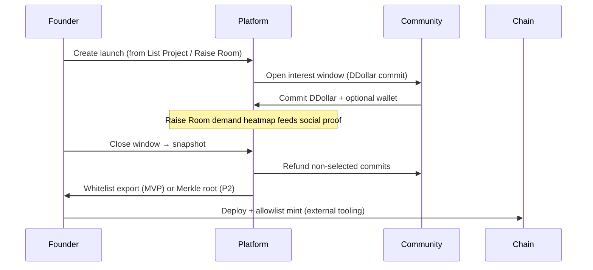

# DDollar Launch Allocation — Product Proposal

**Status:** Draft · July 2026  
**Scope:** Whitelist / interest registration for founder token launches using platform DDollar (stored as `User.reputationPoints` + `PointLedger`). No on-chain implementation in this phase.

---

## Problem

Founders want a fair, auditable way to register community interest before a Solana (or EVM) token launch. The platform already has:

- **DDollar** — single in-game currency (`reputationPoints`, ledger in `PointLedger`, spend/award via `PointsService`)
- **Raise Room** — `SimulatedRaise` + `RaiseAllocation` (paper USD demand signals, slot caps, optional wallet capture)
- **Trust Center / List Project** — scout votes, validation, `builderScore`, listing approval
- **Builder Rewards** — tiered contributors (`builderScore`, `contributorLevel`)

We need a bridge from *platform reputation* → *launch whitelist* without turning DDollar into a tradeable security on-platform.

---

## Recommended model: DDollar **commit** (escrow), not burn

| Mechanism | Pros | Cons |
|-----------|------|------|
| **Burn** | Simple, anti-spam | Permanent loss; feels punitive; hard to refund if launch cancels |
| **Signal only** (no lock) | Zero friction | Sybil / wash interest; no skin in the game |
| **Escrow commit** ✅ | Reversible until snapshot; proves intent; maps to existing `PointsService.spend` atomicity | Requires refund path and clear UX copy |

**Proposal:** When a user registers interest in a launch, `PointsService.spend(userId, amount, 'LAUNCH_WHITELIST_COMMIT')` locks DDollar into a new **`LaunchInterestCommit`** row (see MVP schema). Until snapshot, user can cancel and receive `award(..., 'LAUNCH_WHITELIST_REFUND')`. At snapshot, commits convert to **`WHITELISTED`** or **`REFUNDED`** (if over cap / not selected).

Minimum commit tiers (example):

| Tier | DDollar commit | Whitelist priority |
|------|----------------|-------------------|
| Signal | 500 | Base queue (FIFO within tier) |
| Builder | 2,500 | + verified listing scout / `builderScore` ≥ threshold |
| Anchor | 10,000 | Top-N guaranteed slot if cap allows |

Verified builders (Trust Center validators, approved List Project scouts, Raise Room allocators on the same project) get a **multiplier on rank score**, not a free pass — keeps sybil resistance.

---

## Whitelist generation

At **`snapshotAt`** (founder-configured, min 24h after window opens):

```
rankScore = committedDdollar
          × builderMultiplier(user)
          × trustMultiplier(user)   // e.g. validation accuracy, no scam flags
          × earlyScoutBonus(user, project)
```

1. Sort descending by `rankScore`.
2. Take top **N** = `maxWhitelistSlots` (founder sets; default from `SimulatedRaise.maxParticipantSlots` pattern).
3. Require linked **Solana wallet** (`walletAddress` on commit or profile) for final list.
4. Export:
   - **MVP:** CSV / JSON download for founder + admin (`pubkey, tier, committedDdollar, userId`)
   - **Phase 2:** Merkle root + API for claim program (similar to p0 Locker airdrop pattern)

**Anti-gaming:** one commit per user per launch (`@@unique([launchId, userId])`); optional max wallet per user; admin freeze flag.

---

## Launch flow (end-to-end)



### Founder creates launch

- Entry: **Founder OS → Raise Room tab** or **List Project → Token launch** (linked `projectId`).
- Fields: token name/ticker (metadata), `communityTokenPercent`, `maxWhitelistSlots`, interest window dates, min commit per tier, Solana mint plan (manual in MVP).

### Users commit DDollar

- UI on project page + Raise Room card: “Register interest — lock X DDollar”.
- Show rank estimate (percentile, not exact position — reduces gaming).
- Phantom wallet connect optional until snapshot week (reuse admin Connect Phantom pattern).

### Snapshot → on-chain

- **MVP:** Manual export; founder uses Meteora/Pump/Raydium allowlist or p0-style locker.
- **Phase 2:** Platform signs Merkle root; `LaunchClaim` Solana program reads root; commits already refunded or converted to “allocation credit” off-chain.

---

## Integration with existing surfaces

| Surface | Role in launch |
|---------|----------------|
| **List Project** | Gate who may open a launch (approved listing only); scout who submitted gets small rank bonus |
| **Trust Center** | Validators with high accuracy → `trustMultiplier`; scam flags → excluded |
| **Raise Room** | `SimulatedRaise` / `RaiseAllocation` paper demand **previews** interest before real DDollar commit; heatmap on `/raise-room` |
| **DDollar hub** (`/ddollar`) | Explain commit/refund rules; ledger entries `LAUNCH_WHITELIST_*` |
| **Builder Rewards** | Tier badges visible on commit UI; PARASITE tier capped at Signal tier max |

Reuse **`RaiseAllocation.walletAddress`** pattern for Solana pubkey capture.

---

## What to build

### MVP (4–6 weeks)

1. **Prisma:** `TokenLaunch`, `LaunchInterestCommit` (status: ACTIVE, WHITELISTED, REFUNDED, CANCELLED)
2. **API:** create launch, commit, cancel, snapshot (founder/admin), export whitelist
3. **Points:** new action keys in `reputation-points.ts`; spend/refund via `PointsService`
4. **Web:** project launch tab + Raise Room CTA; commit modal; founder snapshot button
5. **Admin:** audit log, force-refund, block user

### Phase 2

- Merkle whitelist generation + Solana claim program (or integration with external locker)
- Bonding curve **preview** only (no platform custody of SOL) — show simulated curve from commits
- KYC / geo block hooks if needed
- Auto-post snapshot to project wall + Trust Center attestation

### Out of scope (this proposal)

- Platform-deployed tokens (no custodial mint)
- DDollar as on-chain SPL token
- Full p0-style AI token factory

---

## How p0.systems differs (and what we borrow ethically)

**p0** ([p0.systems](https://p0.systems/)) is an AI token factory: planner → builder → deploy to Pump.fun/Bags, creator fees, terminal, locker with Merkle airdrops, tiered credits (Devnet free vs 1 SOL/mo Pro).

| p0 | Doxxed Crypto (proposed) |
|----|--------------------------|
| Pay SOL for speed / credits | Pay **DDollar** (earned by scouting, building, validating) |
| AI generates token + deploy | **Founder** owns narrative; platform validates listing |
| Bonding curve on Pump | Optional **off-chain** curve preview; on-chain choice is founder’s |
| Merkle airdrop in p0 Locker | **Phase 2** export/Merkle from snapshot — same *fairness primitive*, different eligibility (builders not degens) |
| Unlimited daily deploys (Pro) | **Capped whitelist slots** + commit escrow — quality over volume |

**Borrow ethically:** tiered access, public proof pages for allocations, Merkle fairness, clear refund rules.  
**Do not copy:** deceptive “AI coin in one click” positioning; we keep Trust Center + doxxed founder requirement as the differentiator.

---

## Reference: external token context

Founders may launch SPL tokens independently (e.g. pairs on [DexScreener](https://dexscreener.com/solana/i1qcvutpv37h6wnqzq3etac3oye9ksjjs7rxa4j7prp)). Platform whitelist is **pre-launch access control**, not price discovery. DDollar commits measure **platform-native conviction**, not SOL volume.

---

## Open decisions

1. Minimum founder stake (DDollar or verified listing) to open a launch window?
2. Refund timing: immediate on non-selection vs batch after mint confirms?
3. Allow partial commits from Raise Room paper allocations as **bonus rank** (no double lock)?
4. Legal copy: “DDollar commits are platform credits, not investment contracts.”

---

## Success metrics

- % launches that fill ≥80% whitelist slots
- Median commit per selected user vs refunded users
- Scout/validator share of whitelist (target: ≥30% builders)
- Zero negative DDollar balance incidents (reuse atomic spend)
