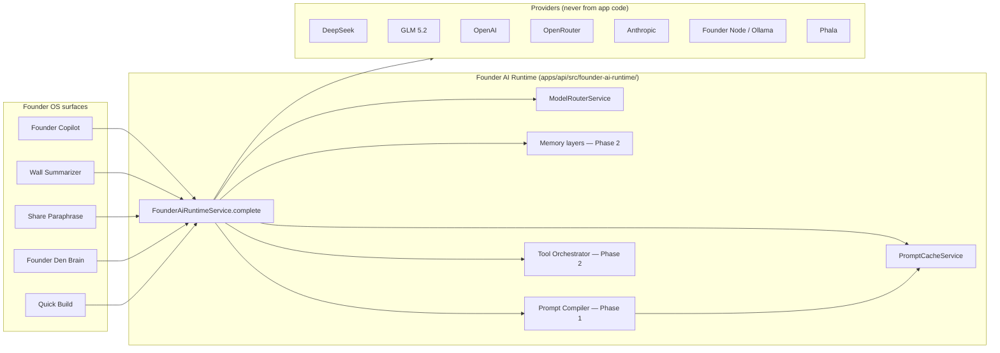

# Founder AI Runtime — Specification

**Status:** Phase 0 shipped (audit + prompt hash cache + pilot path)  
**Date:** 6 July 2026  
**Audience:** Engineering, product  
**Related:** [ARCHITECTURE-REVIEW-V2-RESPONSE.md](./ARCHITECTURE-REVIEW-V2-RESPONSE.md), [ENV-VARS.md](./ENV-VARS.md), [API-ABUSE-AUDIT.md](./API-ABUSE-AUDIT.md)

---

## 1. Vision

Founder OS is not “AI chat.” It is an **AI operating system** with a centralized runtime. Application code must **never call LLM providers directly** — all paths go through:

```
Founder Brain → AI Runtime → Router → Memory → Prompt Compiler → Cache → Providers
```

Phase 0 introduces the module skeleton, prompt hash cache, model routing metadata, and a **pilot integration** on Founder Copilot (`POST /copilot/ask`). Phase 1 makes the runtime **mandatory** for all sections.

---

## 2. Architecture



---

## 3. Seven cache layers

| # | Layer | Scope | Phase | Implementation |
|---|--------|--------|-------|----------------|
| 1 | **CDN / edge** | Static prompts, public docs, marketing | 2 | Vercel edge cache for public Founder OS help |
| 2 | **API / Redis** | Cross-instance prompt hash cache | 0→1 | `PromptCacheService` — in-memory LRU now; `REDIS_URL` backend Phase 1 |
| 3 | **Prompt / prefix** | System prompt + memory prefix hash | 0 ✓ | SHA-256(`section + userId + systemPrefix + normalizedUserPrompt`) |
| 4 | **KV / provider prefix** | Provider-native prefix cache (Anthropic/OpenAI) | 2 | Pass stable system blocks; log `cache_creation_input_tokens` |
| 5 | **Semantic** | Embedding similarity ≥ 0.95 → return cached answer | 2 | pgvector or Redis Stack; section-scoped |
| 6 | **Tool** | Deterministic tool results (deploy status, Railway health) | 2 | Short-circuit AI when tool cache fresh |
| 7 | **Memory** | Global → Workspace → Project → Conversation → Temporary | 2 | Diff-only workspace snapshots; graph prefix already partial via `FounderMemoryGraphService` |

**Phase 0 active:** layers 2–3 (in-process). **Target:** every Founder OS AI call checks layer 2 before any provider fetch.

---

## 4. Model routing

| Intent | Signals | Provider (default) | Model env | Tier |
|--------|---------|-------------------|-----------|------|
| Simple Q&A | Short prompt, status/hello | DeepSeek | `AI_RUNTIME_FAST_MODEL` | fast |
| Reasoning | why/explain/regulatory/architecture | DeepSeek | `AI_RUNTIME_REASONING_MODEL` | reasoning |
| Code | code_draft task, implement/refactor | GLM | `AI_RUNTIME_CODE_MODEL` | code |
| Summarize | `wall_summarizer` section | GLM | `AI_RUNTIME_FAST_MODEL` | fast |
| Social draft | share_paraphrase, founder_draft | DeepSeek | `AI_RUNTIME_FAST_MODEL` | fast |
| Unknown | default copilot | DeepSeek | `AI_RUNTIME_FAST_MODEL` | fast |

Routing is **advisory in Phase 0** (logged + stored on cache entries). Phase 1 enforces route before provider call.

---

## 5. AI call path audit (6 Jul 2026)

Audit scope: `apps/api/src/**` — all LLM provider touchpoints.

| Feature | File | Calls provider directly? | Has caching? |
|---------|------|--------------------------|--------------|
| Founder Copilot ask (sync) | `events/founder-copilot.service.ts` → `builder.service.ts` | Yes — `fetch()` to OpenAI/DeepSeek/GLM/Anthropic/OpenRouter; Phala/Jatevo clients | **Phase 0:** prompt hash via `FounderAiRuntimeService` when `AI_RUNTIME_ENABLED=true` |
| Founder Copilot ask (stream) | `founder-copilot.service.ts` → `tryCopilotChatCompletionStream` | Yes — same direct fetches | No (streaming bypasses cache) |
| Copilot social draft | `founder-copilot.service.ts` | Via `tryCopilotChatCompletion` | Same as copilot ask |
| Quick Build | `builder.service.ts` | Yes — cascade + `AiInvokerService` optional | No |
| Founder draft / updates | `builder.service.ts` | Yes | No |
| Founder Den — ask brain | `founder-den.service.ts` → `tryAiCompletion` | Yes — full cascade | No |
| Share paraphrase | `share/share.service.ts` | Via `AiInvokerService.invoke` → `fetch` | No |
| Wall Chat Summarizer | `wall/wall.service.ts` | Via `AiInvokerService.invoke` | DB caches **output** in `ProjectWallSummary` (subscription window), not prompt hash |
| AI Routing admin test | `ai-routing/ai-invoker.service.ts` | Yes — generic `fetch` | No |
| Builder BYOK verify | `builder.service.ts` | Yes — ping endpoints | No |
| Phala connect | `builder/phala.client.ts` | Yes | No |
| Jatevo | `builder/jatevo.client.ts` | Yes | No |
| Surplus client | `builder/surplus.client.ts` | Yes | No |
| Founder Node Ollama | `founder-node-inference.service.ts` | Node local (not cloud LLM) | Job queue only |
| Showcase BTC bot inference | External (`services/btc-conservative-agent/`) | DeepSeek on bot host | Bot-side only; usage reported to API |

### Audit summary

| Metric | Count |
|--------|-------|
| Distinct AI features (API) | 14 |
| Paths with direct provider `fetch` | 12 (~86%) |
| Paths with any response cache today | 2 (~14%) — Wall summarizer DB cache + Copilot Phase 0 when enabled |
| **% bypassing unified runtime cache today (default `AI_RUNTIME_ENABLED` unset)** | **~100%** |
| **% bypassing after Phase 0 pilot (Copilot non-stream only, flag on)** | **~93%** (1 of 14 features) |

---

## 6. Migration plan

### Phase 0 — Audit + Redis prompt hash cache ✓ (this PR)

- [x] Audit table (above)
- [x] `apps/api/src/founder-ai-runtime/` module skeleton
- [x] In-memory LRU prompt cache (`PromptCacheService`)
- [x] `ModelRouterService` intent classification
- [x] Pilot: `BuilderService.tryCopilotChatCompletion` cache read/write when `AI_RUNTIME_ENABLED=true`
- [x] Feature flag — runtime off by default; existing copilot unchanged

### Phase 1 — Mandatory gateway

- [ ] `FounderAiRuntimeService.complete()` wraps **all** sections; remove direct `fetch` from `builder.service.ts`
- [ ] Redis backend when `REDIS_URL` set (shared cache across Railway instances)
- [ ] Prompt compiler: templates + variables from `config/founder-ai/`
- [ ] Cost optimizer + provider failover inside runtime
- [ ] Deprecate duplicate paths in `AiInvokerService` — invoker becomes runtime adapter

### Phase 2 — Semantic cache + workspace diff context

- [ ] Embedding index per workspace; 0.95 similarity threshold
- [ ] Workspace snapshots: git diff summary only (not full repo) injected by compiler
- [ ] Tool orchestrator: Railway deploy checks without LLM when cached

### Phase 3 — Local Founder Node through same runtime

- [ ] Route `OLLAMA_LOCAL` via runtime with `billingSource=founder_os_local`
- [ ] Unified telemetry across cloud + node

---

## 7. Cost metrics / telemetry

Runtime emits (Phase 1 — Prisma `AiRuntimeMetric` or extend `AiTokenUsageLog`):

| Field | Purpose |
|-------|---------|
| `cacheHit` | Prompt hash hit rate |
| `intent` | Router classification |
| `section` | copilot / wall_summarizer / … |
| `billingSource` | platform_brain / byok / platform_routed |
| `promptTokens` / `completionTokens` | Cost |
| `estimatedUsd` | Optional list-price estimate |

**Dashboards:** Admin Control → AI Routing + adoption chart (`platform-adoption.service.ts`).

**Alerts:** Spike in `cacheHit=false` + `billingSource=platform_brain` → possible abuse (see `RATE_LIMIT_FAIL_OPEN`).

---

## 8. Founder Credits replenishment on graduation

Free Founder Credits (GLM promo, platform DeepSeek brain, DDollar AI spends) replenish on **Founder Graduation** — not on calendar rollover alone:

1. **Graduation event** (`FounderGraduationEvent`, Phase 2) fires when Proof Raise snapshot + compliance gates pass.
2. **Credit grant job** reads `User.builderTier` + graduation payload; applies tier-based refill:
   - **Parasite → Builder:** restore monthly copilot quota
   - **Graduated founder:** one-time **Founder OS AI bundle** (configurable via admin PlatformSettings)
3. **Promo keys:** `FounderPromoService` checks graduation flag before extending GLM 90-day window
4. **Audit:** `PointLedger` entry `GRADUATION_AI_CREDIT_REFILL` + `AiTokenUsageLog.billingSource=graduation_grant`

Credits are **platform scrip** (DDollar + promo tokens), not securities. Copy: “Replenished when your project graduates — ship in public.”

---

## 9. Module reference

```
apps/api/src/founder-ai-runtime/
  founder-ai-runtime.module.ts      # @Global() NestJS module
  founder-ai-runtime.service.ts     # complete(), tryCacheHit(), recordResponse()
  founder-ai-runtime.types.ts       # AiRuntimeRequest / AiRuntimeResponse
  prompt-cache.service.ts           # SHA-256 LRU (Redis adapter Phase 1)
  model-router.service.ts           # Intent → model tier
```

**Entry point:**

```typescript
const result = await founderAiRuntime.complete(request, async (route) => {
  // Phase 1: single provider delegate — no fetch in callers
  return aiInvoker.invoke({ section: request.section, ... });
});
```

---

## 10. Environment variables

See [ENV-VARS.md](./ENV-VARS.md) — `AI_RUNTIME_ENABLED`, `AI_PROMPT_CACHE_TTL_SEC`, `AI_PROMPT_CACHE_MAX_ENTRIES`, `AI_RUNTIME_FAST_MODEL`, `AI_RUNTIME_REASONING_MODEL`, `AI_RUNTIME_CODE_MODEL`, `REDIS_URL` (Phase 1).

---

*Product engineering context only. No API keys in this document.*
