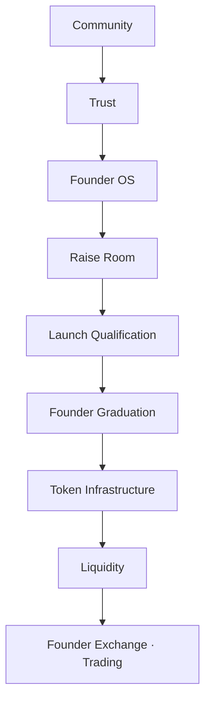
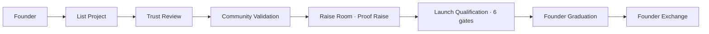

# Founder Graduation — Master Build Plan

**Status:** Active · July 2026  
**Audience:** Engineering + product  
**Sources merged:** [RAISE-ROOM-VALIDATION-VISION-SPEC.md](./RAISE-ROOM-VALIDATION-VISION-SPEC.md), [TOKEN-LAUNCH-TRADING-ECOSYSTEM-PROPOSAL.md](./TOKEN-LAUNCH-TRADING-ECOSYSTEM-PROPOSAL.md) (allocation buckets updated), ChatGPT trust-first architecture, [PLATFORM-ARCHITECTURE-AUDIT-ADDENDUM-V2.md](./PLATFORM-ARCHITECTURE-AUDIT-ADDENDUM-V2.md), **[ARCHITECTURE-REVIEW-V2-RESPONSE.md](./ARCHITECTURE-REVIEW-V2-RESPONSE.md)** (Architecture Review v2 — 15 recommendations)

> **Superseded sections:** Regulatory Engine timing (was Phase 2 only), phase roadmap (§10), sprint backlog RR-011–020, and layer stack — see **[ARCHITECTURE-REVIEW-V2-RESPONSE.md](./ARCHITECTURE-REVIEW-V2-RESPONSE.md)** for Phase 1.5 and full RR-001–020 mapping.

---

## 1. Vision summary

Doxxed Crypto is a **trust-first founder platform**. Community validation and Raise Room paper conviction precede **Founder Graduation** (formerly “token launch”). Graduated projects list on the **Founder Exchange** with trust metadata — not an anon DEX.

**Estimated shipped coverage:** ~38% of full vision (see RAISE-ROOM-VALIDATION-VISION-SPEC §1).

---

## 2. Inverted architecture

---

## 3. Mandatory launch pipeline

| Stage | User action | System outcome |
|-------|-------------|----------------|
| List Project | Submit listing application | `ListingApplication` → vote → `Project` |
| Trust Review | Community + admin | Investigations cleared, listing approved |
| Community Validation | Trust Center + Raise signals | Weighted community score |
| Raise Room | Paper conviction commits | `SimulatedRaise`, allocation registration |
| Launch Qualification | Pass all gates | `LaunchEligibility.allPassed = true` |
| Founder Graduation | Proof Raise snapshot | Scores shown; export for Phase 2 mint |
| Founder Exchange | Swap (Phase 3) | Jupiter + tier fee; trust metadata |

---

## 4. Project Maturity enum

| Maturity | Entry criteria | Exit / next |
|----------|----------------|-------------|
| **IDEA** | Listing approved | First build post or prototype |
| **BUILDING** | Build activity in Founder OS | Trust validation started |
| **VALIDATED** | Trust Center weighted score > 0 | ≥ 10 project followers |
| **COMMUNITY** | Followers + scout engagement | Launch gates in progress |
| **READY** | All 6 launch gates passed | Founder opens Proof Raise |
| **LAUNCHING** | Active `SimulatedRaise` | Snapshot + graduation event |
| **TRADING** | Graduated + live pair | Sustained volume / growth signals |
| **GROWING** | Post-graduation traction | — |

**Code:** `packages/utils/src/project-maturity.ts`, `apps/web/src/components/project-maturity-badge.tsx`

**Legacy mapping:** `ProjectLifecycleStage` (Prisma) until migration — see `mapLifecycleToMaturity()`.

---

## 5. Founder Score (composite at graduation)

| Component | Weight (Launch Score v1) | Source |
|-----------|--------------------------|--------|
| Builder | Part of composite | `builder-score.service`, GitHub, commits |
| Trust | 15% community trust | Trust Center weighted yes% |
| Community | Validation signals | Raise Room + Trust Center |
| Scout | Early scout + success rate | `EarlyScoutRecord`, `ScoutProfile` (Phase 2) |
| Build | Transparency | Videos, build posts (Startup Genome) |
| Delivery | Launch readiness | `computeLaunchReadiness`, milestones |

**Display:** Unlock screen at Founder Graduation shows all six + overall 0–100.

---

## 6. Community allocation buckets (ChatGPT weights)

Founder selects tier (Bronze 0% / Silver 5% / Gold 10% community allocation). **Within** that pool:

| Bucket | Weight | Earn actions |
|--------|--------|--------------|
| Validators | 25% | Trust Center reviews, Raise validation signals |
| Scouts | 20% | Early discovery, scout accuracy |
| Builders | 20% | `builderScore`, verified builder badge |
| Early Followers | 15% | Follow before follower threshold |
| Paper Raise | 10% | Paper conviction commits (effectivePaper) |
| Bug Hunters | 10% | Bounty / quality reports (Phase 2) |

**Rejected:** Equal split among all active users (TOKEN-LAUNCH-TRADING-ECOSYSTEM-PROPOSAL §4).

---

## 7. Launch Qualification gates

| ID | Gate | Threshold | Data source |
|----|------|-----------|-------------|
| G1 | Min followers | ≥ 25 | `ProjectFollow` count |
| G2 | Paper conviction | ≥ $10,000 | `RaiseAllocation` sum |
| G3 | Community score | ≥ 70% weighted | `ValidationSignal` + Trust Center |
| G4 | AI pass | No ACTIVE investigation | Trust Center |
| G5 | Identity verified | X linked OR email + wallet | `User`, `WalletConnection` |
| G6 | Founder Launch Score | ≥ 65 | `FounderLaunchScore.overall` |

**UX:** Progress bar on project + Founder OS; **Open Proof Raise** disabled until all pass.

---

## 8. Regulatory Engine (Phase 1.5 MVP · Phase 2 full)

> Full spec, feature matrix, and Jurisdiction Engine timing: [ARCHITECTURE-REVIEW-V2-RESPONSE.md §B #1, #12](./ARCHITECTURE-REVIEW-V2-RESPONSE.md).

### Questionnaire fields (v1 draft)

| Field | Type | Purpose |
|-------|------|---------|
| `projectPurpose` | textarea | Plain-language description |
| `tokenNecessary` | boolean + rationale | Utility vs. optional |
| `revenueModel` | enum | None / Fees / Subscription / Other |
| `governanceIntent` | boolean | Voting rights planned |
| `capitalIntent` | boolean | Seeking investment |
| `investorGeography` | multi-select | AU / US / EU / Global |
| `existingSecurities` | boolean | Prior raises or registrations |
| `founderIdentityVerified` | read-only | From profile |

### Classification outcomes

| Class | Description | Feature gating |
|-------|-------------|----------------|
| **Community Project** | No token required | Paper + DDollar only; no mint UI |
| **Utility Token** | Product utility | Metadata + Phase 3 swap; no raise vault |
| **Governance Token** | Voting / DAO | Enhanced disclosure copy |
| **Capital Raise** | Investment intent | Block raise UI; **consult AU counsel** CTA only |
| **Restricted** | High risk / incomplete | Admin review; block graduation |

### Feature matrix

| Feature | Community | Utility | Governance | Capital Raise | Restricted |
|---------|-----------|---------|------------|---------------|------------|
| Raise Room paper | ✓ | ✓ | ✓ | ✓ (sim only) | ✓ |
| Proof Raise open | ✓ | ✓ | ✓ | ✗ until counsel | ✗ |
| Token metadata | ✗ | ✓ | ✓ | counsel | ✗ |
| Founder Exchange | ✗ | ✓ post-grad | ✓ post-grad | counsel | ✗ |
| Real SOL raise | ✗ | ✗ | ✗ | Phase 4 + counsel | ✗ |

---

## 9. DDollar — Proof of Contribution

| Earn | Spend (simulation) |
|------|---------------------|
| Trust Center helpful reviews | Raise Room escrow (Phase 2) |
| Scout accuracy, early discovery | Agent marketplace |
| Build posts, bounties | Founder bounties |
| Validation signals | — |

Copy: DDollar has **no cash value**; Proof of Contribution ≠ deposit.

---

## 10. Phase roadmap

> **Authoritative roadmap:** [ARCHITECTURE-REVIEW-V2-RESPONSE.md §Part D](./ARCHITECTURE-REVIEW-V2-RESPONSE.md). Summary:

| Phase | Weeks | Layer | Deliverables |
|-------|-------|-------|--------------|
| **1** | 1–4 | Community / paper | RR-001–007, maturity badge, partial gates *(current)* |
| **1.5** | 4–6 | Regulatory + LQ score | RR-011–015: Regulatory MVP, Launch Qualification Score, Anti-Sybil wire, Compliance Timeline, Progressive Unlock |
| **2** | 6–12 | Reputation + graduation | RR-008–010, RR-016–020: reputation split, Contribution Weighting, Graduation event, AU Compliance Dashboard |
| **3** | 12–18 | Token metadata | Vesting schema, Merkle export, Tokenomics Advisor |
| **4** | 18–24 | Exchange + health | Founder Exchange (Jupiter), Ecosystem Health Engine |
| **5** | Counsel | Jurisdiction + capital | Jurisdiction Engine (AU/SG/UAE/UK/EU/US), real raise vault — **AU counsel required** |

---

## 11. Sprint backlog RR-001 – RR-020

> RR-011–020 defined in [ARCHITECTURE-REVIEW-V2-RESPONSE.md §Part E](./ARCHITECTURE-REVIEW-V2-RESPONSE.md). RR-001–010 below retained for Phase 1 reference.

### RR-001 · Proof Raise / Founder Graduation rebrand

**Scope:** Remove ICO / launchpad / token launch copy from Raise Room surfaces and related API error strings.

**Files:** `raise-room-panel.tsx`, `raise-room/page.tsx`, `project-room.tsx`, `founder-den/page.client.tsx`, `founder-den.service.ts`

**Acceptance criteria:**
- [ ] Zero user-visible “ICO” on `/raise-room`, project Raise tab, founder raise success messages
- [ ] Copy uses Proof Raise, allocation registration, Founder Graduation where appropriate
- [ ] API errors say “Proof Raise slots” not “ICO slots”

**Status:** In progress (Phase 1 start)

---

### RR-002 · Founder Launch Score (read path)

**Scope:** Compute 6-component score; expose API; show on project header + heatmap cards.

**Files:** New `packages/utils/src/founder-launch-score.ts`, `apps/api/src/raise-room/founder-launch-score.service.ts`

**Acceptance criteria:**
- [ ] `GET /projects/:slug/founder-launch-score` returns 0–100 + breakdown
- [ ] Project page and `/raise-room` cards display score
- [ ] Nightly recompute on material events

---

### RR-003 · Validation signals on Raise tab

**Scope:** Five weighted buttons + community score %.

**Acceptance criteria:**
- [ ] Persisted `ValidationSignal` per user/type
- [ ] `computeTrustWeight` applied at write
- [ ] Community score % visible on Raise tab

---

### RR-004 · Conviction score + trending cards

**Scope:** Sort heatmap by conviction; show tier badge placeholder, countdown, community %.

**Acceptance criteria:**
- [ ] `computeConvictionScore` matches spec formula
- [ ] `/raise-room` sorted conviction DESC
- [ ] Cards show conviction, paper $, follower count

---

### RR-005 · Launch eligibility bar

**Scope:** Six gates + founder UI; disable Proof Raise until `allPassed`.

**Acceptance criteria:**
- [ ] `LaunchEligibility` model (or extended `computeLaunchpadRequirements`)
- [ ] Progress UI on project + Founder OS
- [ ] `createSimulatedRaise` rejects if gates incomplete (founder-facing message)

---

### RR-006 · ProjectMaturity badge

**Scope:** Enum + badge component; display on Raise Room where available.

**Acceptance criteria:**
- [ ] `PROJECT_MATURITY_STAGES` in `@dcf/utils`
- [ ] `ProjectMaturityBadge` on `/raise-room` heatmap rows (when lifecycle known)
- [ ] Mapping from legacy lifecycle documented

**Status:** Shipped (enum + badge component)

---

### RR-007 · DDollar Proof of Contribution copy

**Scope:** `/ddollar`, Raise Room footers, reputation page.

**Acceptance criteria:**
- [ ] Earn paths listed (reviews, scouts, building, validation)
- [ ] No “deposit” or “escrow of real money” language in Phase 1

---

### RR-008 · Regulatory Engine v1

**Scope:** Questionnaire UI, classification job, feature flags on project.

**Acceptance criteria:**
- [ ] Founder completes questionnaire before Proof Raise (Phase 2)
- [ ] Capital Raise → block + counsel CTA
- [ ] Admin override audit logged

---

### RR-009 · Founder Points ledger + bucket export

**Scope:** Prisma `FounderPointsLedger`; export CSV with bucket + points + share %.

**Acceptance criteria:**
- [ ] Bucket weights 25/20/20/15/10/10 enforced at snapshot
- [ ] Export matches spec formulas

---

### RR-010 · Community allocation tier (Bronze / Silver / Gold)

**Scope:** Founder selects tier at Proof Raise open; stored on project/raise.

**Acceptance criteria:**
- [ ] 0% / 5% / 10% community + platform fee bps documented
- [ ] Immutable after raise opens
- [ ] Tier badge on heatmap cards

---

## 12. Australian framing checklist

| Use | Avoid |
|-----|-------|
| Allocation registration | ICO, presale, investment |
| Paper conviction / simulated | Guaranteed allocation |
| Founder Graduation | Token sale |
| Proof of Contribution | Deposit |
| Consult AU counsel (Capital Raise) | Platform legal advice |

---

## 13. Explicit non-goals (Phase 1–3)

- Solana contracts, custodial mint, user fund custody  
- Real capital raises without counsel sign-off  
- Equal airdrops  
- Pump.fun positioning  

---

## Changelog

| Date | Change |
|------|--------|
| July 2026 | Master plan — merges ChatGPT refinements + RR-001–010 backlog |
| 6 Jul 2026 | Architecture Review v2 — Phase 1.5, RR-011–020; superseded sections point to ARCHITECTURE-REVIEW-V2-RESPONSE.md |
