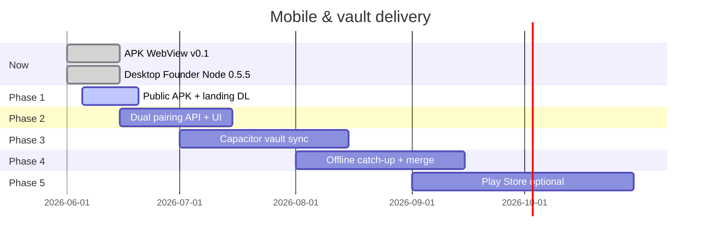

# Mobile app & vault sync — roadmap

**Status (June 2026):** Android **v0.4.0** ships on-device vault + **Phase 4 bidirectional merge** (LWW patches for goals/tasks/roadmap; desktop pull jobs + mobile auto-pull). Encrypted blobs remain per-device; merge patches sync cross-device without sharing keys.

**Privacy context:** [PRIVACY.md](../PRIVACY.md) · **Current APK scope:** [MOBILE_APP.md](./MOBILE_APP.md)

---

## What “vault in the APK” should mean

| Wrong expectation | Correct product design |
|-------------------|------------------------|
| One APK contains every founder’s private notes | **Never** — secrets are per account after login + pairing |
| APK replaces Founder Node on PC | **No** — PC stays primary for Ollama + heavy build |
| Vault = full GitHub codebase | **No** — code stays on **GitHub**; vault = goals, tasks, notes |
| WebView alone syncs `~/FounderVault/` | **Not today** — needs native sync module (below) |

**Goal:** Phone and PC hold the **same founder memory** (encrypted on servers; readable on **your** devices), with **separate pairing codes** per device.

---

## Phases (when to start each push)



---

## Phase 0 — **Now** (already live / maintain)

**You can use today without waiting for vault-in-APK.**

| Item | Action |
|------|--------|
| Website + API | Keep deploying `master` (Vercel + Railway) |
| Desktop vault | Ship [Founder Node 0.5.5](https://github.com/danishhaiderau-maker/doxed-founders-website/releases/latest) |
| Phone (light) | Install APK or browser — Copilot, GitHub, Cursor Cloud via API |
| Docs | [PRIVACY.md](../PRIVACY.md), [ARCHITECTURE.md](./ARCHITECTURE.md) |

**Start pushing:** bugfixes, privacy copy, Founder Node patches anytime.

**Do not promise** “full vault in APK” in marketing until Phase 3 ships.

---

## Phase 1 — **Public Android release** (start now if APK not on landing)

**Effort:** ~1–3 days · **Depends on:** stable production URL, signed or unsigned APK policy

### Steps

1. Bump `apps/mobile-android/package.json` version (e.g. `0.1.0` → `0.2.0`).
2. Build locally: `npm run pack:android` → copies APK to `apps/web/public/downloads/`.
3. Deploy web: `npm run deploy:web` so [doxxedcrypto.digital](https://doxxedcrypto.digital) serves the APK link.
4. Tag release: `git tag android-app-v0.2.0 && git push origin android-app-v0.2.0` → GitHub Actions builds release asset.
5. Smoke test on a real phone: login, Discover, Founder OS nav, Copilot, Settings.
6. Add landing line: “Android app — Discover, trading, Founder OS (vault sync coming).”

### What users get

- Same as mobile web, app icon, `?app=android` nav.
- **No** local vault files yet; cloud + GitHub context only.

**When to push:** **Immediately** after Phase 1 checklist passes — no blocker from vault work.

---

## Phase 2 — **Dual device pairing** (start after Phase 1 tag)

**Effort:** ~1–2 weeks · **Blocks:** mobile vault sync

### API / product

1. Settings UI: **Generate pairing code — Desktop** / **Generate pairing code — Mobile**.
2. Pair creates `FounderNode` with `platform: windows | darwin | linux | android`.
3. Website device list: show online/offline per node; **Revoke** per device.
4. Attestation copy: “Mobile node not paired” vs “Desktop offline — using last relay”.

### Security

- Separate `nodeId` + token per device → one compromise ≠ both.
- Document in [PRIVACY.md](../PRIVACY.md).

**When to push:** API + web first; desktop Founder Node can ignore until Phase 3.

---

## Phase 3 — **Vault inside Capacitor** (core “founder notes anywhere”)

**Effort:** ~3–6 weeks · **This is when vault-in-phone becomes real**

### Engineering

1. Add Capacitor plugin or native module: app-private storage `FounderVault/`.
2. Reuse `@dcf/founder-vault` (same files as PC): `project-context.md`, `tasks.json`, etc.
3. Ship **empty template** on first launch — not other users’ data.
4. After **mobile pairing code**: download encrypted relay from API → decrypt with mobile node token.
5. Background sync: heartbeat + `POST /founder-node/sync` (mirror desktop `runSyncCycle`).
6. `watchPatterns` / deploy: mobile app releases on `apps/mobile-android/**` + `packages/founder-vault/**`.

### APK change

- **Not** “bake notes into APK binary.”
- **Yes** “APK includes vault **engine** + sync; **your** notes after login.”

### Website

- Banner: PC offline → “Using mobile vault · last sync …”
- Copilot: prefer online node for `PUSH_GOAL` / `VAULT_SEARCH`.

**When to push:** Tag `android-app-v0.3.0` only after sync works PC ↔ phone on staging.

---

## Phase 4 — **Offline catch-up** (shipped)

**Live:** `vaultSyncVersion` + `mergePatch` on relay; `GET /founder-node/vault-sync/plan`; desktop `PULL_VAULT_MERGE` jobs; mobile auto-pull every sync cycle; optional `vaultPrimaryPlatform` on builder settings.

1. Per-device relay version + plaintext LWW merge patch (not full decrypt across devices).
2. PC wakes → sync jobs + plan pull apply mobile changes to `~/FounderVault/`.
3. Phone pulls desktop patch when relay version is newer (ack per peer).
4. Tie-break: file `mtime` in manifest; optional primary device `desktop` | `mobile`.
5. Desktop tray notification when merges apply after wake.

**Tag:** `android-app-v0.4.0` + Founder Node build with `vault-sync-pull`.

---

## Phase 5 — **Distribution polish** (optional)

| Step | When |
|------|------|
| Google Play internal testing | After Phase 3 stable 2+ weeks |
| Play App Signing + privacy policy URL | Link [PRIVACY.md](https://github.com/danishhaiderau-maker/doxed-founders-website/blob/master/PRIVACY.md) |
| iOS (Capacitor iOS) | Separate track if demand |

---

## Decision: when to start which update

| If you want… | Start | Ship tag |
|--------------|-------|----------|
| Phone app in founders’ hands **now** | **Phase 1** | `android-app-v0.2.0` |
| Honest **two-device security** | **Phase 2** | API deploy, no APK required |
| **Founder notes on phone** matching PC | **Phase 3** | `android-app-v0.3.0+` |
| PC offline / phone edits / PC catches up | **Phase 4** | API + both apps |
| App Store scale | **Phase 5** | Play Console |

**Recommended order:** **1 → 2 → 3 → 4** (do not skip 2 before 3).

---

## What works on phone **before** Phase 3

| Feature | Phone today |
|---------|-------------|
| Discover, feed, trading, agents | Yes (APK / web) |
| Copilot with cloud LLM / Phala | Yes (keys on API) |
| Cursor Cloud on GitHub repo | Yes (no local repo on phone) |
| Full `~/FounderVault/` files on device | **No** — PC Founder Node only |
| Ollama local | **No** — PC only |

---

## Commands reference

```bash
# Build APK
npm run pack:android

# Release APK (GitHub)
git tag android-app-v0.2.0
git push origin android-app-v0.2.0

# Desktop Founder Node release
git tag founder-node-v0.5.6
git push origin founder-node-v0.5.6
```

---

## Marketing one-liner (until Phase 3)

> **Android app:** trade, discover, and run Founder OS in your pocket. **Desktop Founder Node** holds your private vault today; **mobile vault sync** is rolling out next — encrypted on our servers, readable only on your devices.

After Phase 3:

> **Same founder vault on PC and phone** — separate device pairing, encrypted sync, Phala or Ollama for confidential AI.
