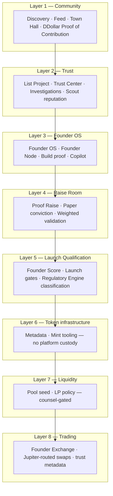
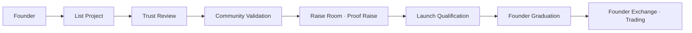

# Platform Architecture Audit — Addendum V2 (Trust-First Stack)

**Date:** July 2026  
**Supersedes (partially):** Launch-first framing in `PLATFORM-ARCHITECTURE-AUDIT.md` §Raise Room & Launch, §Trust Center lifecycle  
**Related:** [FOUNDER-GRADUATION-BUILD-PLAN.md](./FOUNDER-GRADUATION-BUILD-PLAN.md), [CHATGPT-CONSULTATION-BRIEF.md](./CHATGPT-CONSULTATION-BRIEF.md)

---

## Inverted stack — trust before launch

The platform is **not** launch-first. Founders earn eligibility through community and trust signals before any token infrastructure or trading.

**Old mental model (rejected):** Token launch → trading → community as afterthought.  
**New mental model:** Community validates → trust accrues → founders build → Raise Room proves demand → **Founder Graduation** unlocks → exchange lists **graduated** projects only.

---

## Mandatory launch pipeline

Nobody launches immediately. Every project follows:

| Step | Platform surface | Outcome |
|------|------------------|---------|
| List Project | `/list-your-project` | Curated listing application |
| Trust Review | Admin + community vote | `Project` record, investigations cleared |
| Community Validation | Trust Center + Raise Room signals | Weighted validator score |
| Raise Room | `/raise-room`, project tab | Paper conviction + allocation registration |
| Launch Qualification | Founder OS eligibility bar | All gates passed (see build plan) |
| Founder Graduation | Proof Raise snapshot | Achievement unlock — scores visible |
| Trading | Founder Exchange (Phase 3+) | Graduated projects only |

---

## Project Maturity (vision enum)

Product-facing stages (mapped from legacy `ProjectLifecycleStage` until migration):

| Stage | Meaning |
|-------|---------|
| **IDEA** | Listed concept |
| **BUILDING** | Prototype / MVP / beta in public |
| **VALIDATED** | Trust Center + weighted reviews |
| **COMMUNITY** | Scouts, followers, demand signals |
| **READY** | Launch qualification gates passed |
| **LAUNCHING** | Proof Raise / Founder Graduation window |
| **TRADING** | Live on Founder Exchange |
| **GROWING** | Post-graduation traction |

Implementation: `packages/utils/src/project-maturity.ts`, `ProjectMaturityBadge` component.

---

## Terminology updates

| Old | New |
|-----|-----|
| Token Launch | **Founder Graduation** (achievement, not button) |
| ICO / ICO slot | **Proof Raise** / allocation registration slot |
| Doxxed DEX | **Founder Exchange** (graduated projects + trust metadata) |
| DDollar spend-only | **Proof of Contribution** (earn via reviews, scouts, building, validation) |
| Launchpad | **Launch Qualification** path |
| Pump.fun competitor | **Product Hunt · GitHub · AngelList · Kickstarter · YC** positioning |

---

## Community allocation buckets (ChatGPT weights)

Within founder-selected community allocation (0% / 5% / 10% tier), distribution uses **weighted buckets** — not equal airdrops:

| Bucket | Weight |
|--------|--------|
| Validators | 25% |
| Scouts | 20% |
| Builders | 20% |
| Early Followers | 15% |
| Paper Raise (conviction) | 10% |
| Bug Hunters | 10% |

Supersedes equal-split language in `TOKEN-LAUNCH-TRADING-ECOSYSTEM-PROPOSAL.md` §4 for Raise Room policy.

---

## Founder Score (composite)

Displayed at Founder Graduation unlock:

- Builder score  
- Trust score  
- Community score  
- Scout score  
- Build score (shipping proof)  
- Delivery score (milestones, launch readiness)

Distinct from `Founder.reputationScore` and `Project.launchReadiness` alone.

---

## Regulatory Engine (product layer)

Questionnaire classifies each project:

| Class | Typical gating |
|-------|----------------|
| Community Project | Paper + DDollar only; no capital raise UI |
| Utility Token | Metadata + swap; no raise vault |
| Governance Token | Voting copy + enhanced disclosure |
| Capital Raise | **Consult AU counsel** — CSF/AFSL path; geo/KYC Phase 4 |
| Restricted | Block launch features; admin review |

**Australian legal separation (engineering framing, not legal advice):**

- **Company (Doxxed Crypto Pty Ltd):** community software, validation, paper simulation  
- **Blockchain:** settlement layer for user-initiated transactions  
- **Users:** self-custody wallets; platform does not hold user funds in Phase 1–3  

---

## What stays unchanged from original audit

- Hybrid architecture (Neon, Railway, Vercel, Founder Node)  
- DDollar as off-chain credits today  
- Two-bot policy (`config/bot-architecture.lock.json`)  
- Paper trading and signal API disclaimers  
- No blunt sync from local lab bot  

---

## Coverage note

Vision implementation estimate remains **~38%** of full Raise Room × Founder Graduation spec (see `RAISE-ROOM-VALIDATION-VISION-SPEC.md`). Phase 1 in progress: Proof Raise rebrand, maturity badge, consultation docs.
