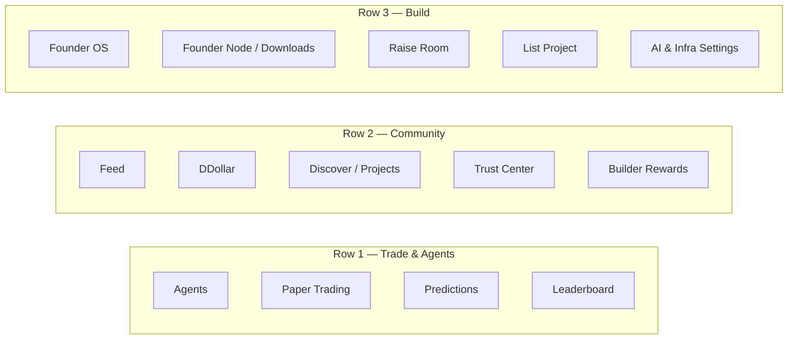
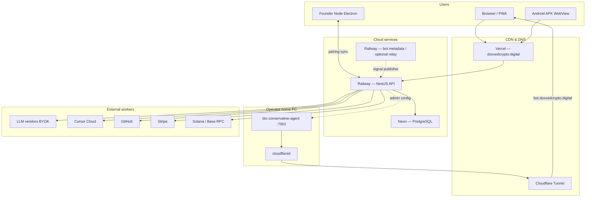

# Doxxed Crypto / Founder OS — Platform Architecture (External Audit Edition)

**Document purpose:** Sanitized architecture reference for external reviewers (e.g. ChatGPT, security consultants, product auditors).  
**Safe to share:** This document contains **no secrets**, API keys, database URLs, production tokens, or private vault contents.  
**Last updated:** July 2026  
**Production site:** https://doxxedcrypto.digital  
**Showcase trading bot (public):** https://bot.doxxedcrypto.digital  

**Related internal specs (names only — do not paste secret-bearing ops docs):**  
`ARCHITECTURE.md`, `AUDIT_FOR_CHATGPT.md`, `FOUNDER_OS_PRODUCT_SPECIFICATION.md`, `MISSION.md`, `RAISE-ROOM-P0-INSPIRED-PLAN.md`, `DDOLLAR-LAUNCH-ALLOCATION-PROPOSAL.md`, `TOKEN-LAUNCH-TRADING-ECOSYSTEM-PROPOSAL.md`, `API-ABUSE-AUDIT.md`, `SIGNAL_AGENT_SECURITY_AND_LEGAL.md`, `DATA_CLASSIFICATION.md`, `PRIVACY_STACK.md`, `bot-architecture.lock.json`

---

## Table of Contents

1. [Executive Summary](#1-executive-summary)
2. [Product Surface Map](#2-product-surface-map)
3. [User Personas & Journeys](#3-user-personas--journeys)
4. [Monorepo Structure](#4-monorepo-structure)
5. [Tech Stack](#5-tech-stack)
6. [Deployment Topology](#6-deployment-topology)
7. [Authentication & Identity](#7-authentication--identity)
8. [Economy — DDollar, Reputation, Builder Tiers](#8-economy--ddollar-reputation-builder-tiers)
9. [Founder OS](#9-founder-os)
10. [Raise Room & Launch Vision](#10-raise-room--launch-vision)
11. [Trust Center & List Project](#11-trust-center--list-project)
12. [Trading & Agents](#12-trading--agents)
13. [Rate Limiting & Abuse Protection](#13-rate-limiting--abuse-protection)
14. [Data Model Overview](#14-data-model-overview)
15. [API Architecture](#15-api-architecture)
16. [Bot Architecture Lock](#16-bot-architecture-lock)
17. [Mobile](#17-mobile)
18. [Regulatory Positioning (High Level)](#18-regulatory-positioning-high-level)
19. [What Is NOT in Scope / Greenfield](#19-what-is-not-in-scope--greenfield)
20. [Glossary](#20-glossary)
21. [Audit Checklist for External Reviewer](#21-audit-checklist-for-external-reviewer)

---

## 1. Executive Summary

### What the platform is

**Doxxed Crypto** (https://doxxedcrypto.digital) is a crypto-native founder and community platform. It combines:

- **Public discovery** — curated projects, founders, feed, scout markets, paper trading, leaderboards.
- **Trust layer** — List Project review, Trust Center investigations, community validation votes.
- **Founder OS** — a web-based operating system for founders: Copilot, build queue, GitHub/Vercel/Railway integrations, Cursor dispatch, publish pipeline.
- **Founder Node** — optional desktop app for local vault memory, encrypted cloud relay, and local Ollama inference.
- **Virtual economy** — DDollar (in-platform credits), reputation points, builder tiers, engagement rewards.
- **Raise Room** — simulated fundraising and planned DDollar whitelist flows for launch validation.
- **Trading agents** — paper trading desk, conservative BTC signal showcase (separate service), optional signal copy for subscribers.

The platform’s mission is to reverse the anonymity-heavy memecoin culture by surfacing **legitimate projects with public founders** — teams that document, ship, and stand behind their work. It is pro-accountability and pro-builder, not anti-speculation.

### Architectural stance

The system is **hybrid by design**:

| Layer | Role |
|-------|------|
| **Public product data** | Fast, shareable content on Neon Postgres (projects, feed, rankings). |
| **Private founder data** | Memory graph, sealed credentials, Founder Node encrypted relay. |
| **Control plane** | NestJS API on Railway orchestrates auth, economy, Copilot, integrations. |
| **Workers** | External services the founder connects: LLMs, Cursor Cloud, OpenHands, GitHub, Vercel, exchanges. |
| **Optional TEE path** | Phala / Redpill attestation and CVM workloads for hardware-backed privacy (operator-configured). |

Founder OS **orchestrates** tools; it does not replace every vendor. The product moat is **continuity** (resume work across desktop, browser, and mobile) and **trust signals** (doxxed founders, scout history, validation), not raw AI model access.

### Repository

Private GitHub monorepo (developer folder name: `doxedcryptofounder`). Application source, Prisma schema, docs, and service code live in git. **Production secrets live outside git** in a sibling secrets vault (never share with auditors).

### What this document is for

External reviewers should use this file plus optional code export (`npm run audit:export` → scrubbed tree) to assess architecture, security boundaries, product scope, and regulatory positioning — **without** receiving credentials or bypass instructions.

---

## 2. Product Surface Map

All routes below are on the public web app unless marked admin-only. Base URL: `https://doxxedcrypto.digital`.

### 2.1 Landing & auth

| Route | Purpose |
|-------|---------|
| `/` | Marketing landing, value proposition, entry to hub |
| `/login` | Sign in (Google, X/Twitter, credentials) |
| `/register` | Account registration |
| `/account` | Profile overview, messages, security, connected accounts, reputation, activity |
| `/notifications` | In-app notification center |
| `/privacy`, `/legal/privacy`, `/legal/terms` | Legal pages |
| `/rules` | Community rules |
| `/busted` | Scam / delist awareness page |

### 2.2 Discovery & projects

| Route | Purpose |
|-------|---------|
| `/discover` | Curated project discovery |
| `/projects` | Project directory |
| `/project/[slug]` | Project detail: metrics, founder, paper buyers, wall, raise panel |
| `/founders` | Founder directory |
| `/founder/[slug]` | Public founder profile |
| `/watchlist` | User watchlist (auth) |
| `/portfolio/[userId]` | Public paper-trading portfolio |

### 2.3 Community & economy

| Route | Purpose |
|-------|---------|
| `/feed` | Social / build activity feed |
| `/build-feed` | Build-focused feed variant |
| `/town-hall` | Community town hall posts |
| `/ddollar` | DDollar wallet, ledger, earn/spend overview |
| `/reputation` | Reputation graph and badges |
| `/leaderboard` | Rankings (daily/weekly/monthly/all-time) |
| `/builder-rewards` | Builder tier rewards program |
| `/airdrop` | Engagement / airdrop campaigns |
| `/scout-votes` | Scout validation voting |

### 2.4 Trust & listing

| Route | Purpose |
|-------|---------|
| `/trust-center` | Governance hub: investigations, validation |
| `/trust-center/investigations/[id]` | Investigation detail |
| `/list-your-project` | Listing application wizard |
| `/raise-room` | Raise Room heatmap, simulated raises, demand signals |

### 2.5 Trading & agents

| Route | Purpose |
|-------|---------|
| `/paper-trading` | Paper trading desk (virtual USD, DDollar-adjacent mechanics) |
| `/predict` | Prediction / scout markets |
| `/agent-hub` | Agent marketplace hub |
| `/agent-hub/[slug]` | Agent detail |
| `/agent-hub/[slug]/hire` | Hire isolated agent instance |
| `/agent-hub/[slug]/my-dashboard` | Subscriber dashboard |
| `/agents`, `/agents/[slug]` | Agent catalog aliases |
| `/docs/signal-api` | Signal API documentation (public spec) |

### 2.6 Founder OS & builder stack

| Route | Purpose |
|-------|---------|
| `/founder-den` | Founder OS command center (Copilot, queue, workspace) |
| `/downloads` | Downloads hub: Founder Node, Android APK, pairing guides |
| `/founder-node` | Redirect / anchor to Founder Node download section |
| `/settings/builder` | Integrations: downloads & pairing, AI providers, infrastructure, security |
| `/settings/integrations` | Integration shortcuts |
| `/settings/security` | Security settings (2FA, passkeys, wallet) |
| `/developers` | Developer / API orientation |

### 2.7 Mobile

| Route | Purpose |
|-------|---------|
| `/mobile` | Mobile install guide (Android APK, iOS PWA) |

### 2.8 Admin (role-gated)

| Route | Purpose |
|-------|---------|
| `/admin/control` | Platform admin: bot control, showcase keys, ops |
| `/admin/applications` | Listing application inbox |
| `/admin/platform` | Platform treasury, fee settings |
| `/admin/agent-registrations` | SAID / Spawn agent registry admin |

### 2.9 Well-known agent metadata

| Route | Purpose |
|-------|---------|
| `/.well-known/agent-card.json` | Public agent card (signal URLs only) |
| `/.well-known/agent.json` | ERC-8004 agent metadata |

### 2.10 Hub navigation model

The product groups features into three hub rows (see `hub-nav-config.ts`):



---

## 3. User Personas & Journeys

### 3.1 Retail scout / community member

**Goals:** Discover legitimate projects, validate scams, earn DDollar, paper trade, climb leaderboard.

**Typical journey:**

1. Land on `/discover` or `/projects`.
2. Read project page, check Trust Center validation history.
3. Add to `/watchlist`, vote in `/scout-votes` or Trust Center.
4. Paper trade on `/paper-trading`; portfolio visible at `/portfolio/[userId]`.
5. Earn DDollar via engagement (`/builder-rewards`, feed participation).
6. Optionally subscribe to trading agent signals via `/agent-hub`.

### 3.2 Founder / builder

**Goals:** Ship in public, earn reputation, use Founder OS to build and publish, list project, run Raise Room validation.

**Typical journey:**

1. Register → connect X (verification unlocks builder tier benefits).
2. Open `/founder-den` — Copilot, CEO inbox queue, build tab.
3. Install Founder Node from `/downloads`; pair device; optional local Ollama.
4. Configure AI (BYOK) and infra (GitHub, Vercel, Railway) at `/settings/builder?tab=ai` and `?tab=infra`.
5. Submit `/list-your-project` → admin/community review.
6. After approval: project page, founder updates, `/raise-room` simulated raise.
7. Future: DDollar whitelist commit for token launch (planned — see Raise Room specs).

**Builder tier gate:** New signups default to **PARASITE** tier (limited free AI promo). **VERIFIED_BUILDER** requires X verification plus GitHub or Cursor connection and recent commit activity.

### 3.3 Trader (paper + signals)

**Goals:** Practice conviction publicly, follow showcase BTC agent, optionally copy signals.

**Typical journey:**

1. `/paper-trading` — virtual portfolio, limit orders, leaderboard linkage.
2. `/agent-hub` — view conservative BTC showcase dashboard (sanitized public view).
3. Hire isolated agent instance (DDollar fee) or subscribe to signal API (API key + success fee model).
4. `/predict` — conviction markets where enabled.

**Important:** Live exchange execution is subscriber-side; platform provides signals and paper simulation, not custodial trading for retail.

### 3.4 Admin / operator

**Goals:** Curate listings, run investigations, control showcase bot, manage agent registrations, platform treasury.

**Typical journey:**

1. Admin role on `User.role = ADMIN` (plus optional 2FA / passkey / WebAuthn).
2. `/admin/applications` — approve/reject listings.
3. `/admin/control` — showcase bot pause/start, credential push to Railway (not in git).
4. `/admin/agent-registrations` — SAID / Spawn on-chain agent identity.
5. `/admin/platform` — fee treasury configuration.

**Audit note:** Admin routes are JWT-guarded and role-checked. Reviewers should verify guards in `apps/api/src/admin-control/` without requesting bypass tokens.

### 3.5 Agent subscriber / developer

**Goals:** Consume ENSE signal cycles, integrate via API, pay success fees on profitable exits.

**Typical journey:**

1. Read `/docs/signal-api`.
2. Obtain API key through authenticated flow (stored hashed in `SignalApiKey`).
3. Poll mandate / intent endpoints; post ORDER_PLACED, FILLED, EXIT lifecycle events.
4. Settlement: DDollar debit first, else USDC to admin treasury with tx proof.

---

## 4. Monorepo Structure

```
doxedcryptofounder/                 # Private GitHub monorepo root
├── apps/
│   ├── web/                        # Next.js 15 frontend → Vercel
│   ├── api/                        # NestJS 11 backend → Railway
│   ├── founder-node/               # Electron desktop vault client
│   └── mobile-android/             # Capacitor Android shell
├── packages/
│   ├── utils/                      # Shared logic: brain router, queue, DDollar, data class
│   ├── ui/                         # Shared React components
│   ├── types/                      # Shared TypeScript types
│   ├── config/                     # Shared config
│   └── founder-vault/              # Vault crypto / sync helpers
├── prisma/
│   └── schema.prisma               # Single Postgres schema (Neon)
├── services/
│   └── btc-conservative-agent/     # Python showcase bot (home PC + public URL)
├── workers/
│   └── phala-cvm-workload/         # Optional Phala CVM workloads
├── docs/                           # Specs, deploy guides, this file
├── config/
│   └── bot-architecture.lock.json  # Bot sync policy (no blunt sync)
└── scripts/                        # Ops scripts (excluded from audit export)
```

### Package roles

| Path | Deploy target | Description |
|------|---------------|-------------|
| `apps/web` | Vercel | Public UI, NextAuth, Founder OS browser experience |
| `apps/api` | Railway | REST API, webhooks, Copilot, economy, auth |
| `apps/founder-node` | GitHub releases | Desktop tray app, local `~/FounderVault/` |
| `apps/mobile-android` | APK sideload / future Play | Capacitor WebView → production web URL |
| `services/btc-conservative-agent` | Home PC + Cloudflare tunnel | Showcase bot at `:7002`, public bot domain |
| `packages/*` | npm workspaces | Shared libraries consumed by apps |

### Secrets boundary (not in git)

Production credentials live in a **sibling secrets vault** outside the repo (referenced by ops scripts). Developers use `npm run secrets:link` locally. **Never paste vault contents into audit materials.**

---

## 5. Tech Stack

| Layer | Technology | Notes |
|-------|------------|-------|
| **Frontend** | Next.js 15, React 19, Tailwind CSS 4, TanStack Query, Zustand, Framer Motion | App Router under `apps/web/src/app/` |
| **Auth (web)** | NextAuth 4 | Google, Twitter/X, credentials; syncs to API JWT |
| **Backend** | NestJS 11, Express, class-validator | Modular controllers per domain |
| **Database** | PostgreSQL via Neon, Prisma 6 | Single `schema.prisma` |
| **Web deploy** | Vercel | `doxxedcrypto.digital` |
| **API deploy** | Railway | NestJS service |
| **Bot runtime** | Python (`bot.py`), home PC | Cloudflare tunnel → `bot.doxxedcrypto.digital` |
| **Desktop** | Electron (Founder Node) | Windows / macOS / Linux installers |
| **Mobile** | Capacitor 7 (Android) | WebView loads production site with `?app=android` |
| **Payments (paper)** | Stripe | Paper trading top-ups (where enabled) |
| **On-chain (signals)** | Solana (Phantom), Base (x402), ethers | Wallet verify, signal settlement, agent registry |
| **AI providers** | OpenRouter, DeepSeek, GLM, Gemini, OpenAI, Anthropic, Ollama, Phala TEE | BYOK + limited platform promo pool |
| **IDE integrations** | Cursor Cloud API, OpenHands | Sealed credentials, dispatch from Founder OS |
| **Optional TEE** | Phala CVM workloads on Railway | Vault backup, credential unwrap (operator env) |
| **Monorepo** | npm workspaces, Turbo | Node ≥ 20 |

### Required environment variable names (values never in git)

| Variable | Service | Purpose |
|----------|---------|---------|
| `DATABASE_URL` | API, Prisma | Postgres connection |
| `JWT_SECRET` | API | JWT signing, credential encryption derivation |
| `NEXTAUTH_SECRET` | Web | NextAuth session encryption |
| `NEXTAUTH_URL` | Web | Canonical site URL |
| `GOOGLE_CLIENT_ID` / `GOOGLE_CLIENT_SECRET` | Web | Google OAuth |
| `TWITTER_CLIENT_ID` / `TWITTER_CLIENT_SECRET` | Web | X OAuth |
| `INTERNAL_AUTH_SECRET` | Web → API | Server-side session refresh bridge |
| `API_URL` / `NEXT_PUBLIC_API_URL` | Web | Backend base URL |
| `RATE_LIMIT_FAIL_OPEN` | API | Fail-closed rate limit on DB outage (default `false`) |
| `TWITTER_VERIFIED_FREE_TOKEN_GATE` | API | Gate free promo on X verification |
| `PARASITE_DAILY_TOKEN_CAP` | API | Daily AI cap for PARASITE tier |
| `BUILDER_DAILY_TOKEN_CAP` | API | Daily AI cap for VERIFIED_BUILDER tier |
| `PHALA_CVM_BACKUP_URL` / `PHALA_CVM_UNWRAP_URL` | API | Optional CVM endpoints |

Full behavioral env documentation: `docs/ENV-VARS.md` (names and semantics only).

---

## 6. Deployment Topology



### Deployment summary

| Component | Host | Public URL |
|-----------|------|------------|
| Web app | Vercel | https://doxxedcrypto.digital |
| API | Railway | API subdomain (configured via env) |
| Database | Neon | No public URL |
| Showcase bot | Home PC `:7002` via Cloudflare tunnel | https://bot.doxxedcrypto.digital |
| Local lab bot (dev only) | User machine `:7800` | None (not public) |

**Sync ops (no bot code sync):** `npm run sync:production`, `npm run sync:all`, `npm run wire:home-bot` — infrastructure and URL wiring only.

---

## 7. Authentication & Identity

### 7.1 Web authentication (NextAuth)

- **Providers:** Google OAuth, Twitter/X OAuth, email/password credentials.
- **Flow:** NextAuth session in browser → API sync creates/updates `User` + `OAuthAccount` → API JWT (`accessToken`) stored in session for authenticated fetches.
- **Session refresh:** Web server calls API `/auth/session-refresh` with internal server secret (env name: `INTERNAL_AUTH_SECRET`) to rotate JWT before expiry.

### 7.2 API authentication (NestJS)

- **Default:** Global `JwtAuthGuard` on all routes unless marked `@Public()`.
- **JWT payload:** User id, role; signed with `JWT_SECRET`.
- **Optional JWT:** Some routes accept anonymous access with reduced data.

### 7.3 X / Twitter verification

- X OAuth links `twitterHandle` on user profile.
- `xVerified` boolean (or derived fallback) gates free AI promo pool when `TWITTER_VERIFIED_FREE_TOKEN_GATE=true`.
- Project claim flow may require X sign-in to match founder Twitter handle.

### 7.4 Founder Node pairing

- Desktop app generates pairing code → user enters in web UI.
- API issues `FounderNode` record with device token (`nodeToken`) for sync endpoints.
- `FounderNodeGuard` protects inference, sync, heartbeat routes.
- Encrypted vault relay: API stores metadata + ciphertext blob; plaintext only on desktop.

### 7.5 Enhanced security (optional per user)

- TOTP 2FA (`UserTotp`)
- WebAuthn passkeys (`WebAuthnCredential`)
- Recovery codes
- Wallet connection (Solana / EVM signature challenge) via `WalletConnection`

### 7.6 Admin role

- `User.role` enum: `USER` | `ADMIN`
- Admin UI routes check session + API role
- Admin actions logged in `AdminAction` model
- Admin security setup via ops scripts (2FA, WebAuthn) — not documented here

### 7.7 Identity data classification

Auth tables are `platform_identity` class — never exposed on public product routes. See `DATA_CLASSIFICATION.md`.

---

## 8. Economy — DDollar, Reputation, Builder Tiers

### 8.1 DDollar (in-platform currency)

- **Storage:** `User.reputationPoints` (numeric balance) + immutable `PointLedger` entries.
- **Display name:** "Ddollar" in UI formatters (`packages/utils/src/ddollar.ts`).
- **Not on-chain:** DDollar is platform credits, not an SPL/ERC-20 token in current production.
- **Operations:** `PointsService.award()` / `PointsService.spend()` with reason codes (e.g. engagement, wall pin, launch commit).

### 8.2 Reputation & gamification

- `ReputationAward`, `UserBadge`, `UserProgressTier`, scout records.
- Leaderboards aggregate paper trading and engagement (`LeaderboardEntry`).
- Engagement lottery (`EngagementLotteryDraw`, `EngagementLotteryWinner`).

### 8.3 Builder tiers (abuse protection)

| Tier | Enum | Typical access |
|------|------|----------------|
| Default new user | `PARASITE` | Email signup only; low daily AI token cap |
| Verified builder | `VERIFIED_BUILDER` | X verified + (GitHub or Cursor) + recent commits |

**Scoring:** Composite `builderScore` from verification, connections, commit activity, account age, minus abuse flags. Cached with TTL (`BUILDER_SCORE_REFRESH_TTL_MS`).

### 8.4 Free AI token promo pool

- Platform-funded promo for Copilot when user has no BYOK key.
- Global cap (~30M tokens per user per 90-day window — configurable in `PlatformSettings`).
- **Pool preservation:** When global pool below threshold (`PROMO_POOL_PRESERVATION_PCT`), PARASITE tier blocked; VERIFIED_BUILDER retains access.
- Usage logged in `AiTokenUsageLog` with `billingSource` (e.g. `platform_promo`, BYOK).

### 8.5 Founder Credits

Separate from DDollar: `Founder.founderCredits` for Cursor build sessions and bounties (`FounderCreditLedger`).

### 8.6 Virtual economy events

`VirtualEconomyEvent` tracks macro economy analytics. Top-up payments via crypto/Stripe where enabled (`TopUpPayment`).

---

## 9. Founder OS

Founder OS is the **web command center** at `/founder-den` — a founder operating system, not a competing IDE.

### 9.1 Core capabilities

| Capability | Description |
|------------|-------------|
| **Founder Brain / Copilot** | Single auto-routing assistant (`founder-brain-router.ts`) — intent detection, no manual Ask/Build split |
| **CEO inbox** | Computed queue buckets: Needs Attention, Review, Approval, Publishing, Deployment, Decision |
| **Agent Runtime** | Cursor/OpenHands dispatch, live build step streaming, review queue items |
| **Agent Bus** | Research→build→content handoffs with dedupe |
| **Decision journal** | Auto-detected decisions injected into Brain context |
| **Desktop Bridge** | Founder Node heartbeat exposes branch, open file names, task label — **not file contents** |
| **Build queue** | `BuildQueueItem` — ideas, specs, GitHub-linked tasks |
| **Connected workspace** | IDE session persistence (`ConnectedWorkspace`, `WorkspaceSession`) |
| **Publish pipeline** | Founder updates, X social drafts, build feed posts |

### 9.2 Workspace model

- **ConnectedWorkspace** — links founder to repo/IDE context.
- **WorkspaceSession** — resumable session state for continuity across devices.
- **IDE Bridge** — dispatches to Cursor Cloud or OpenHands with sealed keys.

### 9.3 Cursor dispatch

- Flagship integration: founder saves Cursor API key (encrypted) → Founder OS dispatches build tasks.
- `CursorBuildSession` tracks sessions; credits debited from `founderCredits`.
- Build room endpoint for structured build suggestions.

### 9.4 Founder Node desktop

- Electron app in `apps/founder-node/`.
- Local vault path: `~/FounderVault/` on founder's machine.
- Sync: encrypted blob to `FounderNodeVaultRelay` via API.
- Local Ollama jobs: `FounderNodeInferenceJob` queue; optional zero-cloud prompt path.
- Vector index v2 for semantic search on local hardware.

### 9.5 Downloads hub (`/downloads`)

Central install surface:

- Founder Node installers (Windows, macOS, Linux) — versioned GitHub releases.
- Android APK (`/downloads/doxxedcrypto-android.apk`).
- Pairing instructions ("Code for Android", desktop pairing).
- Links to mobile guide `/mobile`.

### 9.6 Settings tabs (`/settings/builder`)

| Tab query | Content |
|-----------|---------|
| `?tab=downloads` | Downloads & Founder Node pairing |
| `?tab=ai` | AI providers: OpenRouter, DeepSeek, GLM, Gemini, OpenAI, Anthropic, Ollama, Phala TEE |
| `?tab=infra` | GitHub, Vercel, Railway, OpenHands, Cursor Cloud connections |
| `?tab=security` | Links to account security (2FA, passkeys, wallet) |

Infrastructure vs AI separation keeps cost and trust boundaries clear: AI tab = inference billing; infra tab = deploy/webhook workers.

### 9.7 Privacy stack (optional steps)

1. Founder Vault (local + encrypted relay)
2. BYO AI (founder pays vendor)
3. Phala Private AI (TEE inference + attestation)
4. Founder Node v2 (local vector index)
5. Attestation dashboard

See `PRIVACY_STACK.md`, `FOUNDER_VAULT.md`.

### 9.8 Project agents (loyalty model)

Each approved project gets platform agent roster running **in project context** — Brain (founder LLM), Vault (optional Node memory), Code worker (Cursor/OpenHands). See `PROJECT_AGENT_ARCHITECTURE.md`.

---

## 10. Raise Room & Launch Vision

### 10.1 Current state (shipped)

**SimulatedRaise** — paper USD demand signals:

- Founders create simulated raise on approved projects.
- Community allocates virtual USD (`RaiseAllocation`) — Proof of Conviction (paper).
- `/raise-room` heatmap visualizes demand across projects.
- Optional wallet address capture for future whitelist export.
- Status enum: `DRAFT`, `ACTIVE`, `COMPLETED`, `CANCELLED`.

This is **simulation only** — no on-chain funds, no securities offering.

### 10.2 Planned validation / scout model

Documented in:

- `RAISE-ROOM-P0-INSPIRED-PLAN.md` — UX inspiration from p0.systems **mechanisms only** (tiers, proof pages, launch rhythm), explicitly **not** meme-factory clone.
- `DDOLLAR-LAUNCH-ALLOCATION-PROPOSAL.md` — DDollar **escrow commit** for whitelist interest.
- `TOKEN-LAUNCH-TRADING-ECOSYSTEM-PROPOSAL.md` — long-term Jupiter swap + fee router vision.

**Planned Phase 1 (no Solana contracts):**

| Feature | Description |
|---------|-------------|
| `TokenLaunch` | Launch window entity linked to approved listing |
| `LaunchInterestCommit` | DDollar escrow; reversible until snapshot |
| Tier commits | Signal 500 / Builder 2,500 / Anchor 10,000 DDollar |
| Snapshot | Rank by commit × builder × trust multipliers |
| Export | CSV/JSON whitelist for founder off-platform mint |
| Side-by-side UI | Paper demand + DDollar commit heat on `/raise-room` |

**Planned Phase 2:**

- Merkle whitelist + public proof page
- Optional Solana claim program
- Bonding curve **preview** only (no platform custody)
- Trust Center attestation post-snapshot

### 10.3 Brand guardrails (vs p0 / Pump.fun)

| We adopt | We reject |
|----------|-----------|
| Clear pipeline UX (interest → snapshot → export) | Anonymous one-click memecoin deploy |
| Tiered access tied to reputation | Pay-SOL-for-speed Pro tier |
| Public proof / export pages | Unlimited daily token factory |
| Founder Copilot for narrative/checklist | AI autonomous mint |

**Key difference:** p0 creates and deploys tokens. Doxxed **validates founders**, registers conviction (DDollar + paper), exports whitelist — founder mints elsewhere.

---

## 11. Trust Center & List Project

### 11.1 List Project (`/list-your-project`)

**ListingApplication** workflow:

1. Founder submits dossier: team identity, links, docs, video, audit URLs.
2. Status: `COMMUNITY_VOTING` → `PENDING` → `APPROVED` | `REJECTED`.
3. Community votes via `ListingVote` (`YES` / `NO`).
4. Admin inbox at `/admin/applications` for final review.
5. Approved → `Project` record with lifecycle stage, founder link, metrics ingestion.

**Gates:** Doxxed or building-in-public founder, documentation, verifiable social presence.

### 11.2 Trust Center (`/trust-center`)

**Governance functions:**

- Community validation categories (`CommunityValidationCategory`): LOOKS_LEGIT, BUILDING_CONSISTENTLY, SUSPICIOUS, LIKELY_SCAM, etc.
- **ProjectInvestigation** — active investigations with status workflow.
- **ProjectTrustReport** — structured trust assessments.
- Scout accuracy feeds builder multipliers for future launch whitelist.

### 11.3 Project lifecycle

`ProjectLifecycleStage` enum tracks: IDEA → … → SIMULATED_RAISE → LAUNCH_READY → TOKEN_LAUNCH → LIVE_TRADING.

Listing approval unlocks Raise Room and (planned) TokenLaunch creation.

### 11.4 Delisting / busted flow

Investigations can resolve to `RESOLVED_DELIST`. Public awareness via `/busted` and project status flags.

---

## 12. Trading & Agents

### 12.1 Paper trading

- Virtual USD portfolio (`PaperPortfolio`, `PaperPosition`, `PaperTrade`).
- Limit orders (`PaperLimitOrder`) with trigger types GTE/LTE.
- Public portfolios at `/portfolio/[userId]` — email redacted.
- Stripe top-ups where enabled (paper credits, not live trading).
- Analytics events: `PAPER_TRADE_BUY`, `PAPER_TRADE_SELL`.

**Layer 1 positioning:** Paper trading is simulation and reputation signal, not brokerage.

### 12.2 BTC conservative agent (showcase)

**Separate architecture** from main NestJS API:

| Attribute | Value |
|-----------|-------|
| Source | `services/btc-conservative-agent/bot.py` |
| Runtime | Operator home PC, port `:7002` |
| Public URL | https://bot.doxxedcrypto.digital |
| Admin control | `/admin/control` only |
| Public dashboard | Sanitized `publicSafe: true` fields only |

Bot publishes signal cycles to platform API; subscribers execute on their own exchange accounts.

### 12.3 Signal copy (high level)

1. Bot APPROVE → platform creates `SignalCycle` (INTENT).
2. Subscriber posts ORDER_PLACED → FILLED (requires stop loss flag).
3. Subscriber posts EXIT with PnL.
4. Success fee: 10% of profit, $0 on loss, minimum fee waiver threshold.
5. Settlement: DDollar first, else USDC to admin Solana treasury.

**Legal:** Signals informational only — not investment advice. Disclaimer in `SIGNAL_LEGAL_DISCLAIMER` (`@dcf/utils`).

**x402 (optional):** Pay-per-poll on Base for signal intent endpoint when configured.

### 12.4 Agent Hub

- `TradingAgent`, `AgentRegistryEntry`, `AgentInstall`, `AgentRun`.
- Hire isolated instance: 2,000 DDollar universal fee → admin.
- ERC-8004 / SAID agent registration — admin-only on-chain signing.
- Public agent card at `/.well-known/agent-card.json` — no strategy internals.

### 12.5 Prediction markets

`ScoutMarket`, `ScoutMarketPosition` — conviction markets for community predictions (platform credits).

---

## 13. Rate Limiting & Abuse Protection

### 13.1 July 2026 abuse audit context

An internal code audit (`API-ABUSE-AUDIT.md`) identified gaps where platform AI keys could be consumed without adequate per-user limits — especially when Neon DB was unreachable and limiters failed open.

**Patches applied (summary — no exploit recipes):**

| Patch | Behavior |
|-------|----------|
| `RATE_LIMIT_FAIL_OPEN=false` | Rate limiter and balance checks **fail closed** on DB outage (503) |
| Extended limiter coverage | Copilot sibling routes gated at service layer |
| Atomic balance updates | `PointsService.spend` uses conditional decrement |
| `@SkipThrottle` review | Expensive AI routes removed from throttle bypass where applicable |
| `TWITTER_VERIFIED_FREE_TOKEN_GATE` | Free promo requires X verification |
| Builder tier caps | `PARASITE_DAILY_TOKEN_CAP`, `BUILDER_DAILY_TOKEN_CAP` |
| Promo pool preservation | Reserve remaining pool for verified builders |

### 13.2 Rate limit layers

| Layer | Mechanism | Key |
|-------|-----------|-----|
| Global throttler | NestJS `@nestjs/throttler` — 100 req/min | IP address (in-memory per replica) |
| Custom limiter | `RateLimiterService` + `RateLimit` table | userId + endpoint |
| Promo cap | Aggregate `AiTokenUsageLog` | userId + billingSource |
| Tier cap | Daily token sum | userId + builderTier |

### 13.3 Data classification enforcement

- `npm run audit:data-classes` — static check forbidden fields on public routes.
- `redactForbiddenFields()` in `@dcf/utils` — strips tokens from responses.

---

## 14. Data Model Overview

Single Prisma schema at `prisma/schema.prisma`. Below: key models by domain (**field names only, no production data**).

### 14.1 Identity & auth

| Model | Purpose |
|-------|---------|
| `User` | Core account: email, role, reputationPoints, builderTier, builderScore, xVerified |
| `OAuthAccount` | Linked OAuth providers |
| `UserTotp`, `WebAuthnCredential`, `RecoveryCode` | 2FA and passkeys |
| `WalletConnection` | Solana/EVM linked wallets |
| `AuthPendingChallenge` | Wallet/passkey challenge state |

### 14.2 Founders & projects

| Model | Purpose |
|-------|---------|
| `Founder` | Public founder profile |
| `FounderVerification` | Verification types (IDENTITY, GITHUB, KYC, etc.) |
| `Project` | Listed project entity |
| `ProjectMetrics`, `ProjectSocials`, `ProjectDocument` | Project data |
| `ListingApplication`, `ListingVote` | Listing workflow |
| `ProjectInvestigation`, `ProjectTrustReport` | Trust Center |
| `FounderApplication` | Founder program applications |

### 14.3 Economy

| Model | Purpose |
|-------|---------|
| `PointLedger` | DDollar transaction log |
| `ReputationAward`, `UserBadge` | Gamification |
| `VirtualEconomyEvent` | Economy analytics |
| `PlatformTreasury`, `PlatformSettings` | Operator config |
| `TopUpPayment` | Credit purchases |
| `FounderCreditLedger` | Founder Credits for builds |

### 14.4 Raise & demand

| Model | Purpose |
|-------|---------|
| `SimulatedRaise`, `RaiseAllocation` | Paper raise room |
| `DemandPoll`, `DemandPollVote` | Demand validation polls |
| `ScoutMarket`, `ScoutMarketPosition` | Prediction markets |

### 14.5 Paper trading

| Model | Purpose |
|-------|---------|
| `PaperPortfolio`, `PaperPosition`, `PaperTrade` | Virtual trading |
| `PaperLimitOrder` | Limit orders |
| `LeaderboardEntry` | Rankings |

### 14.6 Community & feed

| Model | Purpose |
|-------|---------|
| `FeedPost`, `FeedComment` | Social feed |
| `TownHallPost` | Town hall |
| `Notification`, `PlatformMessage` | Messaging |
| `CommunityThread`, `CommunityComment`, `HelpfulMark` | Community Q&A |
| `Watchlist`, `ProjectFollow`, `UserFollow` | Follow graph |

### 14.7 Founder OS & integrations

| Model | Purpose |
|-------|---------|
| `BuildQueueItem`, `SuggestedBuildUpdate` | Build pipeline |
| `FounderBuilderSettings`, `GitHubConnection` | Builder config |
| `IntegrationCredential` | Sealed API keys (AES-GCM) |
| `ConnectedWorkspace`, `WorkspaceSession` | IDE workspace |
| `FounderAgent`, `AgentRun`, `AgentInstall` | Project agents |
| `CursorBuildSession` | Cursor dispatch sessions |
| `AiTokenUsageLog` | AI billing audit |
| `AiRoutingProvider`, `AiSectionRouting` | AI routing config |
| `PendingIdeDispatch` | IDE dispatch queue |

### 14.8 Founder Node & privacy

| Model | Purpose |
|-------|---------|
| `FounderNode`, `FounderNodePairingCode` | Device pairing |
| `FounderNodeVaultRelay`, `FounderNodeVaultSyncAck` | Encrypted sync |
| `FounderNodeSyncJob`, `FounderNodeInferenceJob` | Background jobs |
| `FounderVaultItem` | Vault item metadata |
| `PrivacyAttestationLog` | TEE / access audit |
| `ProjectMemoryDeviceSync` | Device memory sync |

### 14.9 Trading agents & signals

| Model | Purpose |
|-------|---------|
| `TradingAgent`, `TradingAgentInstance`, `TradingAgentActivity` | Agent entities |
| `SignalApiKey`, `SignalCycle`, `SignalCycleParticipant`, `SignalCycleEvent` | Signal API |
| `AgentRegistryEntry` | External directory registry |

### 14.10 Wall & engagement

| Model | Purpose |
|-------|---------|
| `ProjectWallMessage`, `ProjectWallPin`, `ProjectWallSummary` | Project wall |
| `EngagementLotteryDraw`, `EngagementLotteryWinner` | Lottery |
| `FounderBounty`, `EarlyScoutRecord` | Bounties / scouts |

### 14.11 Ops & analytics

| Model | Purpose |
|-------|---------|
| `AdminAction` | Admin audit log |
| `AnalyticsEvent`, `SearchLog`, `TrendingScore` | Analytics |
| `RateLimit` | Custom rate limit counters |
| `ApiCache` | Response cache |
| `XSocialPostLog` | X publish log |

### 14.2 Six data classes

Every model maps to a privacy class (`public_product`, `founder_private`, `sealed_credential`, `founder_node_relay`, `audit_telemetry`, `platform_identity`). See `packages/utils/src/data-classification.ts`.

---

## 15. API Architecture

NestJS modular monolith at `apps/api/src/`. Global guards: `JwtAuthGuard`, `ThrottlerGuard`.

### 15.1 Module list

| Module | Domain |
|--------|--------|
| `AuthModule` | Login, register, OAuth sync, JWT |
| `SecurityModule` | 2FA, passkeys, wallet verify |
| `AccountModule` | Profile, ledger, settings |
| `ProjectsModule` | Projects, metrics, discovery |
| `ListingApplicationsModule` | List Project workflow |
| `TrustCenterModule` | Investigations, validation |
| `FounderDenModule` | Founder den features, raises |
| `FounderOsModule` | Build room, bounties, promo |
| `EventsModule` | Copilot, command center, founder queue |
| `BuilderModule` | Cursor/OpenHands dispatch |
| `BuildQueueModule` | Build queue CRUD |
| `FounderNodeModule` | Pairing, sync, inference jobs |
| `FounderMemoryGraphModule` | Memory graph |
| `CredentialsModule` | Sealed credential storage |
| `VaultModule` | Vault relay, CVM endpoints |
| `PrivacyModule` | Data class audit API |
| `AttestationModule` | TEE attestation |
| `PaperTradingModule` | Paper desk |
| `TradingAgentsModule` | Signal cycles, agent hub |
| `AgentsModule` | Founder agents |
| `PointsModule` | DDollar award/spend |
| `ReputationModule` | Reputation graph |
| `EngagementRewardsModule` | Builder rewards, lottery |
| `AirdropModule` | Airdrop campaigns |
| `FeedModule` | Feed posts |
| `TownHallModule` | Town hall |
| `WallModule` | Project wall, summarize |
| `ShareModule` | Social share paraphrase |
| `WatchlistModule` | Watchlists |
| `NotificationsModule` | Notifications |
| `MessagesModule` | DMs |
| `PredictionMarketsModule` | Scout markets |
| `AnalyticsModule` | Event tracking |
| `AdminControlModule` | Admin ops |
| `XSocialModule` | X publishing |
| `GithubModule` | GitHub webhooks |
| `ExchangesModule` | Exchange integrations |
| `GeckoterminalModule`, `DexscreenerModule` | Market data ingest |
| `ConvictionShareModule` | Share cards |
| `FounderUpdatesModule` | Founder update posts |
| `ConnectedWorkspaceModule`, `WorkspaceSessionModule` | Workspace persistence |
| `IdeBridgeModule` | IDE bridge |
| `DesktopBridgeModule` | Desktop heartbeat metadata |
| `AiRoutingModule` | AI provider routing |
| `RateLimitModule` | Custom rate limiter |
| `HealthModule` | Health checks |

### 15.2 Major controller groups (representative routes)

| Prefix | Auth | Purpose |
|--------|------|---------|
| `/auth/*` | Public / JWT | Authentication |
| `/security/*` | JWT | 2FA, passkeys, wallet |
| `/account/*` | JWT | Profile, ledger |
| `/projects/*` | Mixed | Project CRUD, public read |
| `/listing-applications/*` | JWT | List Project |
| `/trust-center/*` | Mixed | Trust governance |
| `/copilot/*` | JWT | Founder Brain |
| `/founder-os/*` | JWT | Build room, settings |
| `/founder-node/*` | Node token | Desktop sync |
| `/paper-trading/*` | JWT + session | Paper desk |
| `/trading-agents/*` | Mixed | Agents, signals |
| `/signals/*` | API key / x402 | Signal subscriber API |
| `/points/*` | JWT | DDollar operations |
| `/admin/*` | Admin JWT | Admin control |
| `/privacy/*` | Mixed | Data class audit |
| `/vault/*` | JWT | CVM capabilities |
| `/wall/*` | Mixed | Project wall |

Webhooks: GitHub (`/founder-os/webhook`), Stripe (paper payments), deploy hooks — signature verified with sealed secrets.

---

## 16. Bot Architecture Lock

Policy file: `config/bot-architecture.lock.json` (version 1, effective 2026-06-23).

### 16.1 Two bots — do not conflate

| | Local lab (legacy) | Global showcase (canonical) |
|--|-------------------|----------------------------|
| **Purpose** | Research / experimentation on developer machine | Public showcase at bot.doxxedcrypto.digital |
| **Source** | External lab script on user desktop (not monorepo canonical) | `services/btc-conservative-agent/bot.py` |
| **Port** | `:7800` | `:7002` |
| **Public URL** | None | https://bot.doxxedcrypto.digital |
| **Architecture** | Diverged — different imports and validation paths | Monorepo-maintained |

### 16.2 Blunt sync prohibition

`allowBluntSync: false`

Scripts that would overwrite monorepo bot with external lab code are **blocked**:

- `scripts/sync-local-btc-bot.mjs`
- `scripts/sync-btc-research-bot.mjs`
- `npm run sync:btc-research-bot`

**Agent rule:** Edit `services/btc-conservative-agent/` in place. Do not blunt-sync unless human explicitly confirms with `BOT_SYNC_FORCE=1` or `--force` after understanding architectural divergence.

### 16.3 Safe ops (no bot code sync)

- `npm run sync:production` / `sync:all` — Vercel/Railway/Neon infra
- `npm run wire:home-bot` — point cloud at home tunnel URL
- `RECOVER-GLOBAL-STACK.cmd`, `start-home-bot.ps1` — run bot from repo checkout

---

## 17. Mobile

### 17.1 Android (shipped)

- **Stack:** Capacitor 7 in `apps/mobile-android/`
- **App ID:** `digital.doxxedcrypto.app`
- **Behavior:** WebView loads `https://doxxedcrypto.digital?app=android`
- **Plugins:** Filesystem, Preferences (Phase 3 mobile vault)
- **Install:** `/mobile`, `/downloads/doxxedcrypto-android.apk`
- **Build:** `npm run pack:android`

### 17.2 iOS (interim)

- Safari + Add to Home Screen PWA at `/mobile#ios`
- Future: Capacitor iOS + TestFlight (not yet primary)

### 17.3 Unified app direction

Target: **one mobile app** with Founder OS UI + on-device vault sync (Node capabilities embedded), not separate store listings. Desktop Founder Node remains heavy runtime (Ollama, large vault, Cursor bridge).

See `MOBILE_UNIFIED_APP.md`, `MOBILE_VAULT_ROADMAP.md`.

---

## 18. Regulatory Positioning (High Level)

**Disclaimer:** This section is product architecture context, **not legal advice**. Consult qualified counsel for jurisdiction-specific compliance.

### 18.1 Layer model

| Layer | Status | Regulatory framing (high level) |
|-------|--------|--------------------------------|
| **Layer 1 — Community & paper** | Shipped | Virtual credits (DDollar), paper trading, simulated raises — platform entertainment/reputation, not brokerage or securities offering |
| **Layer 2 — Signals & agents** | Shipped (signals) | Informational signals; subscribers self-execute; contractual success fees disclosed |
| **Layer 3 — Whitelist / DDollar commit** | Planned Phase 1 | Platform credits escrow for interest registration; explicit copy: not investment contracts |
| **Layer 4 — On-chain launch & swap** | Greenfield | Founder-deployed tokens off-platform; optional Jupiter UI + fee router — requires legal review before ship |

### 18.2 Platform principles

- **No anonymous memecoin factory** — List Project + Trust Center gates.
- **No custodial mint** — Platform exports whitelist; founder deploys externally.
- **No investment advice** — Signal disclaimer, paper trading simulation labels.
- **Founder identity** — Doxxed/building-in-public as counterparty transparency.
- **DDollar not marketed as tradable security** — In-platform credits only in current phase.

### 18.3 Data & privacy

- GDPR-oriented privacy pages at `/legal/privacy`.
- Data classification prevents leaking credentials to public routes.
- Founder Node zero-knowledge relay for sensitive vault content.

---

## 19. What Is NOT in Scope / Greenfield

Features documented but **not production-complete** or explicitly deferred:

| Feature | Status |
|---------|--------|
| Jupiter live swap UI | Proposed in TOKEN-LAUNCH doc — not shipped |
| On-chain DDollar (SPL token) | Out of scope current phase |
| Platform-deployed Pump.fun / bonding curve mint | Explicitly rejected |
| `TokenLaunch` / `LaunchInterestCommit` schema | Planned Phase 1 — may not be merged yet |
| Merkle claim program | Phase 2 |
| iOS native app / TestFlight | Roadmap |
| Full Phala CVM production | Optional operator path |
| Live exchange copy trading (custodial) | Subscribers execute themselves |
| Blunt sync from external research bot | Blocked by architecture lock |

When reviewing code vs marketing, treat Raise Room **SimulatedRaise** as shipped; DDollar whitelist and Jupiter as **spec / roadmap**.

---

## 20. Glossary

| Term | Definition |
|------|------------|
| **DDollar / Ddollar** | In-platform virtual currency stored as `User.reputationPoints` with `PointLedger` audit trail |
| **Founder Points** | Colloquial for reputation/DDollar earnings from engagement (distinct from Founder Credits) |
| **Founder Credits** | Separate currency for Cursor build sessions (`Founder.founderCredits`) |
| **Proof Raise / SimulatedRaise** | Paper USD demand simulation in Raise Room — not real fundraising |
| **Proof of Conviction (PoC)** | Public paper trading + raise allocations showing researched conviction |
| **PARASITE tier** | Default builder tier for unverified new accounts (limited free AI) |
| **VERIFIED_BUILDER** | Tier with X + GitHub/Cursor verification and commit activity |
| **Founder OS** | Web command center for founders at `/founder-den` |
| **Founder Node** | Desktop vault + local AI client |
| **Founder Brain** | Auto-routing Copilot (single assistant, no Ask/Build split) |
| **CEO inbox** | Computed founder queue buckets in command center |
| **Agent Bus** | Handoff orchestration between research/build/content agents |
| **Desktop Bridge** | Metadata-only heartbeat from Founder Node (no file sync) |
| **List Project** | Curated listing application workflow |
| **Trust Center** | Community validation and investigation governance |
| **Scout** | Community member who validates projects and earns reputation |
| **Signal cycle** | BTC agent signal intent → subscriber lifecycle → settlement |
| **ENSE** | Signal payload format for trading agent subscribers |
| **x402** | HTTP 402 micropayment protocol for signal intent polling |
| **BYOK** | Bring Your Own Key — founder supplies LLM/exchange API keys |
| **Sealed credential** | AES-256-GCM encrypted integration key in Neon |
| **Public product data class** | Safe for `@Public()` API responses |
| **Blunt sync** | Dangerous overwrite of monorepo bot from external lab source |

---

## 21. Audit Checklist for External Reviewer

After reading this document (and optional code export), answer the following:

### Architecture & scope

1. Is the separation between public product data, founder private data, and sealed credentials clearly enforced in code?
2. Does the hybrid control plane model (Founder OS orchestrates, does not replace IDEs) match the implementation?
3. Are greenfield features (Jupiter, on-chain raise) clearly distinguished from shipped features (paper raise, DDollar credits)?

### Authentication & authorization

4. Are all admin routes protected by role checks plus optional 2FA?
5. Is JWT handling sound (expiry, refresh, no secrets in browser responses)?
6. Is Founder Node pairing resistant to token theft/replay?
7. Are `@Public()` routes limited to `public_product` data class?

### Economy & abuse

8. Are DDollar spend operations atomic under concurrent requests?
9. Do AI endpoints share a single rate-limit and promo-cap chokepoint?
10. Does `RATE_LIMIT_FAIL_OPEN=false` correctly fail closed when DB is unavailable?
11. Are PARASITE vs VERIFIED_BUILDER tier gates applied consistently on promo paths?

### Privacy & secrets

12. Are integration credentials never returned to the browser after save?
13. Is Founder Node vault ciphertext undecryptable by the API?
14. Does `audit:data-classes` cover new models and routes?
15. Are forbidden field names (`token`, `accessTokenEncrypted`, etc.) redacted on public JSON?

### Trust & listing

16. Can unapproved projects open Raise Room or signal marketplace slots without admin path?
17. Is Trust Center investigation workflow auditable (status transitions logged)?

### Trading & agents

18. Is the showcase bot admin-only for control operations?
19. Are public agent endpoints sanitized (`publicSafe`) with no strategy leakage?
20. Are signal disclaimers present on mandate/API responses?
21. Is subscriber settlement logic correct for loss vs profit fee waiver?

### Bot architecture

22. Is blunt sync blocked between lab bot (:7800) and showcase bot (:7002)?
23. Are bot credentials stored only via encrypted admin path, not in git?

### Mobile & desktop

24. Does Android WebView inherit web auth cookies securely?
25. Is mobile vault sync encrypted end-to-end?

### Regulatory posture (non-legal)

26. Is paper trading clearly labeled as simulation?
27. Is SimulatedRaise distinguished from real securities offerings in UX copy?
28. Does planned DDollar whitelist docs avoid pay-to-launch securities tone?

### Reporting format

Structure findings as:

1. **Severity** — Critical / High / Medium / Low / Informational
2. **Location** — file path + route/function (if code available)
3. **Issue** — what can go wrong
4. **Recommendation** — concrete fix
5. **False positive?** — note if env-gated or intentional public route

**Do not request:** `.env` values, `DATABASE_URL`, `JWT_SECRET`, admin tokens, vault paths, or exchange API keys. Flag **environment variable names** and **code paths** only.

---

## Document metadata

| Field | Value |
|-------|-------|
| **Classification** | Public / audit-safe |
| **Secrets** | None included |
| **Companion file** | `docs/PLATFORM-ARCHITECTURE-AUDIT-SUMMARY.txt` (condensed paste bundle) |
| **Code export** | `npm run audit:export` → `../doxedcryptofounder-audit/` |
| **Maintainers** | Update when major features ship or architecture lock changes |

---

*End of PLATFORM-ARCHITECTURE-AUDIT.md*
