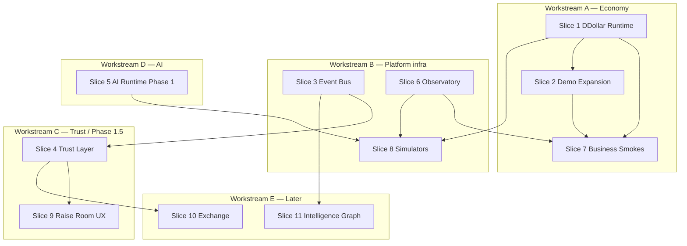

# Founder OS — Platform Readiness Plan

**Status:** Active execution doc · July 2026  
**Audience:** Engineering, product, agents  
**Framing:** Production platform readiness — not isolated RR tickets  
**Owner feedback (Danish):** Complete Phase 1.5 as cohesive vertical slices; Demo Mode is first-class; every feature needs seed data; merge as independently testable slices; do not stop for approval unless blocked.

**Related:** [ARCHITECTURE-REVIEW-V2-RESPONSE.md](./ARCHITECTURE-REVIEW-V2-RESPONSE.md), [DEMO-MODE-AND-VERIFICATION.md](./DEMO-MODE-AND-VERIFICATION.md), [PLATFORM-VERIFICATION-VISION.md](./PLATFORM-VERIFICATION-VISION.md), [DDOLLAR-POC-TWO-LEDGER-SPEC.md](./DDOLLAR-POC-TWO-LEDGER-SPEC.md), [FOUNDER-AI-RUNTIME-SPEC.md](./FOUNDER-AI-RUNTIME-SPEC.md), [RAISE-ROOM-UX-VISION-V2.md](./RAISE-ROOM-UX-VISION-V2.md), [FOUNDER-GRADUATION-BUILD-PLAN.md](./FOUNDER-GRADUATION-BUILD-PLAN.md)

**Safe to share:** No secrets, credentials, or legal advice in this document.

---

## 1. Executive summary

Founder OS is moving from **feature tickets** to **platform readiness vertical slices**. Each slice ships the full stack — backend, frontend, demo seed, verification, telemetry, health, docs, feature flags, and tests — as one independently mergeable unit. Demo Mode is not an admin utility; it is the **one-click living ecosystem** that makes every surface feel populated during development, demos, and smoke runs.

**Phase 1.5 exit:** No project reaches token metadata preview without `RegulatoryClassification` + Launch Qualification score ≥ 70 + progressive unlock stage ≥ 5. Everything below serves that gate and the trust-first launch pipeline in [FOUNDER-GRADUATION-BUILD-PLAN.md](./FOUNDER-GRADUATION-BUILD-PLAN.md).

**Current platform readiness (approx.):**

| Area | Readiness | Notes |
|------|-----------|-------|
| Raise Room paper engine | ~70% | Shipped; UX vision ~15% |
| Demo Mode | ~25% | MVP admin seed; far below scale targets |
| DDollar economy | ~35% | `PointsService` + `PointLedger`; no two-ledger runtime |
| AI Runtime | ~15% | Phase 0 pilot only (~93% paths bypass) |
| Phase 1.5 Trust Layer | ~10% | Constants in `@dcf/utils`; no NestJS modules |
| Verification / Observatory | ~20% | Basic `/health` + 25+ demo smoke checks; see [PLATFORM-VERIFICATION-VISION.md](./PLATFORM-VERIFICATION-VISION.md) |
| Event bus + workers | ~5% | `FounderEvent` feed only; no domain bus |
| Simulators | 0% | Planned in docs only |
| Business smoke tests | ~15% | Infra checks; not full DDollar journey |
| Raise Room UX V2 | ~10% | Vision + partial components |
| Founder Exchange | 0% | Phase 4 |
| Founder Intelligence Graph | ~20% | Build-graph utils only; not platform-wide |

---

## 2. Operating principles

1. **Vertical slices, not tickets** — A slice is merge-ready when backend + UI + demo data + smoke + health + docs + flag + tests all land together.
2. **Demo Mode is first-class** — One click generates enough data that `/raise-room`, Founder OS, leaderboards, marketplace, and AI history feel alive.
3. **Seed data is mandatory** — No feature ships without demo seed coverage and a smoke assertion.
4. **Parallel build, logical merge** — Workstreams run concurrently; merge order respects dependencies (ledger before business smokes; trust layer before graduation UX).
5. **No stop unless blocked** — Complete the slice; only pause for schema conflicts, counsel gates, or missing secrets.
6. **Commit boundaries** — Each slice = one PR (or stacked PRs) that passes its slice smoke suite independently.

---

## 3. Definition of Done (every slice)

| Layer | Requirement |
|-------|-------------|
| **Backend** | NestJS module/service/controller; Prisma models migrated; API documented in route table |
| **Frontend** | User-facing UI or admin surface; empty states handled |
| **Demo data** | `DemoSeedService` (or slice seeder) populates slice entities at `medium` scale minimum |
| **Verification** | Slice smoke checks added to `/api/admin/demo/smoke` or Observatory |
| **Telemetry** | `AnalyticsEvent` or slice-specific metric; logged errors with subsystem tag |
| **Health** | Observatory row: status, version, latency probe, last error |
| **Docs** | Update relevant spec + `ENV-VARS.md` if new flags |
| **Feature flag** | Env or `PlatformSettings` flag; off by default in production unless slice is GA |
| **Tests** | Unit tests for pure logic; API smoke for golden path |

---

## 4. Vertical slice catalog

Slices are numbered in **recommended merge order**. Status reflects **actual repo state** as of 6 July 2026.

---

### Slice 1 · DDollar Runtime (two-ledger foundation)

**Why first:** Demo smokes, trust weighting, marketplace, and Phase 1.5 gates all assume correct spendable vs lifetime semantics. See [DDOLLAR-POC-TWO-LEDGER-SPEC.md](./DDOLLAR-POC-TWO-LEDGER-SPEC.md).

| Field | Value |
|-------|-------|
| **Scope** | Spendable balance, lifetime contribution, marketplace ledger, founder treasury ledger, reward engine, spending engine, audit log, daily emissions, anti-abuse rules, airdrop snapshot hook |
| **Feature flag** | `DDOLLAR_RUNTIME_ENABLED` |
| **Status** | **Partial** — `PointsService`, `PointLedger`, `PlatformTreasury` exist; lifetime field and dedicated runtime module do not |

**Deliverables checklist**

- [ ] Prisma: `User.lifetimeContributionEarned`; `MarketplaceLedgerEntry`; `FounderTreasuryLedgerEntry` (or extend `PointLedger` with typed accounts)
- [ ] `apps/api/src/ddollar/` — `DdollarRuntimeService`, `RewardEngine`, `SpendingEngine`, `AntiAbuseService`
- [ ] `award()` increments both ledgers; `spend()` decrements spendable only
- [ ] Daily emission job stub + admin read API
- [ ] Airdrop snapshot reads lifetime contribution (wire to `airdrop.service.ts`)
- [ ] UI: wallet shows Balance + Lifetime on `/ddollar` and account hub
- [ ] Demo seed uses real column (remove `notificationPrefs.lifetimeContributionEarned` hack)
- [ ] Unit tests: award/spend/lifetime invariant
- [ ] Docs: update DDOLLAR spec § migration complete

**Demo seed requirements:** Every demo user has earn rows, one spend row, lifetime ≥ spendable; 3+ marketplace purchases; treasury balance delta visible.

**Smoke tests:** `ddollar_spend_lifetime_unchanged`, `marketplace_ledger_balanced`, `treasury_audit_trail`.

**Commit boundary:** `feat(ddollar): two-ledger runtime + migration + demo seed`

---

### Slice 2 · Demo Mode Expansion (first-class service)

**Why second:** Unblocks parallel UI/backend work; replaces empty states platform-wide.

| Field | Value |
|-------|-------|
| **Scope** | One-click ecosystem: founders, projects, DDollar, marketplace, AI usage, graduations, trading history, reputation, notifications, leaderboards, comments |
| **Feature flag** | `DEMO_MODE_ENABLED` (existing) + `DEMO_SEED_SCALE` presets extended |
| **Status** | **Partial** — MVP at `apps/api/src/demo/` + `/admin/demo`; scales 20–50 users, not 2500 |

**Scale targets (new `xlarge` preset)**

| Entity | Target |
|--------|--------|
| Founders | 500 |
| Users | 2,500 |
| Projects | 150 |
| Comments | 5,000+ |
| AI history rows | 10,000+ |
| Leaderboard entries | populated |
| Graduated projects | 12+ |
| Simulated raises | 40+ active |

**Deliverables checklist**

- [ ] Extend `DEMO_SCALE_PRESETS` with `xlarge`; batch seed for performance
- [ ] Seed: `FeedComment`, `Notification`, `LeaderboardEntry`, `AiTokenUsageLog`, `PaperTrade`, graduation snapshot records
- [ ] Seed: marketplace purchases (depends Slice 1)
- [ ] Promote Demo Mode entry: onboarding banner + dev toolbar link (not admin-only discoverability)
- [ ] `/admin/demo` progress UI during long seed
- [ ] Expand smoke checks to 20+ (see Slice 8)
- [ ] Docs: update [DEMO-MODE-AND-VERIFICATION.md](./DEMO-MODE-AND-VERIFICATION.md)

**Demo seed requirements:** All subsystems above populated; sample slugs documented in status response.

**Smoke tests:** Existing 12 + entity count thresholds per scale preset.

**Commit boundary:** `feat(demo): xlarge ecosystem seed + marketplace/AI/leaderboard data`

**Current vs vision gap:** See §8.

---

### Slice 3 · Event Bus + Background Jobs

| Field | Value |
|-------|-------|
| **Scope** | Domain events + workers for async recompute, notifications, indexing |
| **Feature flag** | `DOMAIN_EVENT_BUS_ENABLED` |
| **Status** | **Not started** — `packages/utils/src/event-bus.ts` is Copilot intent helpers, not domain events; `FounderEvent` is activity feed only |

**Event catalog (minimum)**

| Event | Producers | Subscribers |
|-------|-----------|-------------|
| `ProjectCreated` | List Project approval | Search index, demo refresh, analytics |
| `ProjectValidated` | Trust Center | Launch score recalc, notifications |
| `FounderGraduated` | Graduation service | Timeline, exchange eligibility, AI credit refill |
| `DDollarEarned` / `DDollarSpent` | DDollar runtime | Leaderboard, airdrop snapshot, anti-abuse |
| `MarketplacePurchase` | Marketplace | Treasury ledger, notifications |
| `LaunchUnlocked` | Progressive unlock | Compliance timeline, Raise Room feed |
| `LaunchQualificationChanged` | LQ engine | Heatmap ranking, notifications |

**Workers (minimum)**

| Worker | Trigger |
|--------|---------|
| AI cache cleanup | Cron |
| Leaderboard refresh | `DDollarEarned`, daily |
| Launch score recalc | Validation / raise events |
| Reputation recompute | Trust + scout events |
| DDollar daily emission | Cron |
| Notification dispatch | All user-facing events |
| Search indexing | Project/founder CRUD |
| Embeddings (AI semantic cache) | Phase 1 AI slice |
| Analytics daily snapshot | Cron |

**Deliverables checklist**

- [ ] `apps/api/src/domain-events/` — typed event envelope + in-process bus (Phase A); Redis/BullMQ (Phase B)
- [ ] Prisma `DomainEventLog` for audit
- [ ] Worker registry + health probes
- [ ] Wire existing writes to emit (Trust Center, Raise allocate, Points award/spend)
- [ ] Demo seed triggers sample events for feed
- [ ] Observatory worker row per job

**Commit boundary:** `feat(events): domain event bus + core workers`

---

### Slice 4 · Phase 1.5 Trust Layer (complete vertical flow)

| Field | Value |
|-------|-------|
| **Scope** | Regulatory Engine → Launch Score → Compliance Timeline → Progressive Unlock → Trust Weight → verification → demo data → smoke tests |
| **Feature flag** | `PHASE_15_TRUST_LAYER_ENABLED` |
| **Status** | **Partial** — `launch-qualification.ts` constants; `trust-weight.ts` + Trust Center wire; no regulatory module, timeline UI, or progressive unlock |

**Deliverables checklist**

- [ ] `apps/api/src/regulatory/` — questionnaire, classification, feature gates (RR-011)
- [ ] `apps/api/src/launch-qualification/` — `computeLaunchQualificationScore()` persisted (RR-012)
- [ ] `apps/api/src/trust/anti-sybil.service.ts` — trust weight on Raise + paper writes (RR-013)
- [ ] `packages/utils/src/progressive-unlock.ts` + `LaunchStage` on `Project` (RR-015)
- [ ] `apps/api/src/projects/compliance-timeline.service.ts` + `compliance-timeline.tsx` (RR-014)
- [ ] Block Proof Raise + metadata preview without classification + LQ ≥ 70 + stage ≥ 5
- [ ] Demo projects at varied stages + classifications
- [ ] Smoke: regulatory gate, LQ score API, timeline API, unlock stage enforcement

**Demo seed requirements:** 3+ regulatory classes; projects at stages 1–6; LQ scores spanning tiers.

**Commit boundary:** `feat(trust): Phase 1.5 regulatory + LQ + progressive unlock vertical slice`

Maps to [ARCHITECTURE-REVIEW-V2-RESPONSE.md](./ARCHITECTURE-REVIEW-V2-RESPONSE.md) RR-011–015.

---

### Slice 5 · AI Runtime Phase 1 (mandatory gateway)

| Field | Value |
|-------|-------|
| **Scope** | Full runtime — nothing bypasses gateway |
| **Feature flag** | `AI_RUNTIME_ENABLED` (mandatory when Phase 1 GA) |
| **Status** | **Partial (Phase 0)** — `apps/api/src/founder-ai-runtime/`; pilot on Copilot non-stream only |

**Deliverables checklist**

- [ ] Request Classifier, Context Builder, Prompt Compiler (`config/founder-ai/`)
- [ ] Prompt Hash Cache + Redis backend (`REDIS_URL`)
- [ ] Prefix Cache metadata; Semantic Cache stub (pgvector Phase 2)
- [ ] Tool Router, Model Router (extend existing)
- [ ] Cost Engine + `AiTokenUsageLog` enrichment
- [ ] Usage Analytics + **AI Cost Dashboard** (admin)
- [ ] Provider Health + Failover inside runtime
- [ ] Response Validator + Audit Logs
- [ ] Migrate all 14 AI paths per [FOUNDER-AI-RUNTIME-SPEC.md](./FOUNDER-AI-RUNTIME-SPEC.md) §5
- [ ] Demo seed: `AiTokenUsageLog` rows per section
- [ ] Smoke: copilot + wall summarizer through runtime; cache hit metric

**Commit boundaries (stacked OK):**

1. `feat(ai-runtime): mandatory gateway + Redis cache`
2. `feat(ai-runtime): cost engine + admin dashboard`
3. `feat(ai-runtime): migrate remaining sections`

---

### Slice 6 · Verification Framework + Founder OS Observatory

| Field | Value |
|-------|-------|
| **Scope** | Internal control room — health, status, version, latency, errors, coverage, last test per subsystem |
| **Feature flag** | `OBSERVATORY_ENABLED` (admin-only) |
| **Status** | **Partial** — `/api/health` (api + db); demo smoke 12 checks; no unified dashboard |

**Deliverables checklist**

- [ ] `apps/api/src/observatory/` — aggregate probes from demo, health, AI, DDollar, workers, DB migrations
- [ ] `apps/web/src/app/admin/observatory/` — control room UI
- [ ] Per-subsystem registry JSON (`config/observatory/subsystems.json`)
- [ ] Wire demo smoke + slice smokes into Observatory "Last Test"
- [ ] Version = git SHA / package version from env
- [ ] Docs: operator runbook section

**Subsystem rows (minimum):** API, Database, Demo Mode, DDollar Runtime, AI Runtime, Event Bus, Regulatory Engine, Launch Qualification, Raise Room, Trust Center, Founder OS integrations.

**Commit boundary:** `feat(observatory): Founder OS control room MVP`

---

### Slice 7 · Business Logic Smoke Tests

| Field | Value |
|-------|-------|
| **Scope** | Golden journeys — business logic, not page loads |
| **Feature flag** | Uses `DEMO_MODE_ENABLED` |
| **Status** | **Partial** — 12 infra smokes; no transactional journey |

**Golden journey (API-level)**

1. Create demo founder + project (or use seeded)
2. Earn DDollar via reward engine
3. Spend DDollar on AI or marketplace
4. Assert lifetime contribution unchanged after spend
5. Assert marketplace + treasury ledgers updated
6. Assert airdrop/builder score inputs recalculated

**Deliverables checklist**

- [ ] `DemoSeedService.runBusinessSmokeChecks()` or dedicated `BusinessJourneyService`
- [ ] Runs in CI against demo DB (optional job)
- [ ] Observatory displays last run + duration
- [ ] Playwright golden journeys (Phase B) per [DEMO-MODE-AND-VERIFICATION.md](./DEMO-MODE-AND-VERIFICATION.md)

**Commit boundary:** `test(smoke): DDollar business golden journey`

Depends on: Slices 1, 2, 3 (partial).

---

### Slice 8 · Simulators

| Field | Value |
|-------|-------|
| **Scope** | AI Cost, DDollar, Founder Journey — nightly regression |
| **Feature flag** | `SIMULATORS_ENABLED` |
| **Status** | **Not started** |

**Deliverables checklist**

- [ ] `apps/api/src/simulators/` — deterministic scenario runners
- [ ] AI Cost Simulator: N requests × sections → cost projection
- [ ] DDollar Simulator: earn/spend/emission over T days
- [ ] Founder Journey Simulator: list → trust → raise → LQ → graduation
- [ ] Cron or manual trigger from Observatory
- [ ] Demo seed baseline for diff comparison

**Commit boundary:** `feat(simulators): nightly founder journey + DDollar sims`

Depends on: Slices 1, 3, 4, 5 (partial).

---

### Slice 9 · Raise Room UX V2 (Demo Day feel)

| Field | Value |
|-------|-------|
| **Scope** | Full Raise Room experience — not backend-only |
| **Feature flag** | `RAISE_ROOM_UX_V2` (per-component sub-flags OK) |
| **Status** | **Partial** — `raise-room-panel.tsx`, heatmap; vision components missing |

**Deliverables checklist (map to RR-UX-001–010 in [RAISE-ROOM-UX-VISION-V2.md](./RAISE-ROOM-UX-VISION-V2.md))**

- [ ] `raise-room-hero.tsx` — tagline + live stats
- [ ] `raise-room-live-feed.tsx` — wired to `FounderEvent` / domain bus
- [ ] Rich project cards + conviction meter
- [ ] `compliance-timeline.tsx` on project Raise tab (depends Slice 4)
- [ ] Graduation keynote modal (depends graduation event)
- [ ] Mobile + a11y polish pass
- [ ] Demo data: featured projects, feed items, conviction spread

**Commit boundaries:** One RR-UX sprint per PR.

Depends on: Slices 2, 4, 3 (feed events).

---

### Slice 10 · Founder Exchange (trust-first, trading last tab)

| Field | Value |
|-------|-------|
| **Scope** | Graduated-only curated swap layer — Jupiter backend, trust metadata |
| **Feature flag** | `FOUNDER_EXCHANGE_ENABLED` |
| **Status** | **Not started** (Phase 4 in architecture docs) |

**Deliverables checklist**

- [ ] `apps/api/src/founder-exchange/` — pair registry, graduated-only guard
- [ ] Jupiter quote + swap proxy (no custody)
- [ ] `apps/web/src/app/exchange/` — trust badge, integrity score, regulatory chip
- [ ] Demo: 3+ graduated pairs with synthetic volume (paper)
- [ ] Smoke: non-graduated project rejected

**Commit boundary:** `feat(exchange): curated graduated-only shell`

Depends on: Slice 4 (graduation), Slice 2 (demo pairs).

---

### Slice 11 · Founder Intelligence Graph (platform-wide)

| Field | Value |
|-------|-------|
| **Scope** | Connect founders, projects, scouts, validators, DDollar, AI, raises — missing subsystem |
| **Feature flag** | `FOUNDER_INTELLIGENCE_GRAPH_ENABLED` |
| **Status** | **Partial** — `packages/utils/src/founder-graph.ts` (build/initiative graph only); `founder-memory-graph.ts` for Founder OS |

**Deliverables checklist**

- [ ] Extend graph model: entities = User, Founder, Project, Raise, TrustSignal, DDollarTx, AiCall, Graduation
- [ ] `apps/api/src/intelligence-graph/` — query API + incremental updates via event bus
- [ ] Founder OS panel: "Ecosystem connections" visualization
- [ ] Demo seed: cross-linked edges for sample founder
- [ ] Smoke: graph query returns expected edge count for demo founder

**Commit boundary:** `feat(graph): platform intelligence graph MVP`

Depends on: Slices 3, 1, 5.

---

## 5. Parallel workstreams map

| Workstream | Slices | Can start now | Blockers |
|------------|--------|---------------|----------|
| **A — Economy** | 1, 2, 7 | Yes | Slice 7 waits on 1 |
| **B — Infra** | 3, 6, 8 | 3 + 6 immediately; 8 later | Simulators need 1 + 4 |
| **C — Trust / UX** | 4, 9 | 4 immediately; 9 after 4 partial | Timeline UI needs regulatory API |
| **D — AI** | 5 | Yes (parallel to A/B) | Redis URL for shared cache |
| **E — Growth** | 10, 11 | After 4 + 3 | Exchange needs graduation |

**Recommended agent allocation (next sprint):**

| Agent | Owns | Merge target |
|-------|------|--------------|
| Agent 1 | Slice 1 DDollar Runtime | Week 1 |
| Agent 2 | Slice 2 Demo Expansion (after 1 lands or mock marketplace) | Week 1–2 |
| Agent 3 | Slice 3 Event Bus core + Slice 6 Observatory scaffold | Week 1–2 |
| Agent 4 | Slice 4 Phase 1.5 Trust Layer (regulatory + LQ service) | Week 2 |
| Agent 5 | Slice 5 AI Runtime Phase 1 gateway migration | Week 2–3 |

---

## 6. Merge order (commit slices)

| Order | Slice | PR title pattern | Independent test |
|-------|-------|------------------|------------------|
| 1 | DDollar Runtime | `feat(ddollar): two-ledger runtime` | Unit + demo DDollar smoke |
| 2 | Demo Mode Expansion | `feat(demo): xlarge ecosystem` | 20+ smoke checks |
| 3 | Event Bus (core) | `feat(events): domain bus + 3 workers` | Event log + worker health |
| 4 | Observatory MVP | `feat(observatory): control room` | Admin page loads all rows |
| 5 | Phase 1.5 Trust Layer | `feat(trust): regulatory + LQ vertical` | Gate smoke + demo stages |
| 6 | Business smoke tests | `test(smoke): golden DDollar journey` | 6-step journey green |
| 7 | AI Runtime Phase 1a | `feat(ai-runtime): mandatory gateway` | 0 direct fetch paths |
| 8 | AI Runtime Phase 1b | `feat(ai-runtime): cost dashboard` | Admin cost chart |
| 9 | Raise Room UX (sprints) | `feat(raise-room): RR-UX-00N` | Visual + API per sprint |
| 10 | Simulators | `feat(simulators): journey sim` | Nightly job green |
| 11 | Intelligence Graph | `feat(graph): platform graph MVP` | Demo founder query |
| 12 | Founder Exchange | `feat(exchange): graduated shell` | Swap gate smoke |

---

## 7. Current status summary (repo audit)

| Slice | Done | Partial | Not started |
|-------|------|---------|-------------|
| 1 DDollar Runtime | `PointLedger`, `PointsService`, `PlatformTreasury` | Two-ledger hack in demo only | Runtime module, marketplace/treasury ledgers, emissions |
| 2 Demo Mode | MVP seed/reset/smoke, admin UI | 35 users / 12 projects | xlarge scale, AI/marketplace/graduations/notifications |
| 3 Event Bus | `FounderEvent` activity | — | Domain bus, workers |
| 4 Trust Layer | `launch-qualification.ts`, `trust-weight.ts`, Trust Center | Anti-sybil not on Raise writes | Regulatory, timeline, progressive unlock |
| 5 AI Runtime | Phase 0 module, Copilot cache pilot | Model router, prompt cache | Mandatory gateway, cost dashboard, 12 bypass paths |
| 6 Observatory | `/api/health` | Demo smoke runner | Unified dashboard |
| 7 Business smokes | Infra checks (12) | — | Transactional journey |
| 8 Simulators | — | — | All |
| 9 Raise Room UX | `raise-room-panel`, heatmap, `project-room` | Rebrand in progress | Hero, feed, conviction meter, timeline |
| 10 Exchange | — | — | All |
| 11 Intelligence Graph | `founder-graph.ts` (build scope) | Memory graph | Platform-wide entity graph |

**Key files (existing)**

| Area | Path |
|------|------|
| Demo Mode | `apps/api/src/demo/`, `apps/web/src/app/admin/demo/` |
| DDollar | `apps/api/src/points/points.service.ts`, `packages/utils/src/ddollar.ts` |
| AI Runtime Phase 0 | `apps/api/src/founder-ai-runtime/` |
| Launch Q constants | `packages/utils/src/launch-qualification.ts` |
| Trust weight | `packages/utils/src/trust-weight.ts`, `apps/api/src/trust-center/` |
| Health | `apps/api/src/health/health.controller.ts` |
| Raise Room | `apps/web/src/app/raise-room/`, `apps/api/src/founder-den/` |

---

## 8. Demo Mode — current vs vision

### Currently seeded (MVP)

| Entity | Medium scale | Notes |
|--------|--------------|-------|
| Users | 35 | `@doxxed.demo` emails |
| Founders | 10 | With GitHub verification |
| Projects | 12 | Lifecycle IDEA → LIVE_TRADING |
| SimulatedRaise | ~8 active | Paper conviction |
| RaiseAllocation | ~6 per raise | Scout commits |
| PointLedger | Per user | Two-ledger **demo hack** via `notificationPrefs` |
| ProjectTrustReport | Per project | Trust signals |
| FounderEvent | Raise + build | Activity feed source |
| FounderBuildPost | Per project | Build logs |

### Missing from Danish's vision

| Gap | Target | Priority |
|-----|--------|----------|
| Scale | 500 founders, 2,500 users, 150 projects | P0 |
| Marketplace transactions | Purchases + ledger | P0 (after Slice 1) |
| AI usage history | `AiTokenUsageLog` per section | P0 |
| Graduations | `FounderGraduationEvent` + snapshot UI data | P1 |
| Trading history | `PaperTrade` / portfolio on demo projects | P1 |
| Reputation rankings | Leaderboards populated from lifetime contribution | P1 |
| Notifications | In-app notification feed | P1 |
| Comments | Feed / project comments | P2 |
| Launch windows | TokenLaunch / interest commits | P2 |
| One-click non-admin entry | Dev/demo toolbar | P1 |
| Regulatory + LQ demo variety | Stages 1–6, classification classes | P1 (Slice 4) |

### Smoke coverage gap

| Current (12 checks) | Needed |
|---------------------|--------|
| Infra + read paths | Transactional earn/spend journey |
| Lifetime via prefs hack | Real `lifetimeContributionEarned` column |
| No marketplace | Marketplace purchase smoke |
| No AI rows | AI runtime usage smoke |
| No graduation | Graduation event smoke |

---

## 9. Phase 1.5 completion checklist

Phase 1.5 is **complete** when all of the following are true:

- [ ] Slice 1: Two-ledger DDollar runtime in production schema
- [ ] Slice 2: Demo ecosystem at `xlarge` populates all Phase 1.5 surfaces
- [ ] Slice 3: Domain events for validation, DDollar, unlock
- [ ] Slice 4: Regulatory + LQ + timeline + progressive unlock enforced
- [ ] Slice 5: AI Runtime Phase 1 — no bypass paths
- [ ] Slice 6: Observatory green for all Phase 1.5 subsystems
- [ ] Slice 7: Business golden journey passes in demo smoke
- [ ] Slice 9 (minimum): Compliance timeline visible on project Raise tab
- [ ] Docs: ARCHITECTURE-REVIEW-V2-RESPONSE Part D Phase 1.5 exit criteria met

---

## 10. Related RR / UX IDs

| Platform slice | Legacy ticket IDs |
|----------------|-------------------|
| Slice 4 | RR-011 – RR-015 |
| Slice 9 | RR-UX-001 – RR-UX-010 |
| Phase 1 (overlapping) | RR-001 – RR-007 |
| Phase 2 (after 1.5) | RR-016 – RR-020 |

RR tickets remain useful as **acceptance criteria inside slices** — not as merge boundaries.

---

## 11. Changelog

| Date | Change |
|------|--------|
| 2026-07-06 | Initial platform readiness plan — vertical slice pivot from Danish feedback |

---

*Product engineering context only. Not legal or investment advice.*
