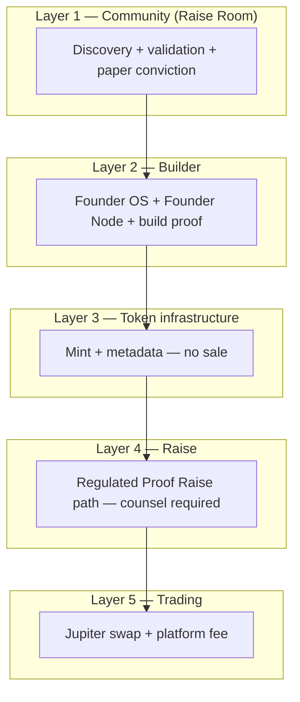

# Raise Room × Validation Vision — Incorporation Spec

**Status:** Draft · July 2026  
**Audience:** Product + engineering  
**Related:** [RAISE-ROOM-P0-INSPIRED-PLAN.md](./RAISE-ROOM-P0-INSPIRED-PLAN.md), [DDOLLAR-LAUNCH-ALLOCATION-PROPOSAL.md](./DDOLLAR-LAUNCH-ALLOCATION-PROPOSAL.md), [TOKEN-LAUNCH-TRADING-ECOSYSTEM-PROPOSAL.md](./TOKEN-LAUNCH-TRADING-ECOSYSTEM-PROPOSAL.md)

---

## Executive summary

Raise Room today is a **working paper-demand engine** (`SimulatedRaise`, `RaiseAllocation`, `/raise-room` heatmap, project tab). It is **not yet** a discovery-first validation marketplace with weighted community signals, Founder Launch Score, scout dashboards, tiered allocation buckets, or Proof Raise launch gates.

This spec maps the ChatGPT-style Founder OS vision onto Raise Room **Phase 1 only** (paper, no tokens, no money). It **rejects equal 10% airdrops** and the equal-split tier model in `TOKEN-LAUNCH-TRADING-ECOSYSTEM-PROPOSAL.md` in favour of **Founder Points + weighted allocation buckets**.

**Estimated vision coverage in codebase today: ~38%** (see audit table below).

---

## 1. Audit — what exists today

### 1.1 Surfaces

| Area | What exists |
|------|-------------|
| **`/raise-room`** | Public heatmap: paper demand, allocator count, % of goal, links to projects. Hero copy: “Validate demand with paper capital.” |
| **`raise-room-panel.tsx`** | Project Raise Room tab: goal, allocated, participants, flat `communityTokenPercent` (default 10%), 1% paper burn on commit, leaderboard, founder export + lock slots. Uses “ICO slot” language. |
| **Founder OS** | `createSimulatedRaise` API wired from `founder-den/page.client.tsx`; raise form props passed to `FounderWorkspace` but **not rendered** in DevWorkspace shell (founders launch via API path only if another surface exists). |
| **Trust Center** | Weighted validation categories, investigations, scout voting, Top Scouts tab — **separate** from Raise Room project detail. |
| **Paper trading** | `PaperPortfolio.cashBalance`; allocations debit virtual cash ($100+ threshold via `RESTRICTED_CASH_THRESHOLD_USD`). |

### 1.2 Backend & utils

| Module | Role |
|--------|------|
| `founder-den.service.ts` | `createSimulatedRaise`, `allocateToRaise`, `exportRaiseParticipants`, `lockRaiseSlots`, `getDemandHeatmap`, `refreshLaunchReadiness`, `computeLaunchpadRequirements`, `requestLaunchpadAccess` |
| `packages/utils/raise-room.ts` | 1% allocation fee, participant export, momentum score |
| `packages/utils/virtual-economy.ts` | `computeLaunchReadiness`, `computeStartupGenome` |
| `packages/utils/trust-weight.ts` | Weighted validation, scout reputation labels (Community member → Legendary scout) |
| `packages/utils/builder-rewards.ts` | Builder sub-scores; snapshot weight guidance (not wired to Raise Room allocation) |
| `builder-score.service.ts` | User-level VERIFIED_BUILDER gate (X, GitHub, Cursor, commits) — **not** project Founder Launch Score |

### 1.3 Prisma (raise-related)

| Model | Purpose |
|-------|---------|
| `SimulatedRaise` | Paper raise window: goal, duration, `communityTokenPercent`, slots, burn total |
| `RaiseAllocation` | Per-user paper USD + wallet capture + slot |
| `EarlyScoutRecord` | First backer before 50 followers |
| `ProjectTrustReport` | Weighted community validation (Trust Center) |
| `PointLedger` / `User.reputationPoints` | DDollar — **not** escrowed for launches yet |
| `User.builderScore`, `contributorLevel` | Anti-sybil inputs |

**Not in schema:** `TokenLaunch`, `LaunchInterestCommit`, `FounderLaunchScore`, `ValidationSignal`, `ScoutProfile`, `LaunchEligibility`, `CommunityAllocationTier`, `FounderPoints` ledger buckets, `VestingSchedule`.

### 1.4 Docs tension to resolve

- `TOKEN-LAUNCH-TRADING-ECOSYSTEM-PROPOSAL.md` proposes **equal 10%/5%/0% splits** among active users — **conflicts with this vision**. This spec supersedes that section for Raise Room allocation policy.
- `DDOLLAR-LAUNCH-ALLOCATION-PROPOSAL.md` DDollar escrow + rank multipliers **aligns** with paper conviction and Phase 2 whitelist; integrate after Phase 1 validation signals ship.

---

## 2. Vision feature audit table

| Vision feature | Exists today | Gap | Priority (Raise Room MVP) |
|----------------|--------------|-----|---------------------------|
| **1. Discovery over launchpad** | `/raise-room` hero emphasises validation; Founder OS still says “ICO slots” | Reposition all Raise Room copy; discovery sort (conviction + founder score), not “launch your token” | **P0** |
| **2. Founder Score before launch** | `Founder.reputationScore`, `Project.launchReadiness`, Startup Genome on project page | No unified **FounderLaunchScore** (identity, GitHub, followers, AI scam, transparency) on Raise cards | **P0** |
| **3. Community validation (weighted)** | Trust Center: 6 categories + `computeTrustWeight` | Not on project Raise detail; missing “I would buy / invest / use”, know founder, reviewed whitepaper | **P0** |
| **4. Proof of Conviction (paper)** | Full: `allocateToRaise` debits paper cash, leaderboard, export | No $100–$10k slider UX; no explicit “reversible until snapshot” copy; DDollar escrow separate | **P1** (extend UI) |
| **5. Scout system (rep, tiers)** | `EarlyScoutRecord`, trust weight labels, `POINTS.EARLY_SCOUT`, Top Scouts list | No `ScoutProfile`, success rate, Trusted/Expert/Legend tiers tied to outcomes | **P1** |
| **6. Weighted allocation buckets** | Flat `communityTokenPercent` (10%); share ∝ paper USD in export | No 40/20/15/15/10 bucket split; no Founder Points ledger | **P0** (spec + Phase 1 ledger) |
| **7. Launch gates** | `computeLaunchpadRequirements` (video, build logs, $10k demand, readiness ≥60) | Missing: min followers threshold, community score >70, AI pass, identity verification snapshot | **P0** |
| **8. Fee tiers Bronze/Silver/Gold** | Constants only (`TOKEN_LAUNCH_FEE_PERCENT`, 1% paper burn) | Founder-selectable tier (0/5/10% community vs 0.10/0.05/0% platform fee) not stored | **P1** |
| **9. Vesting (25% / 75% × 12mo)** | None | Phase 2+ only; document now | **P2** |
| **10. Regulatory Layer 1 (paper only)** | Paper dollars, legal pages, no on-chain raise | Explicit “allocation registration” copy; gate real SOL/ tokens to Phase 3–4 | **P0** (copy + guards) |
| **11. Proof Raise naming** | “ICO slot”, “Reserve ICO slot” in UI | Rename to Proof Raise / allocation registration | **P0** |
| **12. Trending Raises UI** | Heatmap: demand $, allocators, % goal | Missing: conviction score, tier badge, countdown, community reward % | **P0** |
| **13. Personal scout dashboard** | Trust Center Top Scouts; portfolio pages partial | No tab: discoveries, success rate, airdrops earned, rank, paper deployed | **P1** |
| **14. 5-layer compliance architecture** | Implicit paper-only | Not documented in product; needs layer map in UI footer/legal | **P1** (docs + copy) |

---

## A. Raise Room repositioning copy

### Landing psychology — discovery, not launchpad

**Primary headline ( `/raise-room` )**

> **Discover tomorrow's founders — before they launch.**

**Subhead**

> Raise Room is where builders prove demand with paper conviction and weighted community validation. No tokens. No money. Just signal.

**Founder CTA**

> Open your Proof Raise window when your project earns it — not when you're ready to "launch a coin."

**Scout CTA**

> Back projects you believe in with paper dollars ($100–$10,000 simulated). Your conviction feeds discovery rankings and future allocation registration — not an investment contract.

**Anti-patterns to remove**

| Remove | Replace with |
|--------|----------------|
| Launch your token | Register allocation interest |
| ICO / ICO slot | Proof Raise / allocation slot |
| Invest now | I would buy (simulated) |
| Airdrop farm | Earn Founder Points toward weighted allocation |
| Guaranteed returns | Paper-only validation — consult counsel before any real raise (Phase 4) |

**Australian framing (Phase 1)**

- Use **“allocation registration”**, **“paper conviction”**, **“community validation”**.
- Avoid **“investment”**, **“returns”**, **“ICO”**, **“presale”** on Raise Room surfaces.
- Footer disclaimer: *Raise Room is a simulation layer for founder discovery. Paper dollars and DDollar have no cash value. This is not a financial product. For any future token raise, founders must obtain independent legal advice (including Australian fintech counsel) before Phase 4.*

---

## B. Data model additions (Prisma sketch)

No migration in this task — models for Phase 1 implementation planning.

```prisma
enum ValidationSignalType {
  WOULD_BUY
  WOULD_INVEST
  WOULD_USE
  KNOW_FOUNDER
  REVIEWED_WHITEPAPER
  TRUST_CENTER_POSITIVE   // sync from ProjectTrustReport
}

enum CommunityAllocationTier {
  BRONZE   // 0% community / 0.10% platform fee
  SILVER   // 5% community / 0.05% platform fee
  GOLD     // 10% community / 0% platform fee
}

enum AllocationBucket {
  PAPER_CAPITAL      // 40%
  REVIEWERS          // 20%
  EARLY_FOLLOWERS    // 15%
  TOP_SCOUTS         // 15%
  BUILDERS           // 10%
}

enum LaunchGateKind {
  MIN_FOLLOWERS
  PAPER_CONVICTION_THRESHOLD
  COMMUNITY_SCORE
  AI_SCAM_PASS
  IDENTITY_VERIFIED
  FOUNDER_LAUNCH_SCORE
}

model FounderLaunchScore {
  id              String   @id @default(cuid())
  projectId       String   @unique
  overall         Int      // 0-100
  identity        Int
  github          Int
  socialReach     Int
  transparency    Int
  aiScamRisk      Int      // inverted: higher = safer
  communityTrust  Int
  computedAt      DateTime @default(now())
  snapshotJson    Json?    // component breakdown for UI

  project Project @relation(...)
}

model ValidationSignal {
  id         String               @id @default(cuid())
  projectId  String
  userId     String
  type       ValidationSignalType
  weight     Float                // computed at write from trust weight
  comment    String?
  createdAt  DateTime             @default(now())

  @@unique([projectId, userId, type])
  @@index([projectId])
}

model PaperConvictionCommit {
  id          String   @id @default(cuid())
  projectId   String
  userId      String
  raiseId     String?  // link SimulatedRaise
  amountUsd   Decimal  @db.Decimal(16, 2)
  reversible  Boolean  @default(true)
  snapshotAt  DateTime?
  cancelledAt DateTime?
  createdAt   DateTime @default(now())

  @@unique([projectId, userId]) // one active commit per project in Phase 1
}

model ScoutProfile {
  id              String   @id @default(cuid())
  userId          String   @unique
  level           Int      @default(1)  // 1 Trusted, 2 Expert, 3 Legend
  successRate     Float    @default(0)  // 0-1 backed projects that passed gates
  discoveries     Int      @default(0)
  paperDeployedUsd Decimal @default(0) @db.Decimal(16, 2)
  updatedAt       DateTime @updatedAt
}

model LaunchEligibility {
  id          String   @id @default(cuid())
  projectId   String   @unique
  gatesPassed Json     // { MIN_FOLLOWERS: true, ... }
  allPassed   Boolean  @default(false)
  snapshotAt  DateTime?
  proofRaiseOpensAt DateTime?
}

model CommunityAllocationTierChoice {
  id                    String @id @default(cuid())
  projectId             String @unique
  tier                  CommunityAllocationTier
  communityPercent      Int    // 0 | 5 | 10
  platformFeeBps        Int    // 10 | 5 | 0 (basis points on swap — Phase 3)
  chosenAt              DateTime @default(now())
}

model FounderPointsLedger {
  id          String           @id @default(cuid())
  userId      String
  projectId   String?
  bucket      AllocationBucket
  points      Int
  reason      String
  raiseId     String?
  createdAt   DateTime         @default(now())

  @@index([userId, bucket])
  @@index([projectId, bucket])
}

model VestingSchedule {
  id              String   @id @default(cuid())
  projectId       String
  userId          String
  totalTokens     Decimal  // Phase 2+
  immediatePct    Int      @default(25)
  linearMonths    Int      @default(12)
  startAt         DateTime
  // Phase 2: on-chain vesting account reference
}
```

**Bridge to existing models**

- `PaperConvictionCommit` can wrap or alias `RaiseAllocation` in Phase 1 (add `reversible` + link to `FounderPointsLedger`).
- `ValidationSignal` complements `ProjectTrustReport` — Raise Room buttons write here; Trust Center syncs categories.
- `FounderLaunchScore` computed job reads `Founder`, `Project`, GitHub, Trust Center tally, copilot scam flags.

---

## C. Raise Room UI sections (wireframes)

### C.1 Trending Raises (`/raise-room`)

```
┌─────────────────────────────────────────────────────────────┐
│  DISCOVER · Trending Proof Raises                           │
│  Paper-only · Ranked by conviction                          │
├─────────────────────────────────────────────────────────────┤
│ ┌──────────────┐ ┌──────────────┐ ┌──────────────┐         │
│ │ [logo] NAME  │ │ [logo] NAME  │ │ [logo] NAME  │  ...    │
│ │ $TICKER      │ │ $TICKER      │ │ $TICKER      │         │
│ │ Conviction 82│ │ Conviction 71│ │ Conviction 65│         │
│ │ Paper $24k   │ │ Paper $18k   │ │ Paper $9k    │         │
│ │ 142 followers│ │ 89 followers │ │ 56 followers │         │
│ │ GOLD · 10%   │ │ SILVER · 5%  │ │ BRONZE · 0%  │         │
│ │ Launch 12d   │ │ Launch 5d    │ │ Gates 3/6    │         │
│ │ ████████░░ 80%│ │ ██████░░░░ 60%│ │ ███░░░░░░ 30%│         │
│ └──────────────┘ └──────────────┘ └──────────────┘         │
└─────────────────────────────────────────────────────────────┘
```

Sort: `convictionScore DESC`, then `paperCapital DESC`, then `founderLaunchScore DESC`.

### C.2 Project detail — validation + conviction

```
┌─ Founder Launch Score ─────────────────────────────────────┐
│ Overall 74 · Identity ✓ · GitHub ✓ · AI pass ✓ · Trust 68  │
└────────────────────────────────────────────────────────────┘

┌─ Community validation (weighted) ──────────────────────────┐
│ [I would buy] [I would invest] [I would use]               │
│ [I know this founder] [Reviewed whitepaper]                │
│ Community score: 72% (weighted) · 34 validators            │
└────────────────────────────────────────────────────────────┘

┌─ Paper conviction ─────────────────────────────────────────┐
│ $100 ────●──────────── $10,000                             │
│ Commit paper dollars · reversible until Proof Raise opens   │
│ Your Founder Points (this project): 1,240 · bucket: Paper  │
└────────────────────────────────────────────────────────────┘
```

### C.3 Scout dashboard tab (`/raise-room/scout` or account tab)

```
┌─ Your scout rank: Expert Scout (Tier 2) ───────────────────┐
│ Success rate: 61% · Discoveries: 14 · Paper deployed: $42k │
├────────────────────────────────────────────────────────────┤
│ Projects you discovered early    │ Founder Points earned   │
│ · Project A (passed gates) ✓     │ · Paper capital: 4,200  │
│ · Project B (in validation)    │ · Reviewer: 800           │
│ · Project C (failed AI gate) ✗ │ · Top scout bonus: 1,100  │
└────────────────────────────────────────────────────────────┘
```

### C.4 Founder — launch eligibility progress

```
Proof Raise locked · 4/6 gates passed
[████████████░░░░] 67%

✓ Founder video   ✓ Build logs (2+)   ✓ Paper conviction ≥ $10k
✓ Launch readiness ≥ 60   ✗ Community score ≥ 70 (currently 62)
✗ Identity verified (link X + wallet)
```

When `allPassed`: unlock **Open Proof Raise window** (replaces “launchpad request”).

### C.5 Proof Raise window (gates passed)

- Countdown to snapshot date
- Tier badge (Bronze/Silver/Gold) + community % explainer
- Bucket allocation preview (Founder Points leaderboard per bucket)
- Founder: snapshot + export (existing CSV path)
- Copy: *Allocation registration closes at snapshot — paper commits lock for ranking; no tokens issued in Phase 1.*

---

## D. Scoring formulas (implementable)

### D.1 Founder Launch Score (0–100)

Computed nightly + on material events (`refreshLaunchReadiness` hook).

| Component | Weight | Formula |
|-----------|--------|---------|
| **Identity** | 20% | `0` none · `50` email verified · `80` + X linked · `100` X verified (`User.xVerified`) |
| **GitHub** | 15% | `0` none · `60` URL on project · `80` `GitHubConnection` · `100` + commit in 14d |
| **Social reach** | 15% | `min(100, followerCount × 2 + projectFollowers × 3)` capped at 100 |
| **Transparency** | 20% | `min(100, videoCount×25 + buildPostCount×5)` (reuse Startup Genome transparency) |
| **AI scam risk** | 15% | Start 100; `-30` if investigation ACTIVE; `-50` if `LIKELY_SCAM` reports > weighted threshold; `+10` if listing approved + no open investigation |
| **Community trust** | 15% | Trust Center weighted `yesPercent` on project (0 if unlisted → use Raise Room validation signals only) |

```typescript
founderLaunchScore = round(
  identity * 0.20 +
  github * 0.15 +
  socialReach * 0.15 +
  transparency * 0.20 +
  aiScamSafety * 0.15 +
  communityTrust * 0.15
);
```

Expose on `FounderLaunchScore` model + project API as `founderLaunchScore` (distinct from `Founder.reputationScore`).

### D.2 Conviction Score (0–100, for Trending)

Per active `SimulatedRaise`:

```typescript
const fillRatio = goalUsd > 0 ? min(1, totalPaperUsd / goalUsd) : 0;
const validatorScore = min(1, weightedValidators / 25); // target 25 weighted validators
const scoutBonus = min(1, earlyScoutCount / 10);
const founderBoost = founderLaunchScore / 100;

convictionScore = round(
  fillRatio * 40 +
  validatorScore * 25 +
  scoutBonus * 15 +
  founderBoost * 20
);
// reuse formatRaiseMomentum for backward compat display alias
```

### D.3 Trust Score (anti-bot, per action)

Reuse `computeTrustWeight` from `@dcf/utils/trust-weight`:

```
trustWeight = min(10,
  1
  + verifiedAccount ? 1 : 0
  + scoutBonus(contributorLevel)      // 0-3
  + communityBonus(reputationPoints)  // 0-3
  + ageBonus(accountAgeDays)          // 0-2
)
```

Apply to each `ValidationSignal.weight` and paper commit rank multiplier:

```
effectivePaper = amountUsd × (trustWeight / 5)
```

### D.4 Founder Points (allocation buckets)

When founder selects **Gold (10% community)**, platform splits that 10% across buckets — **not equally across all users**:

| Bucket | Share of community allocation | Points formula (per user, per project) |
|--------|------------------------------|------------------------------------------|
| **Paper capital (40%)** | 4% of total supply equivalent | `floor(effectivePaper / 100)` |
| **Reviewers (20%)** | 2% | `50 × trustWeight` per validated review (`VALIDATION_HELPFUL` quality) |
| **Early followers (15%)** | 1.5% | `100` if followed before 100 project followers + `5 × daysEarly` |
| **Top scouts (15%)** | 1.5% | `200` EarlyScout + `scoutProfile.successRate × 500` |
| **Builders (10%)** | 1% | `builderScore` (from `BuilderScoreService`) × 2 |

At snapshot, within each bucket:

```
userShareInBucket = userBucketPoints / sum(allBucketPoints)
userAllocationPct = communityPercent × bucketWeight × userShareInBucket
```

**Export CSV adds columns:** `bucket`, `founderPoints`, `allocationSharePercent`.

### D.5 Launch gates (all required for Proof Raise)

| Gate | Threshold | Source |
|------|-----------|--------|
| Min followers | ≥ 25 project followers | `ProjectFollow` count |
| Paper conviction | ≥ $10,000 total paper | `RaiseAllocation` sum |
| Community score | Weighted validation ≥ 70% | `ValidationSignal` + Trust Center |
| AI pass | No ACTIVE investigation; scam weighted < 40% | Trust Center |
| Identity verified | X linked OR email verified + wallet | `User`, `WalletConnection` |
| Founder Launch Score | ≥ 65 | `FounderLaunchScore.overall` |

Reuse and extend `computeLaunchpadRequirements` — add `allPassed` boolean on `LaunchEligibility`.

### D.6 Fee tiers (founder choice at Proof Raise open)

| Tier | Community allocation | Platform swap fee (Phase 3) |
|------|---------------------|----------------------------|
| **BRONZE** | 0% | 0.10% (10 bps) |
| **SILVER** | 5% | 0.05% (5 bps) |
| **GOLD** | 10% | 0% |

Store on `CommunityAllocationTierChoice`. **Distribution within community % always uses Founder Points buckets — never equal split.**

---

## E. Phase roadmap (4 phases × regulatory layers)



| Phase | Scope | Regulatory layer | Raise Room deliverables |
|-------|--------|------------------|-------------------------|
| **Phase 1** (now → 4 weeks) | Validation + paper + gates + scout rep | **Layer 1 only** — no money, no tokens | Founder Launch Score, ValidationSignal UI, conviction trending, Founder Points ledger, Proof Raise naming, launch eligibility bar, reject equal 10% |
| **Phase 2** (6–10 weeks) | Token mint + metadata, vesting schedule | Layer 3 | Merkle export from snapshot; `VestingSchedule` 25% / 75%×12mo; attestation on project wall |
| **Phase 3** (10–16 weeks) | Jupiter swap, tier fees | Layer 5 | Swap UI; `platformFeeBps` from tier; paper trading mirror |
| **Phase 4** (counsel-gated) | Regulated raise path | Layer 4 | SOL/DDollar raise vault, geo/KYC — **requires AU fintech legal review**; not specified here |

**Phase 1 hard guards**

- API rejects any endpoint that moves real SOL/USDC for Raise Room.
- UI hides wallet raise CTAs until Phase 4 feature flag + legal sign-off.

---

## F. Build first — next 2–4 weeks (ordered)

| # | Task | Files |
|---|------|-------|
| 1 | **Rename ICO → Proof Raise** (UI + API error strings) | `raise-room-panel.tsx`, `project-room.tsx`, `founder-den.service.ts`, `founder-den/page.client.tsx` |
| 2 | **Founder Launch Score service** + display on project + heatmap | New `apps/api/src/raise-room/founder-launch-score.service.ts`, `packages/utils/src/founder-launch-score.ts`, `project-room.tsx`, `founder-den.service.ts` |
| 3 | **`ValidationSignal` API + weighted buttons** on Raise Room tab | New module under `apps/api/src/raise-room/`, `project-room.tsx`, extend `trust-weight.ts` labels |
| 4 | **`computeConvictionScore`** + enrich `/raise-room` cards | `packages/utils/src/raise-room.ts`, `raise-room/page.tsx`, `founder-den.service.ts` (`getDemandHeatmap`) |
| 5 | **`LaunchEligibility` model + progress UI** for founders | `prisma/schema.prisma`, `founder-den.service.ts`, new `launch-eligibility-panel.tsx` in Founder OS / project |
| 6 | **`FounderPointsLedger` + bucket weights** in export | `prisma/schema.prisma`, `packages/utils/src/allocation-buckets.ts`, `buildParticipantExport` refactor |
| 7 | **`CommunityAllocationTierChoice`** (Bronze/Silver/Gold) at raise create | `createSimulatedRaise` DTO, `founder-den/page.client.tsx` or Founder OS funding panel restore |
| 8 | **Scout profile rollup job** + basic dashboard tab | New `scout-profile.service.ts`, `apps/web/src/app/raise-room/scout/page.tsx` |
| 9 | **Restore Founder OS funding tab** (raise create form in DevWorkspace) | `founder-workspace.tsx` or `minimal-dev-workspace.tsx` |
| 10 | **Copy/legal pass** — allocation registration disclaimers | `raise-room/page.tsx`, `apps/web/src/app/legal/terms/page.tsx` (Raise Room section) |

---

## G. Explicit rejection of equal 10% distribution

The vision **does not** give every eligible user an equal slice of 10%.

**Rejected patterns**

- Equal split among “active platform users” (`TOKEN-LAUNCH-TRADING-ECOSYSTEM-PROPOSAL.md` §4).
- Flat `communityTokenPercent` distributed only by paper USD proportion (`buildParticipantExport` today).
- “Everyone gets 10%” meme-airdrop framing.

**Approved pattern**

1. Founder picks **Bronze / Silver / Gold** → sets **total community allocation** (0%, 5%, or 10% of supply — Phase 2+).
2. That total is split across **five buckets** (40/20/15/15/10).
3. Within each bucket, users earn **Founder Points** through specific actions (paper conviction, reviews, early follow, scout accuracy, builder score).
4. Snapshot freezes points; export lists **bucket + points + share**.

Document this in founder-facing copy:

> *Community allocation is earned, not equal. Paper conviction, validation quality, and scout track record determine your registration weight.*

---

## H. Australian framing (Phase 1)

| Use | Avoid |
|-----|-------|
| Allocation registration | Investment, IPO, ICO |
| Paper conviction / simulated | Commit capital, guaranteed allocation |
| Community validation | Financial advice, recommendation to buy |
| Proof Raise window | Token sale, presale |
| DDollar (platform credits, no cash value) | Deposit, escrow of real money |
| Founder discovery marketplace | Launchpad, exchange listing |

**Phase 4 note:** Before any real-asset raise or swap with economic effect, engage **Australian fintech counsel** for AFSL/CSF/crowd-sourced funding analysis. This spec is product engineering only — not legal advice.

---

## Appendix — recommended first sprint (3–5 tickets)

1. **RR-001 · Proof Raise rebrand + discovery copy** — `/raise-room`, `raise-room-panel`, API strings. Acceptance: zero “ICO” in Raise Room surfaces.

2. **RR-002 · Founder Launch Score (read path)** — compute + show on project header and heatmap cards. Acceptance: score 0–100 with 6-component breakdown API.

3. **RR-003 · Validation signals on project Raise tab** — five weighted buttons + community score %. Acceptance: persisted signals, trust-weight applied, deduped per user/type.

4. **RR-004 · Conviction score + trending cards** — sort heatmap by conviction; show tier badge placeholder, countdown, community %. Acceptance: matches formula §D.2.

5. **RR-005 · Launch eligibility bar** — extend `computeLaunchpadRequirements` to six gates + founder UI. Acceptance: Proof Raise CTA disabled until `allPassed`.

---

## Changelog

| Date | Change |
|------|--------|
| July 2026 | Initial spec — maps ChatGPT-style validation vision to Raise Room Phase 1 |
